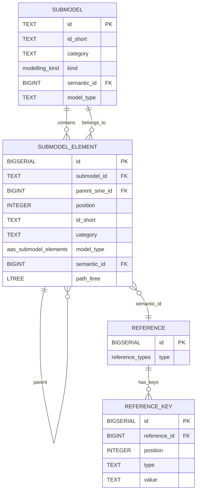

# Relationships & Diagrams

This section provides an overview of the main relationships between tables in the BaSyx database schema.

> **Note:** The Asset Administration Shell (AAS) is a standard provided and maintained by the IDTA (Industrial Digital Twin Association). Eclipse BaSyx is an implementation/server provider for this standard.

## Entity-Relationship Diagram (Mermaid)

## Notes
- `submodel` contains many `submodel_element` (root elements have `parent_sme_id` NULL)
- `submodel_element` can be nested (tree structure via `parent_sme_id`)
- `reference` and `reference_key` model references and their keys
- Specialized tables (e.g., `property_element`, `submodel_element_list`) extend `submodel_element` by 1:1 relationship

For a full list of entities, see [Entity Reference](./entities.md).
