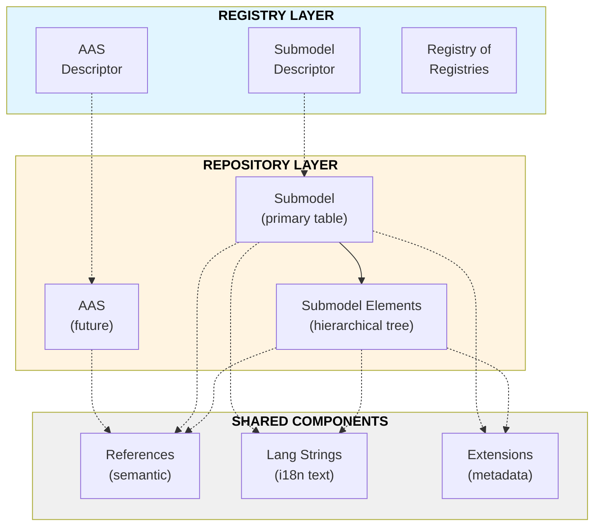

# BaSyx PostgreSQL Database Schema

> **Quick Start**: This schema stores Asset Administration Shells (AAS), Submodels, and their elements in a PostgreSQL database with full support for the AAS metamodel including descriptors for registry services.

## 🎯 What This Schema Does

The BaSyx database schema provides persistent storage for:
- **Asset Administration Shells (AAS)** - Digital twins of physical/logical assets
- **Submodels** - Structured data describing asset aspects
- **Submodel Elements** - The actual data properties, files, operations, etc.
- **Descriptors** - Registry entries for AAS and Submodels (locations, endpoints)
- **References** - Semantic identifiers linking to external definitions

## 📋 Table of Contents

1. [Architecture Overview](#architecture-overview)
2. [Core Components](#core-components)
3. [Key Tables Explained](#key-tables-explained)
4. [Data Types & Enums](#data-types--enums)
5. [Performance Features](#performance-features)
6. [Quick Reference](#quick-reference)

---

## Architecture Overview



### Design Principles

1. **Hierarchical Storage**: Submodel elements use ltree paths for efficient tree queries
2. **Normalization**: Common structures (references, lang strings) are shared tables
3. **Type Safety**: PostgreSQL ENUMs enforce AAS metamodel constraints
4. **Performance**: Strategic indexes for common queries (semantic IDs, paths, values)
5. **Extensibility**: JSON columns for flexible metadata where appropriate

---

## Core Components

### 1. Registry vs Repository

| **Registry** (Discovery) | **Repository** (Storage) |
|--------------------------|--------------------------|
| Stores **descriptors** (metadata) | Stores **actual data** |
| Tells you *where* to find things | Stores the *things* themselves |
| Endpoints, locations | Full AAS/Submodel content |
| `aas_descriptor`, `submodel_descriptor` | `submodel`, `submodel_element` |

### 2. The Three Main Entity Types

#### **Submodel** (`submodel` table)
- Top-level container
- Contains submodel elements

#### **Submodel Element** (`submodel_element` table + type-specific tables)
- Polymorphic - 13 different types (Property, File, Operation, etc.)
- Stored hierarchically with ltree paths
- Type-specific data in child tables (`property_element`, `file_element`, etc.)
- Uniquely identifiable via submodel_id and idshort_path
  - idshort_path itself is only unique in the submodel_id scope
  - In the sql file each submodel element has one PK (id) that is an auto incremented integer.

#### **Descriptor** (`descriptor` + `aas_descriptor`/`submodel_descriptor`)
- Registry entries pointing to service endpoints
- Contains URLs, protocols, security info
- Links descriptors to actual content

### 3. Shared Infrastructure

- **reference**: Semantic identifiers (e.g., "this property means 'temperature'")
- **lang_string_*_type**: Multi-language text (descriptions, display names)
- **extension**: Custom metadata key-value pairs
- **administrative_information**: Versioning and creator info

---

## Key Tables Explained

### `submodel` - The Main Data Container

```sql
submodel
├── id (VARCHAR 2048) - Unique identifier
├── id_short - Short human-readable name
├── semantic_id → reference
├── description_id → lang_string_text_type_reference
├── kind (ENUM) - Instance or Template
└── [metadata fields]
```

**Purpose**: Stores submodels - the primary data structures in AAS.

**Key Relationships**:
- Links to `submodel_element` (one-to-many)
- Has semantic_id pointing to what this submodel represents
- Can have extensions, qualifiers, embedded data specifications

---

### `submodel_element` - The Hierarchical Data Tree

```sql
submodel_element
├── id (BIGSERIAL) - Internal DB ID
├── submodel_id → submodel - Which submodel owns this?
├── parent_sme_id → submodel_element - Parent element (for nesting)
├── idshort_path (LTREE) - Full hierarchical path
├── model_type (ENUM) - Property, File, Operation, etc.
├── position (INT) - Order within parent
└── depth (INT) - Nesting level
```

**Purpose**: Polymorphic storage for all 13 submodel element types.

**The Hierarchy System**:
- `idshort_path`: ltree like `"parent.child.grandchild"`
- `parent_sme_id`: NULL for root elements, points to parent otherwise
- `depth`: 0 for root, increments for each nesting level

**Type-Specific Data**: Each model_type has a child table:
- `Property` → `property_element` (value, valueType)
- `File` → `file_element` (contentType, value path)
- `Blob` → `blob_element` (contentType, binary value)
- `SubmodelElementCollection` → `submodel_element_collection`
- `SubmodelElementList` → `submodel_element_list`
- `Operation` → `operation_element` + `operation_variable`
- Etc.

---

### `reference` - Semantic Identifiers

```sql
reference
├── id (BIGSERIAL)
├── type (ENUM) - ExternalReference or ModelReference
├── parentReference → reference - For nested references
└── rootReference → reference - Top of nesting tree

reference_key (stores the actual key chain)
├── reference_id → reference
├── position (INT) - Order in the key chain
├── type (key_type ENUM) - GlobalReference, ConceptDescription, etc.
└── value (TEXT) - The actual IRI/identifier
```

**Purpose**: Stores semantic identifiers following the AAS Reference structure.

**Example**: A reference to a ConceptDescription might have:
- `reference.type` = 'ModelReference'
- `reference_key[0]` = {type: 'ConceptDescription', value: 'https://example.com/0173-1#02-AAO677#003'}

**Performance**: Indexed for fast lookups by type and value (trigram for fuzzy search).

---

### `descriptor` Tables - Registry Entries

```sql
descriptor (base table)
├── id (BIGSERIAL)
└── [inherited by specific descriptor types]

aas_descriptor : descriptor
├── id (VARCHAR) - The AAS identifier
├── id_short
├── asset_kind (ENUM) - Instance, Type, etc.
├── global_asset_id - The managed asset
└── [endpoints, extensions, specific_asset_ids]

submodel_descriptor : descriptor
├── id (VARCHAR) - The Submodel identifier
├── id_short
├── semantic_id → reference - What type is this?
├── aas_descriptor_id → aas_descriptor - Which AAS owns this?
└── [endpoints]
```

**Purpose**: Registry metadata telling you where to find actual AAS/Submodel data.

**Key Feature**: `aas_descriptor_endpoint` table stores URL endpoints, protocols, security info.

---

### Type-Specific Element Tables

Each submodel element type extends the base `submodel_element`:

| Type | Table | Stores |
|------|-------|--------|
| Property | `property_element` | Typed scalar values (string, int, bool, etc.) |
| MultiLanguageProperty | `multilanguage_property` + `*_value` | Translated text |
| File | `file_element` + `file_data` | File metadata + large object |
| Blob | `blob_element` | Binary data inline |
| Range | `range_element` | Min/max values |
| ReferenceElement | `reference_element` | Points to another element |
| RelationshipElement | `relationship_element` | Links two elements |
| Operation | `operation_element` + `operation_variable` | Invokable operations |
| Entity | `entity_element` | Logical entities with statements |
| SubmodelElementCollection | `submodel_element_collection` | Container for mixed children |
| SubmodelElementList | `submodel_element_list` | Typed array of children |

---

## Data Types & Enums

### Key PostgreSQL ENUMs

```sql
modelling_kind: 'Instance', 'Template'
aas_submodel_elements: All 13 element types
data_type_def_xsd: 'xs:string', 'xs:int', 'xs:boolean', etc.
reference_types: 'ExternalReference', 'ModelReference'
key_type: 'GlobalReference', 'Submodel', 'Property', etc.
asset_kind: 'Instance', 'Type', 'Role', 'NotApplicable'
```

Full enum definitions in [enums.md](./enums.md).

### Special Types

- **ltree**: PostgreSQL extension for hierarchical paths (`idshort_path`)
- **pg_trgm**: Trigram extension for fuzzy text search
- **JSONB**: Used for flexible arrays (e.g., `specific_asset_ids`)

---

## Performance Features

### Indexing Strategy

**1. Hierarchical Queries** (submodel_element tree):
```sql
ix_sme_path_gin        -- GIN index on idshort_path for path queries
ix_sme_sub_path        -- (submodel_id, idshort_path) for filtering
ix_sme_parent_pos      -- (parent_sme_id, position) for children
ix_sme_sub_depth       -- (submodel_id, depth) for level queries
```

**2. Value Searches** (typed indexes for fast filtering):
```sql
ix_prop_num       -- Property numeric values
ix_prop_text_trgm -- Property text with fuzzy search
ix_prop_bool      -- Property boolean values
ix_qual_text_trgm -- Qualifier text search
```

**3. Semantic Lookups**:
```sql
ix_refkey_type_val     -- (type, value) for exact reference matching
ix_refkey_val_trgm     -- Fuzzy search on reference values
ix_sm_semantic_id      -- Fast submodel semantic ID lookup
```

**4. Registry Queries**:
```sql
ix_aasd_id_trgm            -- Fuzzy AAS descriptor ID search
ix_specasset_name_value    -- Specific asset ID filtering
ix_aas_endpoint_href_trgm  -- Endpoint URL fuzzy search
```

### Query Optimization Tips

1. **Filter by submodel first**: Most queries should start with `submodel_id`
2. **Use ltree operators**: `@>`, `<@` for path matching instead of LIKE
3. **Leverage trigram indexes**: Use `%` operator for fuzzy search
4. **Composite indexes**: Use (submodel_id, semantic_id) combos when possible

---

## Quick Reference

### Common Query Patterns

**Find all elements in a submodel:**
```sql
SELECT * FROM submodel_element 
WHERE submodel_id = 'urn:example:submodel:1';
```

**Get root elements only:**
```sql
SELECT * FROM submodel_element 
WHERE submodel_id = 'urn:...' AND parent_sme_id IS NULL
ORDER BY position;
```

**Find element by path:**
```sql
SELECT * FROM submodel_element 
WHERE submodel_id = 'urn:...' 
  AND idshort_path = 'parent.child';
```

**Search by semantic ID:**
```sql
SELECT s.* FROM submodel s
JOIN reference r ON s.semantic_id = r.id
JOIN reference_key rk ON r.id = rk.reference_id
WHERE rk.value = 'https://example.com/semantic/Temperature';
```

**Get properties with values:**
```sql
SELECT se.id_short, pe.value_text, pe.value_num, pe.value_type
FROM submodel_element se
JOIN property_element pe ON se.id = pe.id
WHERE se.submodel_id = 'urn:...';
```

### Table Statistics

Total tables: **~60**
- Core entities: 10-15
- Type-specific element tables: ~13
- Support tables (references, lang strings, etc.): ~20
- Descriptor/registry tables: ~15

### Extensions Used

```sql
CREATE EXTENSION ltree;    -- Hierarchical paths
CREATE EXTENSION pg_trgm;  -- Trigram fuzzy search
```

---

## Additional Documentation

For deeper dives:
- [Enums & Types](./enums.md) - All enum definitions
- [Usage Examples](./examples.md) - Real-world query examples

---

## Need Help?

- **Schema file**: `basyxschema.sql` in the repository root
- **Code examples**: Check `sql_examples/` directory
- **Integration tests**: See test files for usage patterns
