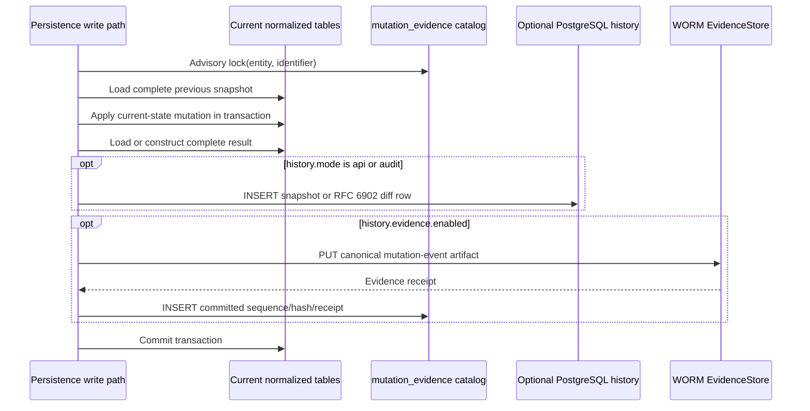
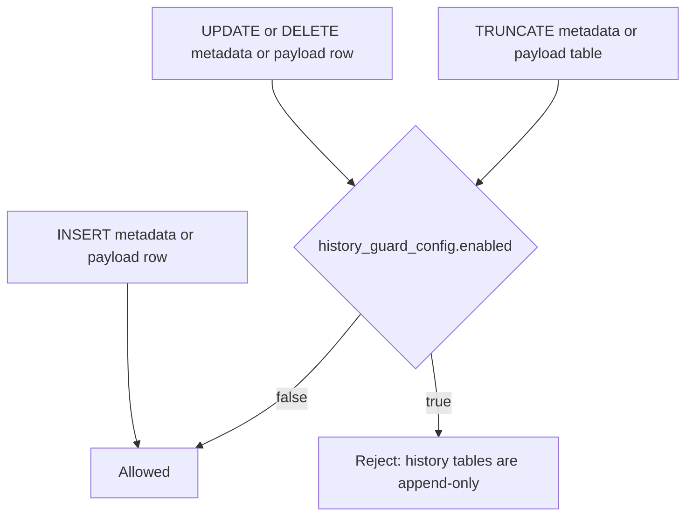
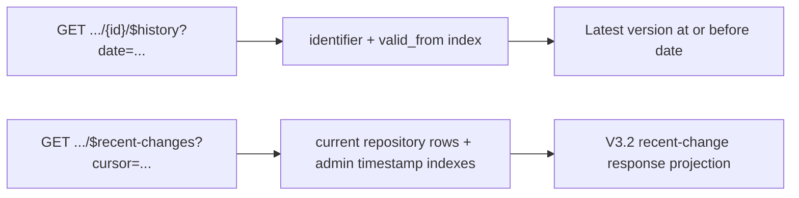

<!--
/*******************************************************************************
* Copyright (C) 2026 the Eclipse BaSyx Authors and Fraunhofer IESE
*
* Permission is hereby granted, free of charge, to any person obtaining
* a copy of this software and associated documentation files (the
* "Software"), to deal in the Software without restriction, including
* without limitation the rights to use, copy, modify, merge, publish,
* distribute, sublicense, and/or sell copies of the Software, and to
* permit persons to whom the Software is furnished to do so, subject to
* the following conditions:
*
* The above copyright notice and this permission notice shall be
* included in all copies or substantial portions of the Software.
*
* THE SOFTWARE IS PROVIDED "AS IS", WITHOUT WARRANTY OF ANY KIND,
* EXPRESS OR IMPLIED, INCLUDING BUT NOT LIMITED TO THE WARRANTIES OF
* MERCHANTABILITY, FITNESS FOR A PARTICULAR PURPOSE AND
* NONINFRINGEMENT. IN NO EVENT SHALL THE AUTHORS OR COPYRIGHT HOLDERS BE
* LIABLE FOR ANY CLAIM, DAMAGES OR OTHER LIABILITY, WHETHER IN AN ACTION
* OF CONTRACT, TORT OR OTHERWISE, ARISING FROM, OUT OF OR IN CONNECTION
* WITH THE SOFTWARE OR THE USE OR OTHER DEALINGS IN THE SOFTWARE.
*
* SPDX-License-Identifier: MIT
******************************************************************************/
-->

# AAS API v3.2 Runtime Notes

This document describes the runtime behavior added for AAS API v3.2 support. It focuses on the implementation choices that are easy to miss when reading only the OpenAPI files.

## Scope

The v3.2 OpenAPI update adds history and recent-change endpoints to repository components, introduces descriptor-list timestamp filters to registry components, adds the `Batch` value for `AssetKind`, extends administrative timestamps, and exposes composed endpoints through the AAS environment.

Implemented history, recent-change, and signing runtime areas from the v3.2 OpenAPI files:

- AAS Repository: `/shells/$recent-changes`, `/shells/{aasIdentifier}/$history`, `/shells/{aasIdentifier}/$signed`.
- Submodel Repository: `/submodels/$recent-changes`, `/submodels/{submodelIdentifier}/$history`, `/submodels/{submodelIdentifier}/$signed`.
- Submodel Repository compatibility route: `/submodels/{submodelIdentifier}/$value/$signed` is exposed by the generated Go router and existing integration coverage, although it is not listed in the current local v3.2 OpenAPI file.
- Concept Description Repository: `/concept-descriptions/$recent-changes`.
- AAS Registry and Digital Twin Registry: `createdFrom` and `updatedFrom` filters on `/shell-descriptors`.
- Submodel Registry: `createdFrom` and `updatedFrom` filters on `/submodel-descriptors`.
- AAS Environment: `/serialization`, `/upload`, descriptor list timestamp filters, `/shells/$recent-changes`, `/shells/{aasIdentifier}/$history`, `/shells/{aasIdentifier}/$signed`, `/submodels/$recent-changes`, `/submodels/{submodelIdentifier}/$history`, `/submodels/{submodelIdentifier}/$signed`, `/submodels/{submodelIdentifier}/$value/$signed`, `/concept-descriptions/$recent-changes`, and the composed asynchronous operation result/status endpoints.
- Migration `1_1_0.sql`: adds v3.2 timestamp columns and the enum migration for `Batch`.
- Migration `1_1_1.sql`: adds history metadata and payload tables, indexes, and PostgreSQL mutation guards.
- Migration `1_1_2.sql`: adds snapshot-checkpoint indexes for diff-backed restore.
- Migration `1_1_3.sql`: adds WORM evidence manifest and artifact receipt catalogs.
- Migration `1_1_4.sql`: adds ABAC policy version, rule, and policy-event tables plus ABAC policy evidence artifact support.
- Migration `1_1_5.sql`: adds dedicated Submodel Registry descriptor history metadata and payload tables.
- Migration `1_1_6.sql`: repairs descriptor administrative timestamp synchronization for future writes by syncing timestamp columns when descriptor rows are inserted after their payload rows. It intentionally does not backfill existing descriptor rows.
- Migration `1_1_7.sql`: normalizes supplemental semantic ID reference ownership and indexes for Submodels, Submodel Elements, Submodel Descriptors, and Specific Asset IDs.

The current v3.2 Submodel Repository OpenAPI also defines `PUT`, `PATCH`, and `DELETE` on `/submodels/{submodelIdentifier}/$signed`. These operations use the normal Submodel request bodies and are routed to the same runtime behavior as `PUT`, `PATCH`, and `DELETE` on `/submodels/{submodelIdentifier}`.

OpenAPI endpoints checked outside the history/recent/signing scope:

- AAS Repository, Submodel Repository, Concept Description Repository, and AAS Environment OpenAPI files contain `/serialization`.
- The AAS Environment `/serialization` and `/upload` endpoints are custom implemented and covered by integration tests.
- The Submodel Repository `/serialization` route is wired and currently returns `501 Not Implemented`.
- The standalone AAS Repository generated serialization handler is present in `pkg/aasrepositoryapi`, but it is not wired by `cmd/aasrepositoryservice`.
- The standalone Concept Description Repository OpenAPI contains `/serialization`, but the current generated Go package only contains the interface, not a registered controller/service implementation.
- AAS Repository, Submodel Repository, and AAS Environment OpenAPI files contain asynchronous operation result/status endpoints. These are separate from the new history/recent-change storage described below.

## History Model

History metadata is stored in dedicated append-only tables:

- `aas_history`
- `submodel_history`
- `concept_description_history`
- `descriptor_history`
- `submodel_descriptor_history`

The complete JSON snapshot is stored in a one-to-one payload table:

- `aas_history_payload`
- `submodel_history_payload`
- `concept_description_history_payload`
- `descriptor_history_payload`
- `submodel_descriptor_history_payload`

Each metadata row stores:

- `identifier`
- `change_type`: `Created`, `Updated`, or `Deleted`
- `deleted`
- `valid_from`
- `valid_to`: reserved for interval-style history, but not populated or used by the current runtime history resolution
- `operation_time`
- administrative timestamp text values plus typed `TIMESTAMPTZ` columns for `createdFrom` and `updatedFrom` filters
- audit metadata columns such as `actor_subject`, `request_id`, `endpoint`, and `http_method`
- payload metadata: `payload_type` and `payload_hash`
- tamper-evidence columns: `previous_hash`, `content_hash`, and `row_hash`

On every create, update, or delete, a new immutable metadata row and one payload row are appended. Existing history rows are not updated by the runtime. Both rows are inserted in the same database transaction as the current-table mutation, including value-only SME updates.

Keeping JSONB outside the indexed metadata row narrows recent-change and latest-hash access paths. With `history.fullSnapshotInterval: 1`, every payload row stores `snapshot`. With larger intervals, the runtime stores one `snapshot` checkpoint followed by up to `N-1` RFC 6902 `diff` payload rows, and it may checkpoint earlier when the diff JSON is not smaller than the full snapshot payload.

History lookup uses:

```text
latest event where valid_from <= requested_date
ORDER BY valid_from DESC, history_id DESC
```

If the latest matching event is marked as deleted, the history endpoint returns not found. This means a deleted entity can still be resolved for dates before deletion, but not after deletion.

Each runtime-created row stores a deterministic SHA-256 hash of the reconstructed canonical JSON snapshot (`content_hash`), a separate hash of the stored snapshot or diff payload (`payload_hash`), and a per-identifier chain hash (`row_hash`) that includes the previous row hash and selected audit metadata.

### Shared Append Algorithm

The shared implementation lives in `internal/common/history`.

- `AppendVersionTx` receives complete pre-mutation and resulting snapshots supplied by the persistence layer. It selects a snapshot checkpoint or diff according to `history.fullSnapshotInterval` and payload size, then writes the enabled sinks.
- For scoped changes, the persistence adapter reads the complete live entity before changing it and passes that snapshot to `AppendMutatedVersionTx`. The helper applies the scoped mutation to a copy and records the complete result. Evidence-only writes never reconstruct model state from PostgreSQL history or prior WORM objects.
- PostgreSQL history insertion remains a separate sink and uses the same resulting snapshot when history mode is `api` or `audit`.
- Evidence-enabled persistence paths acquire a transaction-level PostgreSQL advisory lock derived from the entity type and identifier before reading the pre-mutation snapshot. The lock is held through the live change and evidence append, serializing snapshots, evidence sequences, and predecessor hashes for the same identifiable while allowing unrelated identifiers to proceed independently. Bulk paths acquire these locks in identifier order.
- `mutation_evidence_state` stores only the bounded chain head: terminal sequence, event/content hashes, and the snapshot-interval counter. It stores no model snapshot or diff. Model states remain in the live model, immutable evidence artifacts, and, when enabled, PostgreSQL history.



Complete snapshots in the independent chain keep partial-update evidence independent from PostgreSQL history. The configured interval bounds reconstruction work for both sinks.

`history.fullSnapshotInterval: 1` preserves the full-snapshot behavior. Values greater than `1` allow at most `N-1` diff rows after each full checkpoint. A full snapshot can appear earlier when the diff payload would be equal to or larger than the snapshot payload.

### Per-Identifiable Write Paths

| Identifiable | Complete write path | Optimized partial write path | Missing-history fallback |
| --- | --- | --- | --- |
| AAS | Create and full replace append a complete AAS snapshot. Delete appends an `{id}` tombstone. | Submodel-reference add/remove, asset-information updates, and thumbnail changes mutate the previous AAS snapshot. Thumbnail upload reads only the stored thumbnail metadata needed for the snapshot. | Materialize the complete current AAS once. |
| Submodel | Create, full replace, and full patch append a complete Submodel snapshot. Delete appends an `{id}` tombstone. | Metadata updates replace metadata while preserving `submodelElements`. SME create/update/patch/delete, value-only changes, and attachment changes reload only the affected top-level SME root subtree and splice it into the previous snapshot. | Materialize the complete current Submodel once. |
| Concept Description | Create and replace append the supplied complete Concept Description snapshot. Delete appends an `{id}` tombstone. | No nested partial write path is required. | Not applicable. |
| AAS descriptor | Create and full replace append the stored complete AAS descriptor. Delete appends the complete descriptor marked as deleted. | Nested Submodel descriptor add/replace/remove mutates the owning AAS descriptor snapshot. | Materialize the complete current AAS descriptor once. |
| Submodel descriptor | Create, replace, and delete append the stored complete standalone Submodel descriptor. | No nested partial write path is required. | Not applicable. |

Submodel elements and nested Submodel descriptors are not versioned independently. A child mutation creates a new snapshot for its owning identifiable. For SMEs, reloading the top-level subtree after the current-state mutation covers nested edits, renamed `idShort` values, and list-position changes without re-reading the entire Submodel.

### Submodel Element Lifecycle

Every SME mutation appends `Updated` to `submodel_history`. The history event type describes the owning identifiable, not the nested SME action.

| SME write | Path meaning | Snapshot mutation |
| --- | --- | --- |
| `POST /submodels/{sm}/submodel-elements` | Add a new top-level SME. | Append the new root SME to `submodelElements`. |
| `POST /submodels/{sm}/submodel-elements/{idShortPath}` | Add a new direct child below the existing SME container at `idShortPath`. | Reload and replace the affected top-level root subtree. |
| `PUT /submodels/{sm}/submodel-elements/{idShortPath}` when missing | Create the SME at the target path. Creating by list-index path is rejected. | Append a new top-level root or reload the parent root subtree. |
| `PUT /submodels/{sm}/submodel-elements/{idShortPath}` when present | Replace the target SME. | Reload and replace the affected top-level root subtree. |
| `PATCH /submodels/{sm}/submodel-elements/{idShortPath}` | Merge and update the target SME. | Reload and replace the affected top-level root subtree. |
| `PATCH /submodels/{sm}/submodel-elements/{idShortPath}/$metadata` | Update SME metadata. | Reload and replace the affected top-level root subtree. |
| `PATCH /submodels/{sm}/submodel-elements/{idShortPath}/$value` | Update the value-only representation. | Reload and replace the affected top-level root subtree after the value write. |
| `DELETE /submodels/{sm}/submodel-elements/{idShortPath}` | Delete the target SME and any nested children. | Remove the root when deleting a top-level SME; otherwise reload and replace the surviving root subtree. |
| `PUT` or `DELETE /submodels/{sm}/submodel-elements/{idShortPath}/attachment` | Change File SME attachment content. | Reload and replace the affected top-level root subtree. |

For `Measurements.temperature`, the root path is `Measurements`. For a nested update, the current `Measurements` subtree is read with deep content after the normalized mutation and replaces the old root in the previous snapshot. If a top-level `idShort` changes, the previous path locates the old root and the resolved current path loads the renamed root.

If the Submodel has no prior history row, the optimized mutation path cannot splice into a previous snapshot. It falls back to a one-time complete Submodel materialization and appends that result.

### Endpoint History Matrix

The table lists direct write endpoints. The AAS Environment exposes the corresponding component routes with the same history effects.

| Endpoint family | Verb | Owning history table | Event type |
| --- | --- | --- | --- |
| `/shells` | `POST` | `aas_history` | `Created` |
| `/shells/{aasIdentifier}` | `PUT` | `aas_history` | `Created` or `Updated` |
| `/shells/{aasIdentifier}` | `DELETE` | `aas_history` | `Deleted` |
| `/shells/{aasIdentifier}/asset-information` | `PUT` | `aas_history` | `Updated` |
| `/shells/{aasIdentifier}/asset-information/thumbnail` | `PUT`, `DELETE` | `aas_history` | `Updated` |
| `/shells/{aasIdentifier}/submodel-refs` | `POST` | `aas_history` | `Updated` |
| `/shells/{aasIdentifier}/submodel-refs/{submodelIdentifier}` | `DELETE` | `aas_history` | `Updated` |
| `/submodels` | `POST` | `submodel_history` | `Created` |
| `/submodels/{submodelIdentifier}` | `PUT` | `submodel_history` | `Created` or `Updated` |
| `/submodels/{submodelIdentifier}`, `/submodels/{submodelIdentifier}/$metadata`, `/submodels/{submodelIdentifier}/$value` | `PATCH` | `submodel_history` | `Updated` |
| `/submodels/{submodelIdentifier}` | `DELETE` | `submodel_history` | `Deleted` |
| `/submodels/{submodelIdentifier}/submodel-elements...` SME write routes listed above | `POST`, `PUT`, `PATCH`, `DELETE` | `submodel_history` | `Updated` |
| `/concept-descriptions` | `POST` | `concept_description_history` | `Created` |
| `/concept-descriptions/{cdIdentifier}` | `PUT` | `concept_description_history` | `Created` or `Updated` |
| `/concept-descriptions/{cdIdentifier}` | `DELETE` | `concept_description_history` | `Deleted` |
| `/shell-descriptors` | `POST` | `descriptor_history` | `Created` |
| `/shell-descriptors/{aasIdentifier}` | `PUT` | `descriptor_history` | `Created` or `Updated` |
| `/shell-descriptors/{aasIdentifier}` | `DELETE` | `descriptor_history` | `Deleted` |
| `/shell-descriptors/{aasIdentifier}/submodel-descriptors` | `POST` | `descriptor_history` | `Updated` |
| `/shell-descriptors/{aasIdentifier}/submodel-descriptors/{submodelIdentifier}` | `PUT`, `DELETE` | `descriptor_history` | `Updated` |
| `/bulk/shell-descriptors` | `POST`, `PUT`, `DELETE` | `descriptor_history` | One corresponding event per descriptor after asynchronous processing succeeds |
| `/submodel-descriptors` | `POST` | `submodel_descriptor_history` | `Created` |
| `/submodel-descriptors/{submodelIdentifier}` | `PUT` | `submodel_descriptor_history` | `Created` or `Updated` |
| `/submodel-descriptors/{submodelIdentifier}` | `DELETE` | `submodel_descriptor_history` | `Deleted` |
| `/bulk/submodel-descriptors` | `POST`, `PUT`, `DELETE` | `submodel_descriptor_history` | One corresponding event per descriptor after asynchronous processing succeeds |

The environment import portion of AAS Environment `/upload` invokes the corresponding identifiable `PUT` paths. One upload can therefore append multiple rows across the Concept Description, Submodel, and AAS streams rather than one special upload event.

Read endpoints and operation invocation endpoints do not append history rows.

### Superpath Effects

The AAS Repository and AAS Environment expose Submodel operations below:

```text
/shells/{aasIdentifier}/submodels/{submodelIdentifier}
```

These superpath routes reuse the Submodel persistence layer. They can affect more than one identifiable when the relationship itself changes:

| Superpath write | History effect |
| --- | --- |
| `PUT /shells/{aas}/submodels/{sm}` | Append `Created` or `Updated` to `submodel_history`. If a new AAS-to-Submodel reference is added, also append `Updated` to `aas_history`. |
| `DELETE /shells/{aas}/submodels/{sm}` | Append `Deleted` to `submodel_history` and `Updated` to `aas_history` because the reference is removed. |
| `PATCH /shells/{aas}/submodels/{sm}` and representation variants | Append `Updated` to `submodel_history`. The AAS reference itself is unchanged. |
| `/shells/{aas}/submodels/{sm}/submodel-elements...` SME write routes | Append `Updated` to `submodel_history` only. The AAS reference itself is unchanged. |

Registry synchronization can append additional descriptor history entries when configured. For example, adding, replacing, or removing a nested Submodel descriptor appends `Updated` to the owning AAS descriptor stream.

### Guarded PostgreSQL Mode

Schema patch `1_1_1.sql` installs guard triggers on the initial AAS, Submodel, Concept Description, and AAS descriptor history metadata/payload table pairs. Patch `1_1_5.sql` adds the same guard coverage for Submodel Descriptor history. The triggers are disabled by default through the singleton `history_guard_config` row. Each history-aware DB-backed runtime service applies its expected guard state at startup.



The guard is enabled when history is active and `history.immutability` is `postgres_guarded`. It blocks direct maintenance mutations as well as accidental application mutations. Enabling is monotonic during normal service startup: a runtime service can enable the database-wide guard, but it cannot disable an enabled guard. A service configured as unguarded fails fast when it encounters an already-enabled database guard. Services sharing one database can start concurrently when their configuration is consistent. Disabling guarded mode requires an explicit operator maintenance action. The guard is not equivalent to WORM storage: sufficiently privileged PostgreSQL operators can alter schema objects.

### WORM Mutation Evidence And Legacy Manifests

The default stronger-integrity architecture is:

```text
Current model mutation -> independent evidence chain -> synchronous mutation artifact -> S3-compatible WORM object storage
```

The HTTP APIs are unchanged. `history.evidence.enabled` works with `history.mode: off`, `api`, or `audit`. Every covered mutation writes one canonical `mutation_event` artifact before the surrounding PostgreSQL transaction can commit. The artifact format is identical with history enabled or disabled and contains either a full snapshot or an RFC 6902 diff according to `history.fullSnapshotInterval`, plus `effective_diff`, evidence sequence, and predecessor/event hashes. When history is active, its row is inserted separately and linked through receipt-catalog metadata. Evidence-only state reconstruction never reads PostgreSQL history payloads.

`cmd/historyevidenceverifier -mutation` verifies the independent chain against a required, independently retained terminal event hash, reconstructs snapshots, rejects incomplete or divergent requested ranges, validates live retention state, and checks required binary-reference and immutable-binary receipts. Recovery output identifies the terminal event hash, change type, deletion state, operation time, and audit context. The existing manifest, v1 `history_event`, catalog-export, and recovery paths remain available for legacy evidence. The S3-compatible `EvidenceStore` supports MinIO for local testing; production deployments should use an operated WORM service with versioning and object lock.

For a selected history range, evidence publication:

- verifies PostgreSQL payload hashes and per-identifier row-hash chains first;
- writes canonical `history_event` artifacts for every snapshot and diff row in the range;
- writes full snapshot checkpoint artifacts for every `payload_type = snapshot` row in the range;
- builds a canonical `HistoryManifest` containing first/last `history_id`, first/last `row_hash`, row count, ordered range digest, timestamp, signature metadata, and snapshot artifact references;
- signs the canonical manifest as compact RS256 JWS when an evidence signing key is configured, otherwise stores canonical JSON with `signature_state = unsigned`;
- writes object-store receipts to `history_evidence_manifests` and `history_evidence_artifacts`.

Signed manifests are verified with a configured RSA public key when `history.evidence.signing.publicKeyPath` or `BASYX_HISTORY_EVIDENCE_SIGNING_PUBLIC_KEY_PATH` is set. When signing is required, unsigned or unverifiable manifests are reported as critical findings.

Independent `mutation_event` artifacts provide recovery evidence for every acknowledged write while evidence is enabled. With `history.fullSnapshotInterval: 5`, recovery from WORM replays up to four WORM-stored diff payloads after the latest WORM-stored snapshot event. Use `history.fullSnapshotInterval: 1` when each individual WORM event must be recoverable without replaying diffs. The `effective_diff` field is the attribution trail: for snapshot checkpoint events it prevents a full recovery snapshot from being mistaken for the set of fields changed by the actor. Recovery exports verified JSON only; PostgreSQL restore is intentionally left as an operator-controlled procedure.

Independent verification checks the evidence hash chain, reconstructs snapshots, validates binary correlations, and verifies object hashes and retention. It requires `-expected-head-hash` for the requested terminal sequence so deletion of a matching tail from both PostgreSQL catalog tables remains detectable. Operators must retain the sequence/hash pair outside the database being verified and advance it only after a successful verification. The initial pair is a trust-on-first-use baseline unless an external process has already authenticated it. The legacy v1 workflow can still compare PostgreSQL rows against their hash chain, verify per-row `history_event` receipts, compare a stored manifest against a live range digest, and verify compact JWS signatures. The CLI emits JSON and exits non-zero on critical findings, so it is suitable for cron or Kubernetes CronJob drift detection.

### Attachment And Thumbnail Storage

File attachments and thumbnails share `binary_content`, keyed by SHA-256 and byte length, with one PostgreSQL Large Object per canonical payload. `file_binary_reference` and `thumbnail_binary_reference` remain owner-scoped and carry a fresh 192-bit path token plus a safe filename. Access never resolves globally by token or digest. The stored model value is `/aasx/files/<token>/<filename>`; it is an AASX part URI, not an HTTP route.

Uploads stream into a transient Large Object while hashing and enforce `general.uploadMaxSizeBytes` before writing content beyond the configured limit. A digest-scoped advisory transaction lock and the `(sha256, size_bytes)` uniqueness constraint serialize identical concurrent uploads. A duplicate transient object is unlinked, while the logical reference receives a new token. Delete triggers maintain an atomic reference count across attachment and thumbnail owners and unlink canonical content only after the final reference is gone.

Evidence-enabled uploads stream canonical bytes from PostgreSQL into content-addressed WORM storage. `binary_evidence_receipt` survives removal of the live PostgreSQL payload, allowing later identical uploads to reuse the immutable object and extend—but never shorten—retention. The mutation-event hash commits the model path, digest, byte length, filename, content type, and immutable binary object version before `binary_reference_evidence_artifacts` records the corresponding reference artifact. A missing or modified reference/binary object, missing range tail, or unverifiable retention state is a critical `-mutation` verifier finding.

Patch `1_1_8.sql` only adds the canonical storage and evidence schema; it does not scan or rewrite legacy Large Objects and does not modify `base.sql`. Existing `file_data` and `thumbnail_file_data` rows and model values remain readable through the dual-read path until the owning file is replaced or removed. New uploads use canonical storage and managed paths. The upgrade intentionally emits neither history nor WORM backfill, so a preexisting binary may have no WORM receipt. AASX File Server package objects are not included.

Treat v1.1.8 as a quiesced database upgrade. Stop all database-backed services, take a restorable backup including PostgreSQL Large Objects, run the configuration service alone, confirm clean v1.1.8 state, and then start only v1.1.8 processes. Exact startup validation prevents a newly started schema mismatch but does not continuously fence a v1.1.7 process that was already connected. Rolling or blue/green operation across this schema boundary is unsupported. Rollback requires a complete database restore before restarting v1.1.7; a binary-only rollback can leave the old process unable to resolve canonical binaries. Immutable WORM writes made after the restored backup remain rollback orphans unless a committed catalog receipt identifies them.

Deduplication is global across attachment and thumbnail payloads. Authorization is checked through the owning model before canonical lookup, public responses never disclose hits, hashes, object identifiers, or receipts, and backend failures use the same client-facing storage error. A residual timing side channel between new and reused payloads remains; deployments that require stronger tenant isolation must isolate databases or service instances per security boundary.

AASX export preserves managed File and thumbnail values byte-for-byte, creates package parts at those exact URIs, and relates them as supplementary/thumbnail parts through `aas-package3-golang`. Content is resolved through the owning model association rather than the opaque token. External URLs are skipped and are never fetched.

### Configuration Status

| Setting | Current runtime behavior |
| --- | --- |
| `history.mode: off` | Skip PostgreSQL history rows. Existing rows remain readable. Independent WORM mutation evidence still runs when enabled. |
| `history.mode: api` | Append history rows. |
| `history.mode: audit` | Append the same runtime history rows as `api`; intended for audit-oriented deployments with explicit storage controls. |
| `history.retentionDays` | Must remain `0`. Non-zero values fail fast until cleanup is implemented. |
| `history.fullSnapshotInterval` | `1` stores all payloads as snapshots. Values greater than `1` store one full checkpoint plus up to `N-1` diff rows, with earlier checkpoints when the diff payload is not smaller than the snapshot payload. |
| `history.immutability: none` | Keep PostgreSQL mutation guards disabled. |
| `history.immutability: postgres_guarded` | Enable PostgreSQL mutation guards at service startup. |
| `history.immutability: external_anchor` | Reserved for a future `IntegrityAnchor` backend and still fails fast unless a real provider is implemented. |
| `history.evidence.enabled` | Enables fail-closed, history-independent WORM mutation artifacts. It does not change HTTP response shapes, but mutations fail if required evidence cannot be stored. |
| `history.evidence.provider: s3` | Configures the S3-compatible `EvidenceStore`. Requires bucket, region, retention mode, and positive retention days. Endpoint override and path-style mode support MinIO-style tests. |
| `history.evidence.writeTimeoutSeconds` | Bounds synchronous WORM writes while the PostgreSQL transaction is open. Default is `10`. |
| `history.evidence.signing.privateKeyPath` | Optional RS256 manifest signing key. Falls back to `jws.privateKeyPath` when empty. |
| `history.evidence.signing.publicKeyPath` | Optional RSA public key used to verify compact JWS manifest artifacts. |
| `history.evidence.signing.required` | Requires signed manifests for verifier/recovery operations and requires a private key for `-write`. |
| `history.integrityAnchor.provider: none` | Default. Non-`none` providers such as immudb, Rekor, Trillian, or timestamping services are reserved for later work. |
| `history.auditIdentityMode` | `none` stores no request identity metadata. `minimal` stores `X-Request-ID`/`X-Correlation-ID` when supplied by clients or trusted ingress, authenticated OIDC subject/issuer/client id, ABAC allow metadata, operation, endpoint, and method. `extended` also stores trusted source IP, user agent, policy hash, and deterministic rule ids where available. BaSyx does not generate HTTP request/correlation IDs in the audit middleware when those headers are missing. |
| Active eventing, configured event sinks, or enabled outbox processing | Fail fast until outbox publishing is implemented. |

`AuditContext`, `ChangeEvent`, `EvidenceStore`, and `IntegrityAnchor` remain extension points. Runtime middleware now populates `AuditContext` when configured; no external ledger anchor client is invoked by the append path yet.

Future mutation routes must acquire the entity evidence lock before reading the complete pre-mutation model and append evidence in the same database transaction as the live write. A future eventing implementation should consume the same committed change identity through a transactional outbox instead of adding delivery state to `mutation_evidence_state` or independently reconstructing a mutation after commit.

Example verifier/publisher usage:

```sh
go run ./cmd/historyevidenceverifier \
  -config ./config.yaml \
  -table submodel_history \
  -identifier 'https://example.com/submodels/1' \
  -from 1 \
  -to 25 \
  -write
```

```sh
go run ./cmd/historyevidenceverifier \
  -config ./config.yaml \
  -table submodel_history \
  -identifier 'https://example.com/submodels/1' \
  -from 1 \
  -to 25 \
  -manifest-object-key 'history-evidence/history-manifests/submodel_history/https:%2F%2Fexample.com%2Fsubmodels%2F1/1-25-...json' \
  -manifest-sha256 '<expected-sha256>' \
  -require-signed-manifest
```

```sh
go run ./cmd/historyevidenceverifier \
  -config ./config.yaml \
  -table submodel_history \
  -identifier 'https://example.com/submodels/1' \
  -from 1 \
  -to 25 \
  -catalog-export \
  -out ./recovery-catalog.json
```

```sh
go run ./cmd/historyevidenceverifier \
  -config ./config.yaml \
  -table submodel_history \
  -identifier 'https://example.com/submodels/1' \
  -from 1 \
  -to 25 \
  -recover \
  -recovery-catalog ./recovery-catalog.json \
  -out ./recovered-history.json
```

### Diff-Backed Storage

There is intentionally no separate `history.storageMode` setting. Full-snapshot history is represented by `history.fullSnapshotInterval: 1`; compact storage is enabled by values greater than `1`.

Diff-backed rows use the existing `payload_type`, `payload_hash`, and nullable `diff` payload column:

- Diff payloads are deterministic RFC 6902 JSON Patch operation arrays.
- `content_hash` is the reconstructed full-snapshot hash.
- `payload_hash` is the stored snapshot or diff payload hash.
- Restore walks back to the nearest full checkpoint and applies diffs in order, so worst-case work is bounded by the configured interval.
- Existing snapshot-only history remains readable without backfill.

### Fail-Closed Mutation Coverage

Version-aware HTTP services install a shared mutation-coverage middleware. Every `POST`, `PUT`, `PATCH`, or `DELETE` request must match an explicitly classified route whenever PostgreSQL history or WORM evidence is active:

- Versioned routes are allowed and carry a `MutationCoverage` context value with `Versioned: true`.
- Deliberately non-versioned writes, such as query, invocation, and discovery-link routes, are explicit exemptions with `Versioned: false`.
- An unclassified mutation is rejected before its handler runs with `HISTORY-COVERAGE-UNCLASSIFIED`.

Generated component routes are classified centrally by operation name during server startup. Hand-written routes such as `/bulk/shell-descriptors`, AAS Environment `/upload`, and `/bulk/submodel-descriptors` are classified where they are registered. This makes a forgotten trigger point fail closed instead of committing a current-state write without its required snapshot.

## Recent Changes

Recent-change endpoints are data-bound current-state reads. They use the same live repository queries as the matching `GET all` endpoints, including administrative timestamp filters, and only project the result into the V3.2 recent-change response shape. The default page size is `100`.



Repository recent-change filters:

- `cursor`
- `limit`
- `createdFrom`
- `updatedFrom`
- AAS recent changes additionally apply `assetIds` and `idShort` to current AAS rows.
- Submodel recent changes additionally apply `semanticId` and `idShort` to current Submodel rows.

Registry descriptor list filters:

- `createdFrom` and `updatedFrom` are supported on `GET /shell-descriptors` and `GET /submodel-descriptors`.
- Existing AAS descriptor list filters such as `assetKind`, `assetType`, and `assetIds` are combined with the timestamp filter group.

The published Part 2 OpenAPI schema is the source of truth for the response projection. The result shapes are intentionally component-specific:

- AAS results contain the shared `createdAt` and `updatedAt` fields plus `id`, `globalAssetId`, and `specificAssetIds`.
- Submodel results contain the shared fields plus `id`, `semanticId`, and `supplementalSemanticIds`.
- Concept Description results contain the shared fields plus `id`. This fills the missing shared-schema result type consistently with the other identifiable repositories.

For AAS, Submodel, and Concept Description recent changes, resource-specific metadata is projected from the current live entity. Deleted resources do not appear in public recent-change responses. Technical history and audit rows are still appended independently when history is enabled.

The encoded query contract is applied consistently: AAS recent-change `assetIds` contain base64url-encoded `SpecificAssetId` JSON objects, Submodel recent-change `semanticId` contains a base64url-encoded reference value, and AAS descriptor list `assetType` is base64url-encoded UTF-8.

BaSyx treats `administration.createdAt` and `administration.updatedAt` as user-provided model data. Create, update, replace, patch, and descriptor write operations persist the submitted administrative timestamp values without generating or overwriting them. Rows without administrative timestamps are not matched by timestamp-filtered recent changes or descriptor list filters until a later request explicitly persists those values.

## Migration Behavior

The v3.2 `Batch` asset kind is inserted at enum index `2`. Existing persisted values with index `2` or higher must be shifted by one:

```sql
UPDATE asset_information
SET asset_kind = asset_kind + 1
WHERE asset_kind >= 2;

UPDATE aas_descriptor
SET asset_kind = asset_kind + 1
WHERE asset_kind >= 2;
```

History storage starts with `1_1_1.sql`. The patch creates the initial metadata and payload tables, access-pattern indexes, guard switch, and mutation triggers. Patch `1_1_5.sql` adds Submodel Descriptor history. Existing AAS, Submodels, Concept Descriptions, or descriptors are not backfilled.

After upgrade:

- State from before activation is unavailable through `$history`.
- A complete create or replace writes its supplied complete snapshot directly.
- A partial update first tries to derive the next version from the previous history snapshot.
- If an existing identifiable has no history snapshot yet, that first partial update materializes the current complete identifiable from the normalized backend and appends it. Later partial updates can derive from history.

## Security

The new endpoints are mapped as read operations in the ABAC method-rights map.

Current behavior:

- Route-level authorization applies to history and recent-change endpoints.
- Normal current-entity reads still use their established ABAC filtering paths.
- Public recent-change endpoints skip delete rows.
- Descriptor list filters use current descriptor visibility and current descriptor rows.

Intentional scope boundary for this release:

- Historical snapshots are stored as JSON and are not re-querying the normalized current tables.
- `$history` does not apply current-table ABAC formula filters or logical-expression redaction to stored snapshots.
- `$recent-changes` applies current-table ABAC formula filters for current visible rows but does not redact fields inside returned snapshot JSON.
- Route assignments for these endpoints must only be granted to principals allowed to read the complete resource returned by the endpoint.

Recommended follow-up:

- Add identifier-aware access rules for history and recent-change endpoints.
- Keep fine-grained snapshot filtering out of the historical read contract unless a future specification requirement changes that decision.

## Scalability

Yes, the database can still grow quickly. Every versioned write creates at least one history metadata row and one JSON payload row. Configure `history.fullSnapshotInterval` above `1` to trade bounded restore work for lower payload storage.

Safeguards already implemented:

- History is stored separately from current tables, so normal GET/list endpoints continue to read current tables.
- Recent changes use current repository indexes, including indexed administrative timestamp columns, rather than restoring history snapshots.
- JSONB snapshot/diff payloads live in one-to-one payload tables, keeping indexed event rows narrow.
- History lookup is indexed by identifier and validity range.
- Latest-version derivation is indexed by identifier and descending `history_id`.
- Recent-change pagination is cursor-based and reads one extra row for next-cursor detection.
- Administrative timestamps are extracted into typed, indexed metadata columns for filtering instead of repeatedly querying deep JSON or comparing timestamp strings.
- Partial AAS and descriptor changes derive the next snapshot from the previous reconstructed history row.
- SME changes reload only the affected top-level SME root subtree and splice it into the previous Submodel snapshot.
- Transaction-level advisory locks serialize appends only for the same history table and identifier.
- Guarded PostgreSQL mode blocks normal `UPDATE`, `DELETE`, and `TRUNCATE` operations on history tables when enabled.
- Active history mode rejects unclassified HTTP mutations before their handlers run.
- Delete rows are stored internally as tombstones, not full copies, for AAS, Submodel, and Concept Description deletes.

Scalability risks that remain:

- There is no retention policy yet.
- There is no table partitioning for history tables yet.
- Very large replacements can still create large diff rows.
- Large Submodels with frequent element updates still need careful interval and retention planning.
- The first partial update for a pre-existing identifiable without history still requires a complete live-table materialization.
- JSONB snapshots are flexible but can be more expensive than narrow relational history for some queries.
- PostgreSQL guards are not equivalent to WORM storage; privileged database operators can still alter or remove them.

Recommended follow-up options:

- Add configurable retention per component, for example keep history for `N` days or `N` versions per identifier.
- Partition history tables by time or by hash of identifier when installations expect heavy write volume.
- Add monitoring metrics for history row counts and table size.
- Add optional compaction that keeps all recent rows but collapses older rows to daily or version-tagged checkpoints.
- Consider storing attachment/file changes as metadata references rather than embedding large payloads. Current file bytes are stored outside the metamodel JSON, but file element snapshots can still change frequently.

## Edge Cases

### Date At Exact Update Boundary

Runtime history is event-only. At the exact update timestamp, lookup ordering by `valid_from DESC, history_id DESC` makes the newest event win.

### Delete And Historical Reads

Dates before deletion resolve to the previous snapshot. Dates after deletion return not found.

### Recent Changes After Delete

Delete rows are stored internally as compact tombstones where supported, but public recent-change endpoints read current rows and therefore do not return deleted resources.

### Existing Data After Migration

Migration does not create history rows or backfill administrative timestamps for existing data. The first complete write records the supplied current snapshot without generating or overwriting administrative timestamps. The first partial write falls back to a one-time complete current-state materialization if no prior history snapshot exists.

### AAS Environment

The AAS Environment delegates the component endpoints. Its behavior should stay aligned with the underlying repository and registry services. If a new v3.2 endpoint is added to a component, the environment OpenAPI and routing must be checked as well.

## Planned Follow-Up Work

The shared append points are intentionally kept independent of a specific event broker or immutability provider. Future additions should build on them without changing repository write APIs:

- Add a transactional outbox table written in the same PostgreSQL transaction as each history row.
- Publish CloudEvents from an asynchronous outbox worker with retry and idempotency.
- Anchor row hashes in immudb from an asynchronous worker. Store append-only anchor receipts in a separate table instead of updating guarded history rows.
- Add identifier-aware access rules for `$history` and `$recent-changes`.
- Populate `AuditContext` through middleware before enabling `minimal` or `extended` identity modes.
- Implement operator-controlled retention, partitioning, monitoring metrics, and guarded-mode maintenance procedures.
- Decide whether upgraded installations need an explicit baseline backfill tool.
