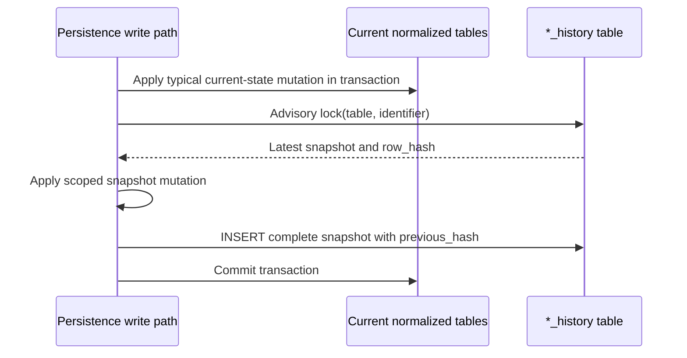
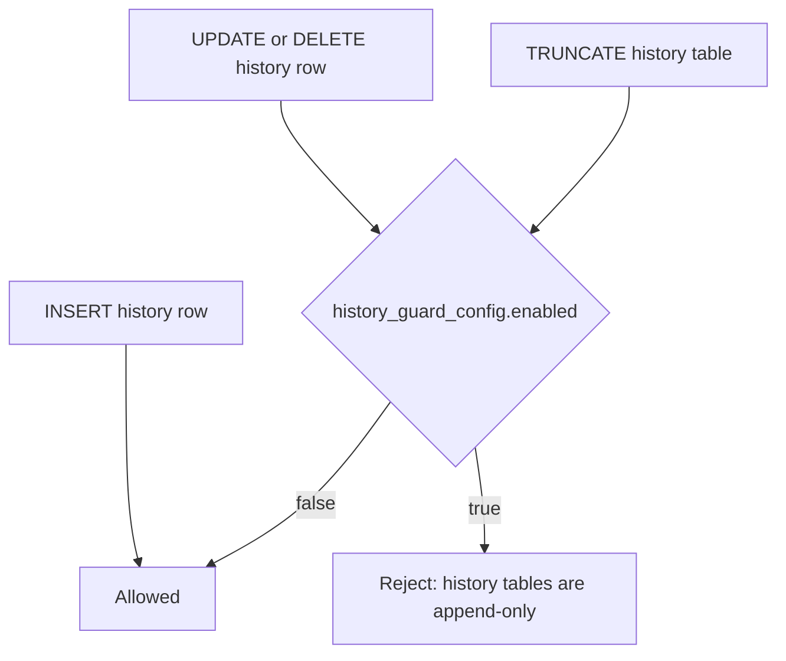
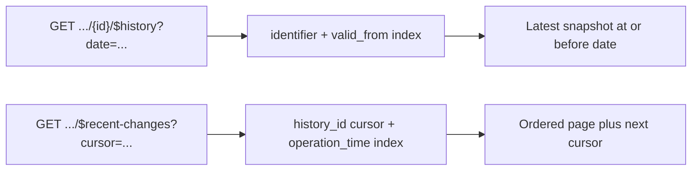

<!--
/*******************************************************************************
* Copyright (C) 2026 the Eclipse BaSyx Authors and Fraunhofer IESE
*
* Permission is hereby granted, free of charge, to any person obtaining
* a copy of this software and associated documentation files (the
* "Software"), to deal in the Software without restriction, including
* without limitation the rights to use, copy, modify, merge, publish,
* distribute, sublicense, and/or sell copies of the Software, and to
* permit persons to whom the Software is furnished to do so, subject to
* the following conditions:
*
* The above copyright notice and this permission notice shall be
* included in all copies or substantial portions of the Software.
*
* THE SOFTWARE IS PROVIDED "AS IS", WITHOUT WARRANTY OF ANY KIND,
* EXPRESS OR IMPLIED, INCLUDING BUT NOT LIMITED TO THE WARRANTIES OF
* MERCHANTABILITY, FITNESS FOR A PARTICULAR PURPOSE AND
* NONINFRINGEMENT. IN NO EVENT SHALL THE AUTHORS OR COPYRIGHT HOLDERS BE
* LIABLE FOR ANY CLAIM, DAMAGES OR OTHER LIABILITY, WHETHER IN AN ACTION
* OF CONTRACT, TORT OR OTHERWISE, ARISING FROM, OUT OF OR IN CONNECTION
* WITH THE SOFTWARE OR THE USE OR OTHER DEALINGS IN THE SOFTWARE.
*
* SPDX-License-Identifier: MIT
******************************************************************************/
-->

# AAS API v3.2 Runtime Notes

This document describes the runtime behavior added for AAS API v3.2 support. It focuses on the implementation choices that are easy to miss when reading only the OpenAPI files.

## Scope

The v3.2 OpenAPI update adds history and recent-change endpoints to repository and registry components, introduces the `Batch` value for `AssetKind`, extends administrative timestamps, and exposes composed endpoints through the AAS environment.

Implemented history, recent-change, and signing runtime areas from the v3.2 OpenAPI files:

- AAS Repository: `/shells/$recent-changes`, `/shells/{aasIdentifier}/$history`, `/shells/{aasIdentifier}/$signed`.
- Submodel Repository: `/submodels/$recent-changes`, `/submodels/{submodelIdentifier}/$history`, `/submodels/{submodelIdentifier}/$signed`.
- Submodel Repository compatibility route: `/submodels/{submodelIdentifier}/$value/$signed` is exposed by the generated Go router and existing integration coverage, although it is not listed in the current local v3.2 OpenAPI file.
- Concept Description Repository: `/concept-descriptions/$recent-changes`.
- AAS Registry and Digital Twin Registry: `/shell-descriptors/$recent-changes`.
- AAS Environment: `/serialization`, `/upload`, `/shell-descriptors/$recent-changes`, `/shells/$recent-changes`, `/shells/{aasIdentifier}/$history`, `/shells/{aasIdentifier}/$signed`, `/submodels/$recent-changes`, `/submodels/{submodelIdentifier}/$history`, `/submodels/{submodelIdentifier}/$signed`, `/submodels/{submodelIdentifier}/$value/$signed`, `/concept-descriptions/$recent-changes`, and the composed asynchronous operation result/status endpoints.
- Migration `1_1_0.sql`: adds v3.2 timestamp columns and the enum migration for `Batch`.
- Migration `1_1_1.sql`: adds history tables, indexes, and PostgreSQL mutation guards.

The Submodel Registry does not have a recent-changes endpoint in the official v3.2 profile currently used here.

The current v3.2 Submodel Repository OpenAPI also defines `PUT`, `PATCH`, and `DELETE` on `/submodels/{submodelIdentifier}/$signed`. These operations use the normal Submodel request bodies and are routed to the same runtime behavior as `PUT`, `PATCH`, and `DELETE` on `/submodels/{submodelIdentifier}`.

OpenAPI endpoints checked outside the history/recent/signing scope:

- AAS Repository, Submodel Repository, Concept Description Repository, and AAS Environment OpenAPI files contain `/serialization`.
- The AAS Environment `/serialization` and `/upload` endpoints are custom implemented and covered by integration tests.
- The Submodel Repository `/serialization` route is wired and currently returns `501 Not Implemented`.
- The standalone AAS Repository generated serialization handler is present in `pkg/aasrepositoryapi`, but it is not wired by `cmd/aasrepositoryservice`.
- The standalone Concept Description Repository OpenAPI contains `/serialization`, but the current generated Go package only contains the interface, not a registered controller/service implementation.
- AAS Repository, Submodel Repository, and AAS Environment OpenAPI files contain asynchronous operation result/status endpoints. These are separate from the new history/recent-change storage described below.

## History Model

History is stored as append-only JSON snapshots in dedicated tables:

- `aas_history`
- `submodel_history`
- `concept_description_history`
- `descriptor_history`

Each history row stores:

- `identifier`
- `change_type`: `Created`, `Updated`, or `Deleted`
- `snapshot`
- `deleted`
- `valid_from`
- `valid_to`: reserved for interval-style history, but not populated or used by the current runtime history resolution
- `operation_time`
- administrative timestamp text values for `createdFrom` and `updatedFrom` filters
- audit metadata columns such as `actor_subject`, `request_id`, `endpoint`, and `http_method`
- tamper-evidence columns: `previous_hash`, `content_hash`, and `row_hash`

On every create, update, or delete, a new immutable event row is appended. Existing history rows are not updated by the runtime. Most persistence paths append in the same database transaction as the current-table mutation. Value-only SME updates currently write the normalized value first and append history immediately afterward in a dedicated transaction.

History lookup uses:

```text
latest event where valid_from <= requested_date
ORDER BY valid_from DESC, history_id DESC
```

If the latest matching event is marked as deleted, the history endpoint returns not found. This means a deleted entity can still be resolved for dates before deletion, but not after deletion.

Each runtime-created row stores a deterministic SHA-256 hash of the canonical JSON snapshot (`content_hash`) and a per-identifier chain hash (`row_hash`) that includes the previous row hash and selected audit metadata.

### Shared Append Algorithm

The shared implementation lives in `internal/common/history`.

- `AppendVersionTx` appends a complete snapshot supplied by the persistence layer.
- `AppendMutatedVersionTx` loads the latest snapshot for the identifier, applies a scoped mutation, and appends the resulting complete snapshot.
- Both functions acquire a transaction-level PostgreSQL advisory lock derived from `<history-table>:<identifier>`.
- The lock serializes hash-chain appends for the same identifiable while allowing unrelated identifiers to proceed independently.
- Both functions append with `INSERT`; they never modify an existing history row.



This reduces reads against the normalized backend for partial updates. It does not reduce history storage: every appended row remains a full identifiable snapshot. The value-only SME path uses the same snapshot derivation but does not currently provide one transaction across its normalized update and history append.

### Per-Identifiable Write Paths

| Identifiable | Complete write path | Optimized partial write path | Missing-history fallback |
| --- | --- | --- | --- |
| AAS | Create and full replace append a complete AAS snapshot. Delete appends an `{id}` tombstone. | Submodel-reference add/remove, asset-information updates, and thumbnail changes mutate the previous AAS snapshot. Thumbnail upload reads only the stored thumbnail metadata needed for the snapshot. | Materialize the complete current AAS once. |
| Submodel | Create, full replace, and full patch append a complete Submodel snapshot. Delete appends an `{id}` tombstone. | Metadata updates replace metadata while preserving `submodelElements`. SME create/update/patch/delete, value-only changes, and attachment changes reload only the affected top-level SME root subtree and splice it into the previous snapshot. | Materialize the complete current Submodel once. |
| Concept Description | Create and replace append the supplied complete Concept Description snapshot. Delete appends an `{id}` tombstone. | No nested partial write path is required. | Not applicable. |
| AAS descriptor | Create and full replace append the stored complete AAS descriptor. Delete appends the complete descriptor marked as deleted. | Nested Submodel descriptor add/replace/remove mutates the owning AAS descriptor snapshot. | Materialize the complete current AAS descriptor once. |

Submodel elements and nested Submodel descriptors are not versioned independently. A child mutation creates a new snapshot for its owning identifiable. For SMEs, reloading the top-level subtree after the current-state mutation covers nested edits, renamed `idShort` values, and list-position changes without re-reading the entire Submodel.

### Submodel Element Lifecycle

Every SME mutation appends `Updated` to `submodel_history`. The history event type describes the owning identifiable, not the nested SME action.

| SME write | Path meaning | Snapshot mutation |
| --- | --- | --- |
| `POST /submodels/{sm}/submodel-elements` | Add a new top-level SME. | Append the new root SME to `submodelElements`. |
| `POST /submodels/{sm}/submodel-elements/{idShortPath}` | Add a new direct child below the existing SME container at `idShortPath`. | Reload and replace the affected top-level root subtree. |
| `PUT /submodels/{sm}/submodel-elements/{idShortPath}` when missing | Create the SME at the target path. Creating by list-index path is rejected. | Append a new top-level root or reload the parent root subtree. |
| `PUT /submodels/{sm}/submodel-elements/{idShortPath}` when present | Replace the target SME. | Reload and replace the affected top-level root subtree. |
| `PATCH /submodels/{sm}/submodel-elements/{idShortPath}` | Merge and update the target SME. | Reload and replace the affected top-level root subtree. |
| `PATCH /submodels/{sm}/submodel-elements/{idShortPath}/$metadata` | Update SME metadata. | Reload and replace the affected top-level root subtree. |
| `PATCH /submodels/{sm}/submodel-elements/{idShortPath}/$value` | Update the value-only representation. | Reload and replace the affected top-level root subtree after the value write. |
| `DELETE /submodels/{sm}/submodel-elements/{idShortPath}` | Delete the target SME and any nested children. | Remove the root when deleting a top-level SME; otherwise reload and replace the surviving root subtree. |
| `PUT` or `DELETE /submodels/{sm}/submodel-elements/{idShortPath}/attachment` | Change File SME attachment content. | Reload and replace the affected top-level root subtree. |

For `Measurements.temperature`, the root path is `Measurements`. For a nested update, the current `Measurements` subtree is read with deep content after the normalized mutation and replaces the old root in the previous snapshot. If a top-level `idShort` changes, the previous path locates the old root and the resolved current path loads the renamed root.

If the Submodel has no prior history row, the optimized mutation path cannot splice into a previous snapshot. It falls back to a one-time complete Submodel materialization and appends that result.

### Endpoint History Matrix

The table lists direct write endpoints. The AAS Environment exposes the corresponding component routes with the same history effects.

| Endpoint family | Verb | Owning history table | Event type |
| --- | --- | --- | --- |
| `/shells` | `POST` | `aas_history` | `Created` |
| `/shells/{aasIdentifier}` | `PUT` | `aas_history` | `Created` or `Updated` |
| `/shells/{aasIdentifier}` | `DELETE` | `aas_history` | `Deleted` |
| `/shells/{aasIdentifier}/asset-information` | `PUT` | `aas_history` | `Updated` |
| `/shells/{aasIdentifier}/asset-information/thumbnail` | `PUT`, `DELETE` | `aas_history` | `Updated` |
| `/shells/{aasIdentifier}/submodel-refs` | `POST` | `aas_history` | `Updated` |
| `/shells/{aasIdentifier}/submodel-refs/{submodelIdentifier}` | `DELETE` | `aas_history` | `Updated` |
| `/submodels` | `POST` | `submodel_history` | `Created` |
| `/submodels/{submodelIdentifier}` | `PUT` | `submodel_history` | `Created` or `Updated` |
| `/submodels/{submodelIdentifier}`, `/submodels/{submodelIdentifier}/$metadata`, `/submodels/{submodelIdentifier}/$value` | `PATCH` | `submodel_history` | `Updated` |
| `/submodels/{submodelIdentifier}` | `DELETE` | `submodel_history` | `Deleted` |
| `/submodels/{submodelIdentifier}/submodel-elements...` SME write routes listed above | `POST`, `PUT`, `PATCH`, `DELETE` | `submodel_history` | `Updated` |
| `/concept-descriptions` | `POST` | `concept_description_history` | `Created` |
| `/concept-descriptions/{cdIdentifier}` | `PUT` | `concept_description_history` | `Created` or `Updated` |
| `/concept-descriptions/{cdIdentifier}` | `DELETE` | `concept_description_history` | `Deleted` |
| `/shell-descriptors` | `POST` | `descriptor_history` | `Created` |
| `/shell-descriptors/{aasIdentifier}` | `PUT` | `descriptor_history` | `Created` or `Updated` |
| `/shell-descriptors/{aasIdentifier}` | `DELETE` | `descriptor_history` | `Deleted` |
| `/shell-descriptors/{aasIdentifier}/submodel-descriptors` | `POST` | `descriptor_history` | `Updated` |
| `/shell-descriptors/{aasIdentifier}/submodel-descriptors/{submodelIdentifier}` | `PUT`, `DELETE` | `descriptor_history` | `Updated` |
| `/bulk/shell-descriptors` | `POST`, `PUT`, `DELETE` | `descriptor_history` | One corresponding event per descriptor after asynchronous processing succeeds |

The environment import portion of AAS Environment `/upload` invokes the corresponding identifiable `PUT` paths. One upload can therefore append multiple rows across the Concept Description, Submodel, and AAS streams rather than one special upload event.

Read endpoints and operation invocation endpoints do not append history rows.

### Superpath Effects

The AAS Repository and AAS Environment expose Submodel operations below:

```text
/shells/{aasIdentifier}/submodels/{submodelIdentifier}
```

These superpath routes reuse the Submodel persistence layer. They can affect more than one identifiable when the relationship itself changes:

| Superpath write | History effect |
| --- | --- |
| `PUT /shells/{aas}/submodels/{sm}` | Append `Created` or `Updated` to `submodel_history`. If a new AAS-to-Submodel reference is added, also append `Updated` to `aas_history`. |
| `DELETE /shells/{aas}/submodels/{sm}` | Append `Deleted` to `submodel_history` and `Updated` to `aas_history` because the reference is removed. |
| `PATCH /shells/{aas}/submodels/{sm}` and representation variants | Append `Updated` to `submodel_history`. The AAS reference itself is unchanged. |
| `/shells/{aas}/submodels/{sm}/submodel-elements...` SME write routes | Append `Updated` to `submodel_history` only. The AAS reference itself is unchanged. |

Registry synchronization can append additional descriptor history entries when configured. For example, adding, replacing, or removing a nested Submodel descriptor appends `Updated` to the owning AAS descriptor stream.

### Guarded PostgreSQL Mode

Schema patch `1_1_1.sql` installs guard triggers on all four history tables. The triggers are disabled by default through the singleton `history_guard_config` row. Each history-aware DB-backed runtime service updates that switch at startup.



The guard is enabled when history is active and `history.immutability` is `postgres_guarded` or `external_anchor`. It blocks direct maintenance mutations as well as accidental application mutations. It is a database-wide switch, so services sharing one database must use consistent configuration. It is not equivalent to WORM storage: sufficiently privileged PostgreSQL operators can alter schema objects.

### Configuration Status

| Setting | Current runtime behavior |
| --- | --- |
| `history.mode: off` | Skip new snapshot writes. Existing rows remain readable. |
| `history.mode: api` | Append history snapshots. This is the default. |
| `history.mode: audit` | Append the same runtime snapshots as `api`; intended for audit-oriented deployments with explicit storage controls. |
| `history.retentionDays` | Parsed and normalized, but no cleanup or compaction job consumes it yet. |
| `history.immutability: none` | Keep PostgreSQL mutation guards disabled. |
| `history.immutability: postgres_guarded` | Enable PostgreSQL mutation guards at service startup. |
| `history.immutability: external_anchor` | Enable the same guards and reserve anchor metadata. No external anchor publisher is wired yet. |
| `history.auditIdentityMode` | Parsed and normalized, but not yet used to enrich or suppress metadata automatically. |

`AuditContext` and the anchor interfaces are extension points. Current runtime middleware does not populate `AuditContext`, and no external anchor client is invoked by the append path yet.

## Recent Changes

Recent-change endpoints read the same history tables. They are ordered by increasing `history_id`, with cursor-based pagination.



Current filters:

- `cursor`
- `limit`
- `createdFrom`
- `updatedFrom`
- AAS recent changes additionally apply asset-id filtering to non-deleted rows.
- Submodel recent changes additionally apply semantic-id filtering to non-deleted rows.

Delete rows are tombstones. For AAS and Submodel recent changes they are returned with the identifier and change metadata, but without reconstructing the deleted object. This avoids parsing tombstone payloads as full metamodel instances and avoids leaking stale metadata into filtered reads.

Concept Description recent changes return the stored snapshots directly, including `{id}` delete tombstones. Descriptor recent changes skip deleted descriptor rows in the public response.

## Migration Behavior

The v3.2 `Batch` asset kind is inserted at enum index `2`. Existing persisted values with index `2` or higher must be shifted by one:

```sql
UPDATE asset_information
SET asset_kind = asset_kind + 1
WHERE asset_kind >= 2;

UPDATE aas_descriptor
SET asset_kind = asset_kind + 1
WHERE asset_kind >= 2;
```

History storage is added by `1_1_1.sql`. The patch creates the tables, access-pattern indexes, guard switch, and mutation triggers. It does not backfill existing AAS, Submodels, Concept Descriptions, or descriptors.

After upgrade:

- State from before activation is unavailable through `$history`.
- A complete create or replace writes its supplied complete snapshot directly.
- A partial update first tries to derive the next version from the previous history snapshot.
- If an existing identifiable has no history snapshot yet, that first partial update materializes the current complete identifiable from the normalized backend and appends it. Later partial updates can derive from history.

## Security

The new endpoints are mapped as read operations in the ABAC method-rights map.

Current behavior:

- Route-level authorization applies to history and recent-change endpoints.
- Normal current-entity reads still use their established ABAC filtering paths.
- Recent-change delete tombstones only expose identifiers and change metadata for AAS and Submodel rows.

Potential edge case:

- Historical snapshots are stored as JSON and are not re-querying the normalized current tables. If access rules become stricter after a historical snapshot was written, we need to ensure historical reads do not leak information that would be filtered from a current read. The current implementation relies on endpoint authorization and component-level access checks, but per-snapshot field redaction is not implemented.

Recommended follow-up:

- Add security integration tests for denied users reading `$history` and `$recent-changes`.
- Decide whether historical snapshots should be redacted by the same field-level ABAC formulas as current reads, or whether history access is an all-or-nothing read right.

## Scalability

Yes, the database can grow much faster now. Every write creates at least one history row with a JSON snapshot. Submodel-element writes are especially growth-heavy because they snapshot the whole owning Submodel.

Safeguards already implemented:

- History is stored separately from current tables, so normal GET/list endpoints continue to read current tables.
- Recent changes use indexed metadata instead of scanning current domain tables.
- History lookup is indexed by identifier and validity range.
- Latest-snapshot derivation is indexed by identifier and descending `history_id`.
- Recent-change pagination is cursor-based and reads one extra row for next-cursor detection.
- Administrative timestamps are extracted into metadata columns for filtering instead of repeatedly querying deep JSON.
- Partial AAS and descriptor changes derive the next snapshot from the previous history row.
- SME changes reload only the affected top-level SME root subtree and splice it into the previous Submodel snapshot.
- Transaction-level advisory locks serialize appends only for the same history table and identifier.
- Guarded PostgreSQL mode blocks normal `UPDATE`, `DELETE`, and `TRUNCATE` operations on history tables when enabled.
- Delete rows are tombstones, not full copies, for AAS and Submodel deletes.

Scalability risks that remain:

- There is no retention policy yet.
- There is no compaction strategy for high-frequency updates.
- There is no table partitioning for history tables yet.
- Full snapshots duplicate unchanged data across versions.
- Large Submodels with frequent element updates can grow history very quickly.
- The first partial update for a pre-existing identifiable without history still requires a complete live-table materialization.
- JSONB snapshots are flexible but can be more expensive than narrow relational history for some queries.
- PostgreSQL guards are not equivalent to WORM storage; privileged database operators can still alter or remove them.

Recommended follow-up options:

- Add configurable retention per component, for example keep history for `N` days or `N` versions per identifier.
- Partition history tables by time or by hash of identifier when installations expect heavy write volume.
- Add monitoring metrics for history row counts and table size.
- Add optional compaction that keeps all recent rows but collapses older rows to daily or version-tagged checkpoints.
- Consider storing attachment/file changes as metadata references rather than embedding large payloads. Current file bytes are stored outside the metamodel JSON, but file element snapshots can still change frequently.

## Edge Cases

### Date At Exact Update Boundary

Runtime history is event-only. At the exact update timestamp, lookup ordering by `valid_from DESC, history_id DESC` makes the newest event win.

### Delete And Historical Reads

Dates before deletion resolve to the previous snapshot. Dates after deletion return not found.

### Recent Changes After Delete

AAS and Submodel delete rows are returned as tombstones. They include the identifier and change type. Filtered recent-change queries skip tombstones when the filter requires data that the tombstone no longer contains.

### Existing Data After Migration

Migration does not create history rows for existing data. The first complete write records the supplied snapshot. The first partial write falls back to a one-time complete current-state materialization if no prior history snapshot exists.

### AAS Environment

The AAS Environment delegates the component endpoints. Its behavior should stay aligned with the underlying repository and registry services. If a new v3.2 endpoint is added to a component, the environment OpenAPI and routing must be checked as well.

## What To Watch Before Release

The biggest implementation questions still worth reviewing are:

- Is route-level read authorization enough for historical snapshots, or do we need per-snapshot ABAC redaction?
- Do we need an implemented operator-facing retention/compaction process before enabling this in large deployments?
- Should guarded mode be disabled automatically for selected integration-test profiles, or should test cleanup keep using unguarded history settings?
- Which external anchoring provider, if any, should be offered first?
- Do consumers need an explicit baseline backfill option for upgraded installations?
- Which middleware should populate `AuditContext`, and how should `auditIdentityMode` control stored fields?
- Should descriptor recent changes include delete tombstones in the public response, or is skipping deleted descriptors acceptable for the registry profile?
- Do we want security tests for every new history/recent-change endpoint in addition to integration tests?
