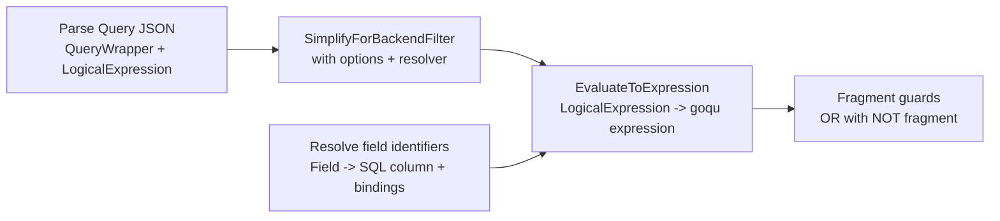

# Query Language Architecture and Flow

This document explains how logical expressions are simplified and converted into SQL. It focuses on the internal pipeline: expression trees, implicit casts, field identifiers, fragment identifiers, and filter mapping.

## High-level architecture

## Core components

- Query model
  - [internal/common/model/grammar/query.go](internal/common/model/grammar/query.go)
- Logical expression AST
  - [internal/common/model/grammar/logical_expression.go](internal/common/model/grammar/logical_expression.go)
- Simplification (partial evaluation)
  - [internal/common/model/grammar/logical_expression_simplify_backend.go](internal/common/model/grammar/logical_expression_simplify_backend.go)
- SQL conversion and fragment guards
  - [internal/common/model/grammar/logical_expression_to_sql.go](internal/common/model/grammar/logical_expression_to_sql.go)
- Field and fragment resolution
  - [internal/common/model/grammar/fieldidentifier_processing.go](internal/common/model/grammar/fieldidentifier_processing.go)
  - [internal/common/model/grammar/field_column_mapping.go](internal/common/model/grammar/field_column_mapping.go)
  - [internal/common/model/grammar/fragment_string_pattern.go](internal/common/model/grammar/fragment_string_pattern.go)

## Step-by-step details

### 1) Parse logical expressions

- The query payload is unmarshaled into QueryWrapper and LogicalExpression.
- Validation enforces operator structure (for example, $and and $or sizes, comparison operand counts).

Key types:
- QueryWrapper and Query in [internal/common/model/grammar/query.go](internal/common/model/grammar/query.go)
- LogicalExpression in [internal/common/model/grammar/logical_expression.go](internal/common/model/grammar/logical_expression.go)

### 2) Simplify the logical expression

- Simplification partially evaluates the expression using a resolver and leaves backend-only parts intact.
- A tri-state decision is produced:
  - SimplifyTrue: expression becomes a boolean true literal.
  - SimplifyFalse: expression becomes a boolean false literal.
  - SimplifyUndecided: expression still depends on backend fields.

Implicit casts:
- Simplification can insert implicit casts when field types and literal types differ.
- This is controlled by SimplifyOptions.EnableImplicitCasts.
- When disabled, mismatched comparisons remain undecided or fail validation downstream.

Key functions:
- SimplifyForBackendFilterWithOptions in [internal/common/model/grammar/logical_expression_simplify_backend.go](internal/common/model/grammar/logical_expression_simplify_backend.go)
- SimplifyForBackendFilterNoResolver in [internal/common/model/grammar/logical_expression_simplify_backend.go](internal/common/model/grammar/logical_expression_simplify_backend.go)

### 3) Resolve attributes

- Attribute values (for example, CLAIM or GLOBAL) are resolved by a caller-provided resolver.
- If an attribute cannot be resolved, it remains undecidable and is preserved for backend evaluation.
- In ABAC, attributes are resolved from claims and time globals.

Key references:
- AttributeResolver usage in [internal/common/model/grammar/logical_expression_simplify_backend.go](internal/common/model/grammar/logical_expression_simplify_backend.go)
- Claim and global resolution in [internal/common/security/abac_engine_attributes.go](internal/common/security/abac_engine_attributes.go)

### 4) Resolve field identifiers

- Field identifiers (for example, $aasdesc#specificAssetIds[].value) are parsed into tokens.
- Each token is mapped to a SQL column and optional array bindings.
- Fragment identifiers resolve to bindings only, enabling fragment guards.

Key functions:
- ResolveScalarFieldToSQL in [internal/common/model/grammar/fieldidentifier_processing.go](internal/common/model/grammar/fieldidentifier_processing.go)
- ResolveFragmentFieldToSQL in [internal/common/model/grammar/fieldidentifier_processing.go](internal/common/model/grammar/fieldidentifier_processing.go)
- ResolveAASQLFieldToSQLColumn in [internal/common/model/grammar/field_column_mapping.go](internal/common/model/grammar/field_column_mapping.go)

### 5) Build SQL expressions

- The simplified expression is converted to a goqu expression tree.
- When a ResolvedFieldPathCollector is provided, the builder can inject EXISTS or CTE structures for complex paths.
- When no collector is provided, the expression is built with direct SQL conditions and bindings.

Key functions:
- EvaluateToExpression in [internal/common/model/grammar/logical_expression_to_sql.go](internal/common/model/grammar/logical_expression_to_sql.go)
- EvaluateToExpressionWithNegatedFragments in [internal/common/model/grammar/logical_expression_to_sql.go](internal/common/model/grammar/logical_expression_to_sql.go)

### 6) Combine expressions and filters

- Logical expressions are combined explicitly via $and, $or, and $not in the expression tree.
- Filter lists can be merged per fragment by AND-ing conditions that target the same fragment.
- When multiple filters target different fragments, each fragment gets its own logical expression tree.

Key helpers:
- QueryFilter merging in [internal/common/security/authorize.go](internal/common/security/authorize.go)
- Fragment matching in [internal/common/security/abac_engine.go](internal/common/security/abac_engine.go)

## Combination formulas (detailed)

### Logical operator normalization

For a simplified expression tree, normalization follows the semantics below:

$$
\begin{aligned}
	ext{AND}([E_1,\dots,E_n]) &= E_1 \land \cdots \land E_n \\
	ext{OR}([E_1,\dots,E_n]) &= E_1 \lor \cdots \lor E_n \\
	ext{NOT}(E) &= \lnot E
\end{aligned}
$$

Short-circuit behavior during simplification:

$$
\begin{aligned}
	ext{AND}([\text{false}, \dots]) &= \text{false} \\
	ext{AND}([\text{true}, E]) &= E \\
	ext{OR}([\text{true}, \dots]) &= \text{true} \\
	ext{OR}([\text{false}, E]) &= E
\end{aligned}
$$

### Implicit casts in comparisons

When implicit casts are enabled, comparisons are normalized to compare like types:

$$
	ext{op}(\text{field}, \text{literal}_T) \Rightarrow \text{op}(\text{cast}(\text{field}, T), \text{literal}_T)
$$

This is controlled by `SimplifyOptions.EnableImplicitCasts` in
[internal/common/model/grammar/logical_expression_simplify_backend.go](internal/common/model/grammar/logical_expression_simplify_backend.go).

### Attribute resolution

Attribute references are resolved to concrete scalars via a resolver function:

$$
	ext{resolve}(\$\text{attribute}(k)) \rightarrow v \quad \text{or} \quad \varnothing
$$

If $v$ is available, the attribute node is replaced with the literal $v$ during
simplification; otherwise it remains unresolved and the expression is undecidable.

### Rule combination into QueryFilter (ABAC)

Each rule $r$ that passes gates yields a simplified formula $F_r$ and an optional
set of fragment filters $F_{r,k}$ per fragment $k$.

Combined formula across all matching rules:

$$
F_{\text{combined}} = \bigvee_{r \in R} F_r
$$

Combined fragment filters across all matching rules:

$$
F_{k,\text{combined}} = \bigvee_{r \in R} \begin{cases}
F_{r,k} & \text{if rule } r \text{ defines fragment } k \\
F_r & \text{otherwise}
\end{cases}
$$

This logic is implemented in [internal/common/security/abac_engine.go](internal/common/security/abac_engine.go).

### Rule-local filter aggregation

Within a single rule, multiple filter conditions targeting the same fragment are
ANDed with the rule formula:

$$
F_{r,k} = F_r \land C_{r,k,1} \land \cdots \land C_{r,k,m}
$$

When multiple fragments are present, each fragment gets its own $F_{r,k}$.

### QueryFilter merging with user queries

When a user query is merged into an existing QueryFilter, the condition is ANDed
into the global formula and into the fragment-specific filters:

$$
F' = F \land Q
$$

$$
F'_{k} = F_{k} \land Q_{k}
$$

This logic is implemented in [internal/common/security/authorize.go](internal/common/security/authorize.go).

## Fragment filters and guards

- Fragment filters apply conditions to a specific array fragment (for example, $aasdesc#specificAssetIds[]).
- To avoid excluding other rows, the filter is combined as:

$$
\text{combined} = \text{mainExpr} \lor \bigvee_i \lnot(\text{fragmentExpr}_i)
$$

- This guard behavior is implemented in EvaluateToExpressionWithNegatedFragments.

### When are fragment expressions negated?

- Negation is applied only for fragment filters, not for every logical expression.
- Each fragment filter produces a fragment expression based on the fragment identifier bindings.
- The guard adds NOT(fragmentExpr) terms only when a fragment identifier resolves to concrete bindings.

Binding rules and effects:
- Wildcard fragments like $aasdesc#specificAssetIds[] have no concrete bindings, so no NOT(fragmentExpr) term is added.
- Indexed fragments like $aasdesc#specificAssetIds[2] resolve to bindings (for example, position = 2) and DO add NOT(fragmentExpr).
- Fragments that encode bindings through other indices (for example, nested keys arrays) also add NOT(fragmentExpr) terms for each resolved binding.

Why this matters:
- The guard keeps unrelated rows in the result set when a fragment filter targets a specific fragment.
- If a fragment has no bindings, negation would be redundant, so it is skipped.

Implementation reference:
- EvaluateToExpressionWithNegatedFragments in [internal/common/model/grammar/logical_expression_to_sql.go](internal/common/model/grammar/logical_expression_to_sql.go)
- ResolveFragmentFieldToSQL in [internal/common/model/grammar/fieldidentifier_processing.go](internal/common/model/grammar/fieldidentifier_processing.go)

## Common pitfalls

- Invalid field identifiers are rejected during parsing or resolution.
- Field-to-field comparisons are not supported in SQL conversion.
- If an expression is undecidable, the SQL still includes backend-resolved predicates.

## Related tests

- SQL conversion tests in [internal/common/model/grammar](internal/common/model/grammar)
  - logical_expression_to_sql_*_test.go
  - logical_expression_simplify_backend.go tests
