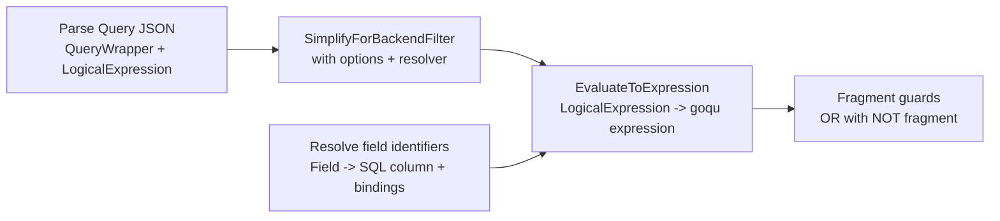

# Query Language Architecture and Flow

This document explains how logical expressions are simplified and converted into SQL. It focuses on the internal pipeline: expression trees, implicit casts, field identifiers, fragment identifiers, and filter mapping.

## Quick mental model (no background required)

- A query is a tree of logical operators (AND/OR/NOT) and comparisons (EQ/GT/etc).
- If a value is known up front (for example, a claim or a time constant), it can be simplified before SQL.
- Everything that still depends on data in the database becomes SQL.
- Fragment filters are special: they apply only to a subset of array items, so they must be guarded.

Full logical expression example (from access rules):

```json
{
  "$and": [
    { "$eq": [ { "$attribute": { "CLAIM": "role" } }, { "$strVal": "admin" } ] },
    { "$ge": [ { "$field": "$aasdesc#createdAt" }, { "$dateTimeVal": "2024-01-01T00:00:00Z" } ] }
  ]
}
```

## Glossary

- LogicalExpression: the parsed tree for $and, $or, $eq, $gt, etc.
- Attribute: a value resolved at request time (for example, a claim or time).
- Field identifier: a path like $aasdesc#specificAssetIds[].value that points to data in the DB model.
- Fragment identifier: a field identifier that ends in an array segment, used to scope filters (for example, $aasdesc#endpoints[]).
- Binding: a concrete array index constraint derived from a fragment (for example, position = 2).
- Simplify: reduce what can be decided before SQL is built.

## High-level architecture



## Core components

- Query model
  - [internal/common/model/grammar/query.go](internal/common/model/grammar/query.go)
- Logical expression AST
  - [internal/common/model/grammar/logical_expression.go](internal/common/model/grammar/logical_expression.go)
- Simplification (partial evaluation)
  - [internal/common/model/grammar/logical_expression_simplify_backend.go](internal/common/model/grammar/logical_expression_simplify_backend.go)
- SQL conversion and fragment guards
  - [internal/common/model/grammar/logical_expression_to_sql.go](internal/common/model/grammar/logical_expression_to_sql.go)
- Field and fragment resolution
  - [internal/common/model/grammar/fieldidentifier_processing.go](internal/common/model/grammar/fieldidentifier_processing.go)
  - [internal/common/model/grammar/field_column_mapping.go](internal/common/model/grammar/field_column_mapping.go)
  - [internal/common/model/grammar/fragment_string_pattern.go](internal/common/model/grammar/fragment_string_pattern.go)

## Step-by-step details

### 1) Parse logical expressions

- The query payload is unmarshaled into QueryWrapper and LogicalExpression.
- Validation enforces operator structure (for example, $and and $or sizes, comparison operand counts).

Key types:
- QueryWrapper and Query in [internal/common/model/grammar/query.go](internal/common/model/grammar/query.go)
- LogicalExpression in [internal/common/model/grammar/logical_expression.go](internal/common/model/grammar/logical_expression.go)

### 2) Simplify the logical expression

- Simplification partially evaluates the expression using a resolver and leaves backend-only parts intact.
- A tri-state decision is produced:
  - SimplifyTrue: expression becomes a boolean true literal.
  - SimplifyFalse: expression becomes a boolean false literal.
  - SimplifyUndecided: expression still depends on backend fields.

Implicit casts:
- Simplification can insert implicit casts when field types and literal types differ.
- This is controlled by SimplifyOptions.EnableImplicitCasts.
- When disabled, mismatched comparisons remain undecided or fail validation downstream.

Key functions:
- SimplifyForBackendFilterWithOptions in [internal/common/model/grammar/logical_expression_simplify_backend.go](internal/common/model/grammar/logical_expression_simplify_backend.go)
- SimplifyForBackendFilterNoResolver in [internal/common/model/grammar/logical_expression_simplify_backend.go](internal/common/model/grammar/logical_expression_simplify_backend.go)

### 3) Resolve attributes

- Attribute values (for example, CLAIM or GLOBAL) are resolved by a caller-provided resolver.
- If an attribute cannot be resolved, it remains undecidable and is preserved for backend evaluation.
- In ABAC, attributes are resolved from claims and time globals.

Key references:
- AttributeResolver usage in [internal/common/model/grammar/logical_expression_simplify_backend.go](internal/common/model/grammar/logical_expression_simplify_backend.go)
- Claim and global resolution in [internal/common/security/abac_engine_attributes.go](internal/common/security/abac_engine_attributes.go)

### 4) Resolve field identifiers

- Field identifiers (for example, $aasdesc#specificAssetIds[].value) are parsed into tokens.
- Each token is mapped to a SQL column and optional array bindings.
- Fragment identifiers resolve to bindings only, enabling fragment guards.

Key functions:
- ResolveScalarFieldToSQL in [internal/common/model/grammar/fieldidentifier_processing.go](internal/common/model/grammar/fieldidentifier_processing.go)
- ResolveFragmentFieldToSQL in [internal/common/model/grammar/fieldidentifier_processing.go](internal/common/model/grammar/fieldidentifier_processing.go)
- ResolveAASQLFieldToSQLColumn in [internal/common/model/grammar/field_column_mapping.go](internal/common/model/grammar/field_column_mapping.go)

Beginner notes:
- Think of a field identifier as a path inside a JSON-like object, but mapped to SQL columns.
- The part before # is the root type ($aasdesc, $smdesc, $sm, $sme, $bd).
- The part after # is a dotted path with optional array selectors.

Example mappings:
- $aasdesc#idShort -> aas_descriptor.id_short
- $aasdesc#specificAssetIds[].value -> specific_asset_id.value with no index binding
- $aasdesc#specificAssetIds[2].value -> specific_asset_id.value with position = 2

### 5) Build SQL expressions

- The simplified expression is converted to a goqu expression tree.
- When a ResolvedFieldPathCollector is provided, the builder can inject EXISTS or CTE structures for complex paths.
- When no collector is provided, the expression is built with direct SQL conditions and bindings.

Key functions:
- EvaluateToExpression in [internal/common/model/grammar/logical_expression_to_sql.go](internal/common/model/grammar/logical_expression_to_sql.go)
- EvaluateToExpressionWithNegatedFragments in [internal/common/model/grammar/logical_expression_to_sql.go](internal/common/model/grammar/logical_expression_to_sql.go)

### 6) Combine expressions and filters

- Logical expressions are combined explicitly via $and, $or, and $not in the expression tree.
- Filter lists can be merged per fragment by AND-ing conditions that target the same fragment.
- When multiple filters target different fragments, each fragment gets its own logical expression tree.

Key helpers:
- QueryFilter merging in [internal/common/security/authorize.go](internal/common/security/authorize.go)
- Fragment matching in [internal/common/security/abac_engine.go](internal/common/security/abac_engine.go)

## Combination formulas (detailed)

### Logical operator normalization

For a simplified expression tree, normalization follows the semantics below:

$$
\begin{aligned}
          AND([E_1,\dots,E_n]) &= E_1 \land \cdots \land E_n \\
          OR([E_1,\dots,E_n]) &= E_1 \lor \cdots \lor E_n \\
          NOT(E) &= \lnot E
\end{aligned}
$$

Short-circuit behavior during simplification:

$$
\begin{aligned}
          AND([\text{false}, \dots]) &= \text{false} \\
          AND([\text{true}, E]) &= E \\
          OR([\text{true}, \dots]) &= \text{true} \\
          OR([\text{false}, E]) &= E
\end{aligned}
$$

Example (short-circuit):

```json
{ "$and": [ { "$boolean": false }, { "$eq": [ { "$field": "$aasdesc#id" }, { "$strVal": "x" } ] } ] }
```

Simplifies to:

```json
{ "$boolean": false }
```

Example (short-circuit OR):

```json
{ "$or": [ { "$boolean": true }, { "$eq": [ { "$field": "$aasdesc#id" }, { "$strVal": "x" } ] } ] }
```

Simplifies to:

```json
{ "$boolean": true }
```

### Implicit casts in comparisons

When implicit casts are enabled, comparisons are normalized to compare like types:

$$
            op(\text{field}, \text{literal}_T) \Rightarrow op(\text{cast}(\text{field}, T), \text{literal}_T)
$$

Example:

```json
{ "$gt": [ { "$field": "$sme#value" }, { "$numVal": 10 } ] }
```

Normalized form (conceptual):

```json
{ "$gt": [{"$numCast": { "$field": "$sme#value" }}, { "$numVal": 10 } ] }
```

If the field is stored as text, an implicit cast converts it to numeric before the comparison.

This is controlled by `SimplifyOptions.EnableImplicitCasts` in
[internal/common/model/grammar/logical_expression_simplify_backend.go](internal/common/model/grammar/logical_expression_simplify_backend.go).

### Attribute resolution

Attribute references are resolved to concrete scalars via a resolver function:

$$
          resolve(\$\text{attribute}(k)) \rightarrow v \quad \text{or} \quad \varnothing
$$

Example (attribute in expression):

```json
{ "$eq": [ { "$attribute": { "CLAIM": "role" } }, { "$strVal": "admin" } ] }
```

If claims contain role=admin, this becomes:

```json
{ "$eq": [ { "$strVal": "admin" }, { "$strVal": "admin" } ] }
```

Which simplifies to:

```json
{ "$boolean": true }
```

If $v$ is available, the attribute node is replaced with the literal $v$ during
simplification; otherwise it remains unresolved and the expression is undecidable.

### Rule combination into QueryFilter (ABAC)

Each rule $r$ that passes gates yields a simplified formula $F_r$ and an optional
set of fragment filters $F_{r,k}$ per fragment $k$.

Combined formula across all matching rules:

$$
F_{\text{combined}} = \bigvee_{r \in R} F_r
$$

Combined fragment filters across all matching rules:

$$
F_{k,\text{combined}} = \bigvee_{r \in R} \begin{cases}
F_{r,k} & \text{if rule } r \text{ defines fragment } k \\
F_r & \text{otherwise}
\end{cases}
$$

This logic is implemented in [internal/common/security/abac_engine.go](internal/common/security/abac_engine.go).

Example with two rules:

Rule A: $F_A = (role = admin)$

Rule B: $F_B = (createdAt \ge 2024-01-01)$

Combined:

$$
F_{\text{combined}} = F_A \lor F_B
$$

Example (combined logical expression):

```json
{
  "$or": [
    { "$eq": [ { "$attribute": { "CLAIM": "role" } }, { "$strVal": "admin" } ] },
    { "$ge": [ { "$field": "$aasdesc#createdAt" }, { "$dateTimeVal": "2024-01-01T00:00:00Z" } ] }
  ]
}
```

### Rule-local filter aggregation

Within a single rule, multiple filter conditions targeting the same fragment are
ANDed with the rule formula:

$$
F_{r,k} = F_r \land C_{r,k,1} \land \cdots \land C_{r,k,m}
$$

When multiple fragments are present, each fragment gets its own $F_{r,k}$.

Example (same fragment twice):

$$
F_{r,k} = F_r \land (k.name = \text{"customerPartId"}) \land (k.value = \text{"X"})
$$

Example (filter list targeting the same fragment):

```json
{
  "$filters": [
    { "$fragment": "$aasdesc#specificAssetIds[]", "$condition": { "$eq": [ { "$field": "$aasdesc#specificAssetIds[].name" }, { "$strVal": "customerPartId" } ] } },
    { "$fragment": "$aasdesc#specificAssetIds[]", "$condition": { "$eq": [ { "$field": "$aasdesc#specificAssetIds[].value" }, { "$strVal": "X" } ] } }
  ]
}
```

### QueryFilter merging with user queries

When a user query is merged into an existing QueryFilter, the condition is ANDed
into the global formula and into the fragment-specific filters:

$$
F' = F \land Q
$$

$$
F'_{k} = F_{k} \land Q_{k}
$$

This logic is implemented in [internal/common/security/authorize.go](internal/common/security/authorize.go).

Example (merge):

$$
F' = (role = admin) \land (createdAt \ge 2024-01-01)
$$

Example (merged logical expression):

```json
{
  "$and": [
    { "$eq": [ { "$attribute": { "CLAIM": "role" } }, { "$strVal": "admin" } ] },
    { "$ge": [ { "$field": "$aasdesc#createdAt" }, { "$dateTimeVal": "2024-01-01T00:00:00Z" } ] }
  ]
}
```

## Fragment filters and guards

- Fragment filters apply conditions to a specific array fragment (for example, $aasdesc#specificAssetIds[]).
- To avoid excluding other rows, the filter is combined as:

$$
\text{combined} = \text{mainExpr} \lor \bigvee_i \lnot(\text{fragmentExpr}_i)
$$

Example (fragment guard with index):

```json
{
  "mainExpr": { "$eq": [ { "$field": "$aasdesc#idShort" }, { "$strVal": "motor-1" } ] },
  "fragment": "$aasdesc#specificAssetIds[2]"
}
```

Conceptual combined guard:

```text
mainExpr OR NOT(fragment(position = 2))
```

- This guard behavior is implemented in EvaluateToExpressionWithNegatedFragments.

### When are fragment expressions negated?

- Negation is applied only for fragment filters, not for every logical expression.
- Each fragment filter produces a fragment expression based on the fragment identifier bindings.
- The guard adds NOT(fragmentExpr) terms only when a fragment identifier resolves to concrete bindings.

Binding rules and effects:
- Wildcard fragments like $aasdesc#specificAssetIds[] have no concrete bindings, so no NOT(fragmentExpr) term is added.
- Indexed fragments like $aasdesc#specificAssetIds[2] resolve to bindings (for example, position = 2) and DO add NOT(fragmentExpr).
- Fragments that encode bindings through other indices (for example, nested keys arrays) also add NOT(fragmentExpr) terms for each resolved binding.

Why this matters:
- The guard keeps unrelated rows in the result set when a fragment filter targets a specific fragment.
- If a fragment has no bindings, negation would be redundant, so it is skipped.

Implementation reference:
- EvaluateToExpressionWithNegatedFragments in [internal/common/model/grammar/logical_expression_to_sql.go](internal/common/model/grammar/logical_expression_to_sql.go)
- ResolveFragmentFieldToSQL in [internal/common/model/grammar/fieldidentifier_processing.go](internal/common/model/grammar/fieldidentifier_processing.go)

Beginner notes:
- A fragment identifies an array position, not a single scalar value.
- The guard makes sure a filter only applies to the intended array element.

## Common pitfalls

- Invalid field identifiers are rejected during parsing or resolution.
- Field-to-field comparisons are not supported in SQL conversion.
- If an expression is undecidable, the SQL still includes backend-resolved predicates.

## Example (end-to-end without endpoint context)

Query condition:

```json
{
  "$and": [
    { "$eq": [ { "$field": "$aasdesc#idShort" }, { "$strVal": "motor-1" } ] },
    { "$gt": [ { "$field": "$aasdesc#createdAt" }, { "$dateTimeVal": "2024-01-01T00:00:00Z" } ] }
  ]
}
```

What happens:
- Parse into a LogicalExpression tree.
- Simplify: no attributes here, so it stays undecided and unchanged.
- Resolve fields to columns.
- Build SQL: AND of two comparisons on those columns.

If you add a fragment filter (example fragment: $aasdesc#specificAssetIds[2]):
- Resolve fragment to bindings (position = 2).
- Build fragmentExpr from bindings.
- Final WHERE becomes: mainExpr OR NOT(fragmentExpr).

## Related tests

- SQL conversion tests in [internal/common/model/grammar](internal/common/model/grammar)
  - logical_expression_to_sql_*_test.go
  - logical_expression_simplify_backend.go tests
