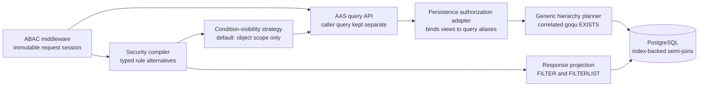

# AAS Hierarchy Query Authorization Plan

Status: proposed architecture; not implemented yet.

## Security invariant

An AAS query may evaluate a referenced Submodel or Submodel Element only when the requesting principal is allowed to read the data being evaluated. A reference from an allowed AAS does not grant access to the referenced resource.

The query must behave as if unauthorized related resources do not exist. This applies to every operator, including equality, inequality, prefix, regular expression, numeric comparison, casts, negation, and `$match`.

The AAS-to-Submodel reference is a structural correlation edge, not an additional authorization target for hierarchy evaluation. No implicit permission check is added for `$aas#submodels[]`. If an AAS access-rule formula explicitly uses that fragment, it remains part of the normal AAS authorization decision; AAS fragment filters also continue to control reconstruction of the returned AAS. Neither is automatically converted into a third edge permission.

An access-rule `FILTER` or `FILTERLIST` is a response-projection rule. It never reduces which fields may be evaluated by a caller condition. Related-resource condition visibility is determined by the relevant READ rule's ACL gates, object target, and main `FORMULA` or `USEFORMULA`. An `OBJECTS: FRAGMENT` entry is different: it is an authorization target and therefore limits the condition target covered by that grant.

## Recommended policy semantics

The effective result is the intersection of independently evaluated permissions:

1. The outer AAS must satisfy the effective AAS READ policy.
2. A `$sm` predicate may evaluate a referenced Submodel only when it satisfies an effective Submodel READ condition-access view.
3. A `$sme` predicate may evaluate a referenced Submodel Element only when it satisfies an effective SME READ condition-access view. That view is derived from Submodel READ grants and explicit Referable or Fragment object grants, but not from access-rule fragment filters.

These permissions do not have to be declared in one access rule. Separate rules are preferable when AAS and Submodel access have different conditions. A rule containing both `$aas` and `$sm` objects can express the same grant when both objects intentionally share rights, attributes, and formulas; the object entries remain alternative targets and must still be evaluated once for each resource scope.

A Submodel READ grant makes that Submodel and its SMEs eligible for caller conditions whenever the rule's main formula and object constraint hold. Its `FILTER` or `FILTERLIST` still controls reconstruction if a Submodel representation is returned, but does not alter condition eligibility. A Referable object grant makes the addressed SME eligible without granting general condition access to its parent Submodel. A Fragment object grant makes only the addressed fragment eligible, together with the minimum row identity required to correlate it.

A Referable grant is exact by default. Descendants are included only when the source policy construct has explicitly defined subtree semantics and is normalized to a subtree constraint during policy compilation. A string-prefix match on `idShortPath` must never create subtree access implicitly.

Conceptually:

```text
returned AAS
  = AAS allowed by AAS READ
  AND caller hierarchy predicate matches at least one related row
      admitted by the required Submodel or SME condition-access view
```

## Intended behavior examples

These examples define the intended security boundary for `/query/shells` and can be used as the PR discussion and acceptance matrix.

| Alice can read | AAS-A references | Permitted hierarchy conditions |
| --- | --- | --- |
| AAS-A only | Submodel-B | `$aas` only. Alice must not use Submodel-B or any of its SMEs as a condition. |
| AAS-A and Submodel-B | Submodel-B | `$sm` conditions on Submodel-B and `$sme` conditions on its complete element view. |
| AAS-A and Submodel-B with a fragment filter | Submodel-B | The same `$sm` and `$sme` conditions as unfiltered Submodel READ. The fragment filter affects only reconstruction of a returned Submodel representation. |
| AAS-A and SME-A only | Submodel-B containing SME-A | `$sme` conditions on SME-A only. Alice must not use Submodel-B as a condition or observe other SMEs in it. |
| AAS-A and an `OBJECTS: FRAGMENT` grant for SME-A | Submodel-B containing SME-A | `$sme` conditions only on that authorized Fragment. Other fields of SME-A remain unavailable as conditions. |
| AAS-A and a parent SME subtree | Submodel-B containing that subtree | `$sme` conditions on the visible parent SME and its descendants only. |
| SME-A only | Submodel-B containing SME-A | No AAS may be returned, because the outer AAS is not readable. |

For the SME-A-only case, the query planner may join through Submodel-B to prove ownership and the AAS reference, but this join must not grant or evaluate general Submodel-B data. The SME authorization guard and caller predicate must apply to the same SME row.

Further rules that must hold:

- An allowed AAS reference never grants implicit Submodel access.
- Access to an SME in an unrelated Submodel must not make AAS-A match.
- If AAS-A references multiple Submodels, a permission check and a caller predicate must match the same referenced Submodel. `$match` also requires the same SME row where applicable.
- Identically named SMEs in different Submodels remain separate authorization targets.
- `OR`, `NOT`, inequality, prefix, regex, numeric comparisons, and casts must operate over the authorized view only. A denied row must not change an AAS result, trigger a cast error, affect pagination, or affect a count/cursor.
- AAS access and related-resource access may be granted by separate rules. They do not have to occur in one rule.
- A Submodel READ grant makes all of its SMEs eligible for caller conditions even when its response contains fragment filters. A policy that must prevent an SME or field from influencing conditions must narrow the authorized object scope, for example through exact Referable or Fragment object grants. A response filter is not a substitute for that authorization scope.
- Access-rule `FILTER` and `FILTERLIST` conditions stay on the existing response-reconstruction path and never participate in hierarchy selection under the default strategy.
- Authorization formulas are trusted policy expressions. Caller predicates are untrusted selection expressions. Their provenance must remain separate until SQL planning so condition-access guards are applied only at the intended boundary and never recursively to the authorization formula that defines the guard.
- A valid denied related-resource view is represented by a constant-false guard. It is not a compilation error and participates normally in `OR` and `NOT` semantics.

## Required architecture changes

### 1. Preserve one authorization snapshot for the request

The ABAC middleware should place an immutable request-scoped authorization session in the context. It should contain the active compiled access-model snapshot, an immutable claim set, trusted globals resolved once for the request, simplification options, and the policy identifier used for the initial decision.

All related-resource evaluations must use this same session. Reading the active model from the provider a second time could combine an AAS decision from one policy version with a Submodel decision from another version.

Relevant components:

- `internal/common/security/authorize.go`
- `internal/common/security/abac_engine.go`

### 2. Precompile semantic rule indexes at policy activation

Extend access-model materialization with immutable rule indexes keyed by right and semantic resource scope. Object parsing, reusable-definition expansion, route-to-scope translation, and normalization of Identifiable, Referable, Fragment, exact-path, and explicit-subtree constraints must happen once when the policy is loaded or activated, not for every query. The compiled rule representation must keep the main rule formula and object constraint separate from its response-projection filters.

Known route objects such as a global wildcard or Submodel collection route should be translated through one explicit mapping table. A route grant that cannot be translated without ambiguity must be marked unusable for hierarchy authorization during policy validation; it must never be silently treated as a grant for another resource type. An AAS route grant must not become an implicit Submodel grant.

The precompiled index contains policy structure only. It must not cache request claims or request-dependent simplification results. `FILTER` and `FILTERLIST` remain available to the existing reconstruction pipeline but are not inputs to the default condition-access decision.

### 3. Compile READ condition-access views

Add a security-layer operation that compiles the effective READ condition-access view for `$sm` or `$sme` from the request authorization session and the precompiled semantic rule index. It should reuse the existing gates for rights, attributes, objects, and the main rule formula without depending on the incoming `/query/shells` route.

The result should preserve complete permitting alternatives:

- an explicit `unrestricted`, `restricted`, or `denied` decision;
- for each permitting rule, its simplified main formula and normalized object constraint;
- exact Referable and Fragment grants, plus only explicitly defined subtree grants;
- policy and matched-rule metadata for auditing.

For a condition target, eligibility is conceptually:

```text
conditionEligible(target, row)
  = OR over permitting rule alternatives (
      rule main formula(row)
      AND rule object constraint(row)
      AND rule object covers target
    )
```

An Identifiable Submodel grant covers the Submodel and its SME condition targets. A Referable grant covers its exact SME by default. A Fragment object grant covers its exact fragment. Access-rule `FILTER` and `FILTERLIST` predicates do not appear in this expression.

Keep condition visibility behind a small security-layer strategy interface. The initial `ObjectScopeOnly` strategy implements the expression above. A future `ObjectScopeAndProjection` strategy may additionally intersect condition targets with response-projection filters if the specification or deployment policy requires that behavior. The strategy consumes the compiled rule alternative and requested semantic target and returns a provider-agnostic condition-access decision; the API and SQL planner must not change when the strategy changes. Do not expose the alternative strategy as a runtime option until its semantics and compatibility requirements are defined.

A denied view is a successfully compiled view whose eligibility expression is constant false. It is not an error. Missing session state, invalid policy data, or an ambiguous required route translation is a compilation failure and rejects the request before SQL execution.

### 4. Preserve caller and policy expression provenance

Do not merge the caller query irreversibly into the middleware's AAS `QueryFilter` before hierarchy planning. The API should build a typed authorized-query input containing separate values for:

- the effective outer AAS policy view produced by middleware;
- the original caller query;
- the compiled Submodel condition-access view when `$sm` is used;
- the compiled SME condition-access view when `$sme` is used.

The request context should carry only the immutable authorization session and existing request metadata. The typed authorized-query input should be passed explicitly to persistence. If compatibility requires temporary context transport, it must be one typed value that still preserves the four components above.

Authorization formulas are evaluated as trusted policy expressions against raw resource attributes. Condition-access guards are applied to caller expressions, not recursively to the policy formula defining the guard. Response-projection filters remain a separate typed component used only by reconstruction.

### 5. Determine the required related scopes before persistence

The AAS query API should inspect the validated query roots:

- no `$sm` or `$sme`: keep the existing AAS-only authorization path;
- `$sm`: compile the effective Submodel READ condition-access view once;
- `$sme`: compile the effective SME READ condition-access view once. It includes qualifying Submodel READ alternatives, exact Referable grants, Fragment object grants, and explicit subtree grants, while preserving the owning Submodel correlation without requiring general Submodel visibility;
- both roots: compile both views. A shared `$match` containing `$sm` and `$sme` requires both applicable views on the same referenced Submodel scope.

When ABAC is enabled and a required view cannot be compiled, fail closed before executing SQL. A valid denied view is passed to the planner as constant false so `OR` and `NOT` retain authorized-view semantics. Until related-scope enforcement is implemented, the safe transitional behavior is to reject hierarchy predicates under ABAC while continuing to allow them when ABAC is disabled.

Relevant components:

- `internal/aasrepository/api/api_asset_administration_shell_repository_api_service.go`
- `internal/common/model/grammar/query_field_roots.go`

### 6. Inject condition-access guards into hierarchy planning

Keep the grammar package independent from the security package. A small adapter in the AAS persistence layer should bind the security condition-access view to the aliases and semantic targets produced by the hierarchy planner. The planner should consume a provider-agnostic guard interface or typed callback; it should not know about access rules, claims, fragment filters, visibility strategies, or policy providers.

For every caller condition, the adapter must determine whether its semantic target is condition-authorized for the exact candidate row. The default strategy bases this decision only on the applicable READ alternatives' ACL gates, object constraints, and main formulas. It deliberately ignores access-rule fragment filters. For broad Submodel or Referable grants, one guard can be shared across all covered fields; exact Fragment object grants remain target-specific.

Keep ordinary equality, range, identifier, and path operands on their raw typed columns. Do not wrap every caller field or complete caller predicate in a generic `CASE`, because doing so can make otherwise indexable predicates non-sargable. Place the condition-access guard as a normal predicate in the same correlated scope as the caller predicate and structurally outside caller negation.

PostgreSQL does not guarantee the evaluation order of `WHERE` terms. Therefore, every cast or conversion that can fail must be intrinsically safe even if PostgreSQL evaluates it before the condition-access guard. Validate the source representation inside a narrowly scoped `CASE` before casting and return SQL `NULL` for invalid input. Apply this only to unsafe casts, date extraction, and equivalent operations; do not hide raw relationship, identifier, path, or already typed value columns behind the safety expression.

The Submodel condition-access view must be evaluated inside the same correlated `EXISTS` as the caller's `$sm` predicate:

```sql
EXISTS (
  SELECT 1
  FROM referenced_submodel
  WHERE referenced_submodel belongs to outer_aas
    AND submodel_read_condition_access(referenced_submodel)
    AND caller_submodel_predicate(referenced_submodel)
)
```

Here `submodel_read_condition_access` applies the relevant main rule formula and object constraint, but not its response filter. For `$sme`, the corresponding condition-access guard and caller predicate must constrain the same referenced Submodel and SME rows. Two independent `EXISTS` clauses are insufficient because one could authorize a different row from the row containing the protected value. Logical rewriting for `NOT` must keep authorization outside the negated caller expression so an unauthorized row cannot become a positive match.

Authorization expressions must remain structured goqu expressions throughout planning. They must not be rendered and concatenated as SQL text.

Relevant components:

- `internal/common/model/grammar/logical_expression_to_sql.go`
- `internal/aasrepository/persistence`

### 7. Preserve query correlation semantics

Authorization guards must be added to every hierarchy scope produced by the planner:

- separate predicates outside `$match` may use separate authorized `EXISTS` scopes;
- predicates grouped by `$match` must share one authorized related-resource scope;
- negation must operate on the authorized view, so denied rows cannot affect its result;
- each condition-target guard must remain bound to the exact Submodel, array element, or SME instance whose value is evaluated;
- policy formulas remain outside caller-condition wrapping while their result stays associated with the rule alternative they authorize;
- response-projection filters must not be inserted into any hierarchy selection scope by the default condition-visibility strategy.

## Performance and scalability requirements

The authorization design must add predicates to the database query, not create a second per-resource authorization workflow. A request over millions of rows must still execute as one set-oriented, parameterized SQL statement.

### Policy-side performance

- Materialize and validate semantic object constraints and route mappings once per policy activation.
- Index compiled rules in memory by semantic scope and right so a request scans only relevant READ rules.
- Activate a compiled policy snapshot atomically on each cluster node only after full validation. In-flight requests retain their pinned immutable snapshot; version-keyed compiled snapshots must use bounded retention rather than an unbounded process cache.
- Resolve claims and trusted globals once per request and simplify each relevant rule once per required scope.
- Compile each required condition-access view once and reuse it across all matching hierarchy nodes.
- Deduplicate equivalent rule alternatives and condition-access guards. Generated SQL size and planning work must grow linearly with the caller AST plus relevant rule alternatives; avoid cross products between rules and predicates.
- Under `ObjectScopeOnly`, hoist and reuse the broad Submodel or Referable condition-access guard for all condition fields it covers. Do not emit response-filter predicates or a separate authorization expression for every field.
- Canonicalize alternative and parameter ordering so equivalent policy/query shapes produce stable SQL suitable for PostgreSQL and driver statement-plan reuse.
- Encode large sets of exact identifiers as parameterized set membership, such as an array parameter, rather than emitting one SQL `OR` term per identifier.
- Bound the number and complexity of related-scope alternatives accepted from a policy. Reject an over-budget policy during validation, rather than allowing a single request to generate unbounded SQL or planner work.

### Database-side performance

- Use correlated `EXISTS` expressions that PostgreSQL can execute as index-backed semi-joins. Do not enumerate authorized resource IDs in Go, issue one authorization query per AAS, or create an N+1 query path.
- Keep equality correlation on raw indexed columns. Do not cast or wrap `aas_id`, reference IDs, `submodel_identifier`, `submodel_id`, or `idshort_path` in functions.
- Start each hierarchy scope from the most selective available relationship and path predicates, and join only tables required by the caller predicate or its condition-access view.
- Apply authorization and caller predicates before pagination. A denied matching row must not consume a page slot or alter the next cursor.
- Avoid broad materialized CTEs of all readable Submodels or SMEs. Keep subqueries decorrelatable and allow PostgreSQL to choose join order. Use `CASE` only inside casts or conversions that require total, error-free evaluation, not as a general authorization wrapper.
- Reuse the existing indexes for `aas_submodel_reference(aas_id)`, reverse reference-key lookup, unique `submodel_identifier`, and `submodel_element(submodel_id, idshort_path, id)`. Confirm the final SQL with representative `EXPLAIN (ANALYZE, BUFFERS)` plans. Any missing index must be added through a versioned database patch, never by changing `database/base.sql`, and queryable columns must not be added to payload tables.
- Keep expensive unbounded regex or cast-heavy scans subject to the service's query-complexity and database statement-timeout controls. Authorization must not make those operations less bounded.

### Selectivity and skew requirements

Millions of rows do not by themselves require a full scan. Performance depends on whether PostgreSQL can start from a selective relationship, path, or value predicate and on how many rows the requested result genuinely contains.

| Data or query shape | Expected plan requirement |
| --- | --- |
| Globally unique or rare value | Use a selective value index when the workload requires global value lookup; otherwise an exact Submodel and `idshort_path` must narrow the candidates before the value check. |
| Value present in approximately 99% of rows | Permit PostgreSQL to choose an outer-driven, bitmap, or sequential plan. A low-selectivity value index must not be assumed to make this query cheap. |
| Rare complement of a common value | Maintain accurate most-common-value and histogram statistics so PostgreSQL can distinguish the rare and common parameter cases. |
| No matching value | Treat as a worst-case candidate scan and enforce the statement-timeout and query-complexity budget. |
| `NOT`, broad regex, deep pagination, or total count | Expect potentially large scans; benchmark these separately from selective first-page queries. |

The typed `property_element` value columns currently do not have general-purpose secondary indexes. The existing `(submodel_id, idshort_path, id)` index makes path-constrained lookup efficient after the Submodel is known, but it does not guarantee an efficient global search for a rare value across all Submodels. Add value indexes only from measured query patterns: broad indexes on low-cardinality values such as booleans can add write and storage cost without improving reads.

Keep statistics current after large imports and policy-relevant data changes. Increase per-column statistics targets through a versioned database patch when representative plans show that default histograms or most-common-value lists do not capture important skew.

Parameterized SQL must be tested with both rare and common values. PostgreSQL or the database driver may reuse a generic prepared plan whose average selectivity is unsuitable for a highly skewed parameter. Verify custom-versus-generic plan behavior for the deployed driver and statement-cache configuration; do not assume that one cached plan is optimal for both the unique-value and 99%-common cases.

Keyset pagination bounds response materialization but cannot make an intrinsically broad predicate or exact total count constant-time. Performance acceptance must therefore distinguish first-page latency, deep-page latency, no-match latency, and full-count work.

### Architecture boundary



Only the security compiler interprets access rules. The condition-visibility strategy decides which authorized object targets may participate in caller conditions; the default strategy ignores response projections. The existing response-reconstruction path applies `FILTER` and `FILTERLIST` independently. Only the hierarchy planner owns correlation and SQL shape. The persistence adapter is the narrow boundary that converts condition-access decisions into alias-bound guards. This keeps policy semantics testable without a database and SQL correlation testable without an ABAC provider.

## Test plan

Add focused security-compiler unit tests for:

- policy-activation indexing by right and semantic resource scope;
- preservation of each rule's main formula and object constraint as one condition-access alternative, with its response filters stored separately;
- unrestricted Submodel, exact Referable, exact Fragment object, explicit subtree, and denied condition-access views;
- proof that `FILTER` and `FILTERLIST` do not alter the default condition-access view and remain available to response reconstruction;
- a substitute condition-visibility strategy that can intersect condition access with response projections without changing the compiler's callers or the SQL planner contract;
- exact Referable behavior by default and subtree behavior only after explicit normalization;
- route translation, including rejection of ambiguous translations and prevention of AAS-to-Submodel grant inference;
- constant-false denied views versus policy/session compilation failures;
- immutable request snapshots and request-dependent simplification without cross-request caching;
- caller-versus-policy expression provenance, including prevention of recursive condition-access guards.

Add SQL-planner unit tests for:

- direct, indexable column predicates for identifiers, paths, equality, and range conditions;
- intrinsically safe cast and date expressions without wrapping unrelated indexed operands;
- preservation of same-Submodel and same-SME correlation;
- shared scopes for `$match` and separate scopes for independent predicates;
- authorization placement outside caller negation and denied-view behavior for `OR`, `NOT`, and null/existence-style predicates;
- reuse of equivalent condition-access expressions without multiplying rule alternatives by caller predicates;
- structured goqu generation with bound parameters and no rendered policy SQL fragments.

Add ABAC integration coverage with an allowed AAS referencing both allowed and denied Submodels. Verify that denied data never changes the returned AAS set for:

- equality and inequality;
- starts-with and regular-expression predicates;
- numeric comparisons, casts, and date extraction, including malformed values in denied fields;
- `$match` and non-`$match` combinations;
- negated hierarchy predicates;
- a Submodel READ grant whose fragment filter hides an SME field, proving that the field may still satisfy a hierarchy condition while the filter retains its normal reconstruction behavior;
- an allowed Submodel with an SME excluded by object scope rather than a response filter;
- an allowed AAS with one explicitly allowed SME but no general parent-Submodel access;
- exact Referable, exact Fragment, and explicit-subtree grants;
- multiple referenced Submodels where authorization and the caller predicate match different rows;
- a policy activation during a request, proving one policy snapshot is used;
- missing or untranslatable related-resource authorization, proving fail-closed behavior;
- pagination, count, and cursor stability in the presence of denied matching rows;
- an AAS-to-Submodel reference with no independent edge permission, proving that no implicit `$aas#submodels[]` authorization check is introduced while an explicitly configured AAS rule condition or reconstruction filter on that fragment still has its normal effect.

Positive cases must show that an AAS is returned only when the same referenced row is both readable and matches the caller predicate. Response bodies and status behavior must not reveal whether a denied related resource exists.

Add performance regression coverage using representative high-cardinality data and policy sizes:

- assert that one hierarchy request produces one parameterized database statement and no per-AAS or per-related-resource queries;
- verify that generated SQL size and authorization compilation work grow linearly with the caller AST plus relevant rule alternatives;
- compare `EXPLAIN (ANALYZE, BUFFERS)` plans for selective `$sm`, `$sme`, and `$match` cases and require index-backed joins or semi-joins without broad authorization materialization;
- exercise unique/rare, evenly distributed, approximately 99%-common, rare-complement, and no-match property values;
- measure first-page, deep-page, negated, regex, and total-count cases independently;
- verify most-common-value statistics and compare custom and generic prepared plans with both rare and common parameters;
- prove that authorization and conversion-safety expressions do not prevent index conditions or predicate pushdown on relationship, identifier, path, and typed value columns;
- measure warm-policy request latency separately from policy-activation compilation, and record planning time, execution time, rows visited, and buffer reads;
- run concurrent requests against one activated policy snapshot to validate immutability and the absence of shared request-state mutation.

## Implementation order

1. Add the fail-closed transitional rejection for hierarchy predicates while ABAC is enabled.
2. Define the semantic policy intermediate representation, validation rules, route mapping, and immutable indexes built at policy activation. Store main rule authorization and response-projection filters as distinct typed components.
3. Define and store the immutable request authorization session.
4. Implement the Submodel and SME READ condition-access compiler plus the `ObjectScopeOnly` condition-visibility strategy, with denied as a constant-false view and invalid policy/session state as an error.
5. Replace irreversible caller-query merging for this path with the typed authorized-query input that preserves expression provenance.
6. Add the persistence authorization adapter and guarded related-resource operands, then bind them inside the planner's correlated goqu `EXISTS` scopes.
7. Add security-compiler and SQL-planner unit tests, followed by the complete ABAC integration matrix.
8. Benchmark representative large datasets and rule sets, inspect query plans, and add versioned index patches only where measurements demonstrate a need.
9. Remove the transitional rejection only after security, integration, and performance acceptance checks pass.

## Acceptance criteria

- AAS authorization alone can never make denied Submodel or SME data observable through a query predicate.
- `$aas#submodels[]` remains a structural correlation edge: no third implicit permission is required, while explicit AAS policy conditions and reconstruction filters on that fragment retain their normal behavior.
- Policies can grant AAS and Submodel/SME access in separate rules.
- Under the default strategy, access-rule `FILTER` and `FILTERLIST` conditions never reduce the fields available to caller conditions and retain exactly their existing response-reconstruction behavior.
- Related-resource condition access is determined by the applicable READ rule's ACL gates, object target, and main formula. Exact Referable or Fragment object grants do not widen into subtree access.
- The condition-visibility strategy can later be replaced with one that intersects response projections without changing the API, persistence adapter, or planner contracts.
- All related checks use the same principal, trusted globals, simplification options, and active policy snapshot.
- Caller predicates, trusted policy formulas, and response-projection filters remain structurally separate, and condition-access guards are never applied recursively to the formulas that define them.
- A valid denied view compiles to constant false. Missing session state, invalid policy data, and ambiguous required route translation reject the request before SQL execution.
- A malformed value in an unauthorized related resource cannot produce a cast, regex, or date-processing error and cannot affect results, counts, pagination, or cursors.
- Every authorization alternative and caller predicate is correlated to the same referenced Submodel and, when applicable, the same SME row.
- A hierarchy request executes as one set-oriented, parameterized SQL statement with no N+1 authorization path or application-side enumeration of authorized resource IDs.
- SQL generation and authorization planning grow linearly with the caller AST plus relevant rule alternatives, and representative high-cardinality query plans use the intended relationship, identifier, and SME-path indexes.
- Authorization guards leave ordinary relationship, identifier, path, equality, and range operands available as direct PostgreSQL index conditions; only operations that can fail use narrowly scoped safety expressions.
- Performance validation covers rare, approximately 99%-common, rare-complement, and no-match values and verifies both custom and generic prepared-plan behavior.
- First-page, deep-page, negated, regex, and total-count cases have separate documented performance budgets and fail safely through complexity limits or statement timeouts when those budgets are exceeded.
- The grammar and SQL planner remain authorization-provider agnostic.
- All database expressions use goqu with bound parameters; no policy expression is injected through raw SQL string composition.

## Specification reference

The design follows the resource separation and least-privilege intent of the [IDTA AAS Specification Part 4: Security](https://industrialdigitaltwin.org/en/wp-content/uploads/sites/2/2025/06/IDTA-01004-3-0-2_AAS-Specification_Part4_Security.pdf). The specification defines authorization targets and object forms for Identifiables, Referables, and Fragments and describes an access-rule `FILTER` as restricting returned objects. The precise interaction between response filters and client query conditions is not stated normatively, so this plan defines BaSyx's default as projection-only and isolates that choice behind the condition-visibility strategy.
