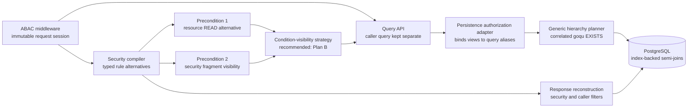

# Security-Filtered Query Conditions and Cross-Resource Authorization Plan

Status: proposed architecture; not implemented yet. Plan B below is recommended.

## Scope: two precondition points

This plan addresses two related but independent places where security must constrain a caller-controlled query condition:

1. **Cross-resource precondition:** `/query/shells` may evaluate `$sm` or `$sme` only on referenced Submodels or Submodel Elements admitted by their own READ rules. Read access to the outer AAS does not grant access to referenced data.
2. **Security-fragment precondition:** an access-rule `FILTER` or `FILTERLIST` may make a fragment unavailable to a caller's query `$condition`, even though the rule's trusted main `FORMULA` was allowed to inspect the raw fragment.

The first point was the original scope of this plan. The second point generalizes the same condition-visibility boundary to security fragment filters and potentially to every query-language endpoint.

The AAS-to-Submodel reference remains a structural correlation edge, not an additional authorization target. No implicit permission check is added for `$aas#submodels[]`. An explicit AAS rule formula or fragment filter on that fragment retains its configured effect, but the reference itself grants no Submodel permission.

## Terminology and ordering invariant

- **Grant predicate:** the trusted ACL, object target, and main `FORMULA` or `USEFORMULA` of an access rule.
- **Security fragment filter:** `FILTER` or `FILTERLIST` declared by an access rule.
- **Caller condition:** any client-controlled predicate used to select result membership, including a query `$condition` and specialized parameters lowered into a condition, such as DTR `assetIds`.
- **Caller response filter:** a client-supplied query `$filters` entry.
- **Condition-visible view:** the rows and fields that are permitted to influence a caller condition.

"Preconditional security filtering" never means evaluating a security filter condition against an already filtered object. The security filter's own `CONDITION` or `USEFORMULA` is trusted policy and is evaluated against the raw candidate row. Under the recommended plan, the grant predicate is also evaluated against raw authorized data. Only then is the security-filtered condition-visible view constructed for the caller condition.

"Preconditional" defines logical security semantics, not physical SQL evaluation order. Plan B must compile fragment visibility into target-specific authorization guards combined with the caller predicate in the same correlated SQL scope. It must not materialize a filtered JSON document or resource representation before evaluating the caller condition. PostgreSQL may reorder total boolean predicates while preserving the required result; correctness must therefore come from the expression structure rather than an assumed execution sequence.

Caller response filters remain post-condition projections. A caller cannot change condition visibility by adding or removing `$filters`.

## Design alternatives

### Plan A: make all security fragment filters preconditional

Under this global ordering, security fragment filters affect every subsequent data-dependent condition, including the access rule's own main formula and caller conditions on query endpoints:

```text
ACL, right, and object gates
  -> evaluate security FILTER conditions on raw candidates
  -> construct security-filtered view
  -> evaluate main access-rule FORMULA on that view
  -> evaluate caller condition, when present
  -> return filtered representation
```

This is the strongest interpretation, but it changes ordinary GET and list authorization as well as query behavior. It also introduces self-dependency when a rule's main formula reads a fragment removed by the same rule's filter. Missing operands under `NOT`, inequality, or existence tests can accidentally turn a hidden value into a permitting result unless the policy evaluator uses fail-closed undefined semantics. A rule alternative that requires any hidden operand must therefore be false even when that operand occurs below negation.

Plan A requires a new evaluation model for main policy formulas, changes existing policy behavior, and can require derived-table or multi-phase SQL that is harder to optimize. It is not recommended as the default.

### Plan B: make security fragment filters preconditional only for query conditions

Under this ordering, grant predicates keep their current raw-resource semantics. On every query-language endpoint, only access-rule security filters constrain the caller condition:

```text
evaluate ACL, object target, and main FORMULA on raw data
  -> build condition-visible view from matched security FILTER/FILTERLIST rules
  -> evaluate caller $condition on that view
  -> apply security and caller response projections
```

Non-query GET, list, mutation, and execution behavior remains unchanged. Caller `$filters` also remain response-only. This closes the result-membership oracle in which a hidden field can select an otherwise visible parent resource, without making trusted policy formulas self-denying.

Plan B must be applied consistently to every endpoint accepting the common query language, including AAS, Submodel, Concept Description, and registry query endpoints. It must also cover specialized query-like endpoints that lower caller parameters into the same grammar or SQL selection predicates, including DTR `assetIds` lookup and descriptor listing. Applying it only to `/query/shells`, or only to routes literally named `/query`, would leave the same class of inference available elsewhere.

### Plan C: add an explicit policy scope for fragment filters

A schema extension could let a policy declare whether a security fragment filter applies to `RESPONSE`, `QUERY_CONDITION`, or `BOTH`. This gives the cleanest migration control but is not currently part of the standardized access-rule shape. It also makes confidentiality depend on policy authors selecting the secure scope correctly.

If introduced, the scope must be compiled at policy activation and must not be selected by the caller. New policies should default to `BOTH`; legacy response-only behavior should require an explicit compatibility mode with a removal plan.

### Plan D: reject conditions that may reference filtered fragments

As a simpler fail-closed transition, a query can be rejected when any caller field could be controlled by a security fragment filter. This is easy to audit and avoids complex SQL, but it rejects valid conditions when a conditional filter would expose the field or another matched rule grants it unrestricted. It can also reveal coarse policy structure through validation errors. This is suitable only as a transitional safeguard.

### Recommendation

Implement Plan B through a provider-agnostic `SecurityProjectionForCallerConditions` strategy. Keep `ObjectScopeOnly` as an explicit temporary compatibility strategy and model Plan A separately as `SecurityProjectionForAllConditions`; do not implement Plan A by recursively feeding projected data back into the existing formula evaluator.

## Security invariant

A query may evaluate a resource or fragment only when the requesting principal has an applicable READ grant and that grant exposes the target to caller conditions. Unauthorized resources and security-filtered fragments must behave as if they do not exist to the caller condition.

This applies to equality, inequality, prefix, regular expression, numeric comparison, casts, existence checks, negation, and `$match`, and to results, counts, pagination, and cursors. A hidden value must not change a result or cause a data-dependent error.

An `OBJECTS: FRAGMENT` entry remains different from a security fragment filter: it is an authorization target and limits the object scope covered by the grant. Under Plan B, object scope and security projection are both required for condition visibility.

An administrator with an unrestricted READ grant may legitimately use all covered fields in conditions. A request made with a non-administrator's credentials never includes the administrator's grant alternative, so it cannot use admin-only data to select visible parent resources.

## Recommended policy semantics

The effective result is the intersection of independently evaluated permissions:

1. The outer AAS must satisfy the effective AAS READ policy.
2. A `$sm` predicate may evaluate a referenced Submodel only when a Submodel READ alternative admits that row and exposes the requested target through its security fragment projection.
3. A `$sme` predicate may evaluate a referenced Submodel Element only when a Submodel, Referable, or Fragment READ alternative admits that exact SME target and exposes it through its security fragment projection.

These permissions do not have to be declared in one access rule. Separate rules are preferable when AAS and Submodel access have different conditions. A rule containing both `$aas` and `$sm` objects can express the same grant when both objects intentionally share rights, attributes, and formulas; the object entries remain alternative targets and must still be evaluated once for each resource scope.

Within one rule alternative, the main formula, object constraint, and applicable security fragment predicate remain associated. Across permitting alternatives, condition visibility is combined with `OR`. A rule without an applicable filter exposes the covered target unrestricted and must not be narrowed by another rule's filter. Multiple applicable filters within one alternative retain their defined conjunction and fragment-instance semantics.

A Referable grant is exact by default. Descendants are included only when the source policy construct explicitly defines subtree semantics and is normalized to a subtree constraint during policy compilation. A string-prefix match on `idShortPath` must never create subtree access implicitly.

Conceptually:

```text
returned AAS
  = AAS allowed by AAS READ
  AND caller hierarchy predicate matches at least one related row
      admitted by the required Submodel or SME READ alternative
      AND exposed to conditions by that same alternative's security projection
```

## Intended behavior examples

These examples define the recommended Plan B boundary for `/query/shells`.

| Alice can read | AAS-A references | Permitted hierarchy conditions |
| --- | --- | --- |
| AAS-A only | Submodel-B | `$aas` only. Alice must not use Submodel-B or any of its SMEs as a condition. |
| AAS-A and Submodel-B | Submodel-B | `$sm` conditions on Submodel-B and `$sme` conditions on its complete element view. |
| AAS-A and Submodel-B with a security fragment filter | Submodel-B | `$sm` and `$sme` conditions only on fragments that survive the applicable security filter. The same filter still controls a returned Submodel representation. |
| AAS-A and SME-A only | Submodel-B containing SME-A | `$sme` conditions on SME-A only. Alice must not use Submodel-B as a condition or observe other SMEs in it. |
| AAS-A and an `OBJECTS: FRAGMENT` grant for SME-A | Submodel-B containing SME-A | `$sme` conditions only on that authorized Fragment. Other fields of SME-A remain unavailable as conditions. |
| AAS-A and a parent SME subtree | Submodel-B containing that subtree | `$sme` conditions on the visible parent SME and its explicitly covered descendants only. |
| SME-A only | Submodel-B containing SME-A | No AAS may be returned, because the outer AAS is not readable. |

For the SME-A-only case, the query planner may join through Submodel-B to prove ownership and the AAS reference, but this join must not grant or evaluate general Submodel-B data. The SME authorization guard, security fragment predicate, and caller predicate must apply to the same SME row.

Further rules that must hold:

- An allowed AAS reference never grants implicit Submodel access.
- Access to an SME in an unrelated Submodel must not make AAS-A match.
- If AAS-A references multiple Submodels, the READ alternative, security projection, and caller predicate must match the same referenced Submodel. `$match` also requires the same SME or array row where applicable.
- Identically named SMEs in different Submodels remain separate authorization targets.
- Authorization formulas and security-filter conditions are trusted policy expressions evaluated against raw resource attributes under Plan B. Caller conditions are untrusted selection expressions evaluated only against the condition-visible view.
- Caller response filters remain response-only and never grant or remove condition visibility.
- A valid denied or fully masked condition-access view is represented by a constant-false guard. It is not a compilation error and participates with fail-closed semantics under `OR` and `NOT`.

## Compatibility impact of the two plans

The following repository fixtures contain the relevant overlap between security filters and conditions. "Empty" means a successful collection query with no matching result; a direct lookup would normally preserve the service's existing hidden/not-found behavior.

| Existing fixture or documented behavior | Current result | Plan A: all conditions | Plan B: caller query conditions only |
| --- | --- | --- | --- |
| [AAS Registry viewer query](../../../internal/aasregistry/query_integration_tests/postBody/query_shells_with_filters.json) | Descriptors B and C | Only B | Only B |
| [AAS Registry editor query](../../../internal/aasregistry/query_integration_tests/postBody/query_shells_userx_tighter.json) | Descriptor A | Empty | Empty |
| [Concept Description query with masked `idShort`](../../../internal/conceptdescriptionrepository/security_tests/postBody/queryViewerAllowed.json) | One descriptor without `idShort` | Empty | Empty |
| [AAS Registry security-filter viewer list](../../../internal/aasregistry/security_filter_tests/expected/expectedShellUserA.json) | Descriptors A, B, and C | Only B | Unchanged |
| [Digital Twin Registry read without `Edc-Bpn`](../../../examples/BaSyxDigitalTwinRegistryExample/README.md#4-read-descriptor-by-id-without-tokenheader) | Public descriptor is returned without `specificAssetIds` | Descriptor is no longer returned because its public formula witness was filtered before the main formula | Unchanged |
| [Submodel Registry caller-filter query](../../../internal/smregistry/integration_tests/postBody/query_submodel_descriptors_with_filters.json) | Descriptors B and C | Unchanged | Unchanged |

The AAS Registry changes are caused by conditions reading `specificAssetIds` markers that the matched security rule removes. Descriptor B retains its `customerPartId` marker; A and C do not. The Concept Description rule always removes the same `idShort` used by the caller condition and by its own main formula.

The Submodel Registry example is intentionally unchanged under both plans because its `$filters` are caller response filters, not access-rule security filters. If caller response filters were also made preconditional, that query would become empty: it retains `FILTER_VISIBLE` while its condition requires the removed `QUERY_ALLOWED` marker. That is a separate semantic and is outside both plans.

Other inspected behavior remains stable:

- Submodel Repository security-query fixtures use a constant-true caller condition for non-admin users, so their security masks change only reconstruction.
- The AAS Repository security-test policy does not contain access-rule fragment filters.
- Catena-X security filters retain the BPN or `PUBLIC_READABLE` value that witnesses their main formula, so no current example membership changes are expected under Plan A; Plan B has no caller query condition in the example flow.
- The Tractus-X access-rule fixture is not exercised because its compose configuration sets `ABAC_ENABLED=false`. If enabled under Plan A, a non-matching tenant could lose public-only descriptors after the nested key filter removes the public formula witness.
- Indexed AAS Registry fixtures keep the required marker visible or have another permitting rule for the current data. Their expected final sets remain unchanged, although individual rule alternatives can stop matching under Plan A.

General compatibility consequences are:

- Plan A can change any GET, list, query, mutation old-state check, or other operation whose main formula reads a fragment controlled by the same rule's security filter.
- Plan B changes only query membership, counts, pagination, and cursors when a caller condition depends on a security-filtered fragment. Response reconstruction remains unchanged.
- Neither plan changes queries solely because they contain caller `$filters`.

## Integration with pull request #616

This assessment uses [pull request #616](https://github.com/eclipse-basyx/basyx-go-components/pull/616) at head `876782ae` and must be repeated if that branch changes. The pull request is not merely a JWT parsing change. It preserves typed claim values, adds `CLAIMPATH`, introduces fail-closed `SimplifyIndeterminate` propagation through logical expressions and SQL, preserves that state while cloning query filters, changes right selection and staged write checks, and touches the grammar, authorization, AAS persistence, and Submodel write paths.

Those changes are a useful foundation for this plan, but they do not implement condition visibility:

| Pull request #616 behavior | Integration into this plan | Required boundary |
| --- | --- | --- |
| Original typed JWT claims and `CLAIMPATH` resolution | Store the typed claims in the immutable request authorization session and simplify claim-only policy operands once per request. | Never cache request claims or request-simplified alternatives in the activated policy index. |
| `SimplifyIndeterminate` survives `NOT`, `AND`, `OR`, and `$match` and becomes SQL unknown | Reuse it for malformed, missing, or unusable operands in trusted policy formulas and security-filter conditions. An indeterminate permitting alternative must not grant access. | Do not use indeterminate as the representation of an ordinarily denied or security-masked caller target. A valid denied or masked target is a separate constant-false condition-access guard placed outside caller negation. |
| Query-filter cloning preserves non-JSON evaluation metadata | Retain this behavior for compatibility wrappers and existing response reconstruction. | The new compiled rule alternatives and condition-access views should be immutable typed values, not repeatedly cloned JSON structures. |
| `AuthorizeWithFilterWithOptions` still combines permitting formulas with `OR` and separately merges fragment filters for the response pipeline | Keep the existing combined result for response reconstruction where compatibility requires it. | Never derive condition visibility from the flattened formula and merged filter maps. The condition-access compiler must preserve each permitting rule's formula, object scope, and fragment predicate as one alternative so a filter from one rule cannot narrow or expose a different rule's grant. |
| `MergeQueryFilter` still combines the policy formula and caller condition | Keep it only for unaffected legacy paths during migration. | Query-language paths covered by this plan must replace the irreversible merge with the typed authorized-query input described below, otherwise policy, security-filter, and caller-expression provenance is lost. |
| CREATE and UPDATE formulas evaluate staged state, and UPDATE checks current and prospective state | Preserve these semantics unchanged under Plan B. | Query-only security projection must never leak into mutation authorization. Plan A would need a separate design and compatibility review for these paths. |

For performance, integrate #616 at the policy-activation and request-compilation boundary. Resolve and type-check claim-only `CLAIM` and `CLAIMPATH` operands once per request, simplify or reject indeterminate alternatives before SQL generation, and emit SQL only for resource-field-dependent parts. Claim resolution and JSON Pointer traversal must not run once per database row, and complete claims must not be serialized into repeated SQL predicates.

### Merge-order recommendation

Prefer merging pull request #616 into `main` after its own review and checks complete, then rebase or merge that updated `main` into this feature branch **before implementing the security compiler, request session, expression-provenance split, or condition-access guards**. This plan should consume #616's claim types and fail-closed simplifier instead of creating temporary competing versions of those APIs.

Design work, fixture preparation, provider-agnostic guard interfaces, and isolated hierarchy-planner work can proceed while #616 is under review. The two implementations should not independently modify claim resolution, `SimplifyForBackendFilterWithOptions`, `QueryFilter`, `MergeQueryFilter`, `authorize.go`, or write-formula enforcement and then be combined only at the end. If implementation cannot wait, base the security work explicitly on #616's head, keep the dependency visible, and rebase whenever #616 changes.

At the assessed revisions, both branches share base `8f0ad594`. Six existing files are changed by both branches, and a dry merge reports one textual conflict in `internal/common/model/grammar/logical_expression_to_sql.go`. Resolve it by preserving this branch's AAS/Submodel hierarchy collector and join planning while also preserving #616's indeterminate handling: indeterminate logical and match expressions produce SQL unknown, and Boolean casts must not coerce unknown to false before logical composition. This is a small current merge conflict, but implementing this plan first would create additional semantic conflicts in the security compiler and query-filter APIs.

After integration, run #616's grammar, claim-resolution, authorization, OIDC, and staged-write tests together with this branch's query and security suites. Add explicit combined tests proving that an indeterminate claim cannot grant through negation, while a valid security-masked field remains a false condition-access guard and cannot influence query results, errors, counts, pagination, or cursors.

## Reuse of the DTR asset-ID prefilter

The DTR already contains useful parts of the required implementation, but its current asset-ID flow has three layers that must not be treated as one reusable abstraction:

1. `mergeAssetLinkLookupFilter` and `buildAssetLinkQueryForRoot` convert `assetIds` into grammar expressions and add DTR-specific `Edc-Bpn` or `PUBLIC_READABLE` witnesses. `$match` keeps the requested name, value, and access witness on the same asset-link row.
2. `SearchAASIDsByAssetLinks` builds one parameterized goqu query for the lookup stage. It deduplicates requested links, uses one correlated `EXISTS` per exact name/value pair, applies the authorization formula before keyset pagination, and can use the existing `(name, value, aasRef)` and AAS identifier indexes.
3. The shared security and descriptor code represents fragment predicates with `FragmentFilterPredicate`, resolves row scopes through `ResolvedFieldPathCollector`, injects row-local or correlated predicates through `AddFilterQueryFromContext` and `AddCorrelatedFilterQueryFromContext`, deduplicates equivalent masks, and uses `SharedFragmentMaskRuntime` when response JSON must be reconstructed with masked fields.

The reusable model is the second layer's set-oriented `EXISTS` shape together with the third layer's fragment matching, predicate composition, `$match` scoping, collector correlation, goqu generation, and deduplication. This already demonstrates the desired SQL form:

```text
matching parent
  = EXISTS related row (
      correlation
      AND caller selection on that row
      AND security visibility for the selected target on that row
    )
```

### Required extraction

Extract a shared fragment-visibility compiler from the existing common security helpers instead of implementing a second fragment evaluator for query conditions. The security layer should produce immutable, provider-independent condition-access alternatives. The persistence adapter should bind one alternative and semantic target to a `ResolvedFieldPathCollector` and reuse the existing fragment-predicate evaluator to produce a goqu guard.

The shared primitive should accept an explicit compiled alternative and target rather than reading a flattened `QueryFilter` from `context.Context`. Existing response readers may keep `AddFilterQueryFromContext`, `AddCorrelatedFilterQueryFromContext`, and `BuildSharedFragmentMaskRuntime` as compatibility wrappers around the same primitive. The new query path should expose an operation conceptually equivalent to:

```text
CompileConditionVisibilityGuard(conditionAccessView, target, collector)
  -> unrestricted, constant-false, or structured goqu predicate
```

Reuse or extract the following behavior:

- canonical fragment-root and token parsing, including indexed and wildcard array equivalence;
- `FragmentFilterPredicate` Boolean composition and per-leaf fragment and `MATCH` scope;
- selection between row-local predicates and correlated `EXISTS` scopes;
- alias binding and same-row correlation from `ResolvedFieldPathCollector`;
- canonical predicate signatures, equivalent-mask deduplication, and unrestricted fast paths;
- parameterized goqu construction and existing query-shape tests.

The current `FilterPredicateEntriesFor` equal-length shape lookup is sufficient when a response reader asks for the exact container or field it is reconstructing. It is not sufficient unchanged for a caller condition on a descendant field. The condition-access index must find security filters attached to the target itself and every applicable ancestor fragment, preserve concrete array-index restrictions, and compile all of them into the guard for that target. Reuse the tokenizer and wildcard/index rules, but perform this applicability lookup from pre-tokenized policy data rather than rescanning and retokenizing the map.

Do not reuse these parts as the new architecture:

- DTR's hard-coded `Edc-Bpn` and `PUBLIC_READABLE` expressions; the generic compiler must derive visibility from the active access rules;
- `MergeQueryFilter`, because it erases the distinction between caller selection, the main policy formula, and security fragment predicates;
- `WithAssetLinksAlreadyConstrained` as a general provenance mechanism; it is a DTR migration flag and should be replaced by the typed authorized-query input;
- `SharedFragmentMaskRuntime`'s `CASE`, `BOOL_OR`, window, and derived-table projections for condition evaluation. They remain appropriate for response reconstruction, but Plan B needs only their underlying Boolean guard and must not materialize a masked representation;
- the descriptor-list orchestration that first returns AAS IDs to Go and then creates an `OR` expression for a second descriptor query. It is page-bounded compatibility behavior, not the scalable pattern for general authorization.

`FilterPredicateEntriesFor` currently scans and tokenizes the filter map, and mask signatures currently serialize predicates while building a query. Those costs are independent of database row count and acceptable for small policies, but the generalized compiler should pre-tokenize fragment paths, precompute stable fingerprints, and index them by semantic root and shape at policy activation. Request planning should then inspect only relevant alternatives and distinct caller targets.

### DTR migration path

Treat DTR `assetIds`, `createdAfter`, and similar membership-changing parameters as caller-condition provenance even though the public endpoint does not expose a `$condition` document. Keep decoding, validation, exact asset-link matching, duplicate removal, and AND semantics for multiple links in the DTR adapter. Replace its manual security expansion with the same `SecurityProjectionForCallerConditions` view used by common query endpoints.

For a specific asset link, the requested name/value predicate and the target-specific security guard must remain in the same `$match` or correlated row scope. For `globalAssetId`, visibility must be compiled for `$aasdesc#globalAssetId` or its translated `$bd` target itself; visibility of a different public asset-link fragment must not authorize selection by a hidden global asset ID. An unrestricted READ alternative should reduce the visibility guard to true and preserve the existing indexed lookup fast path.

The lookup endpoints can continue using the existing single-statement `SearchAASIDsByAssetLinks` shape after its authorization input is changed from the merged context filter to the typed condition-access view. For `/shell-descriptors?assetIds=...`, the final scalable form should place the asset-link `EXISTS`, condition-access guard, descriptor authorization, ordering, and pagination in one descriptor query. The current two-stage ID-list handoff may remain only as a transitional compatibility path with a bounded page, the same immutable authorization snapshot in both stages, and tests proving stable paging; it must not be copied to hierarchy queries.

Extend the existing DTR unit, integration, and scalability suites with filtered and unrestricted cases for specific and global asset IDs, multiple links, `$match` row correlation, rare and common values, and pagination. Add a regression proving that a security-masked asset ID cannot select a descriptor even when another visible fragment makes that descriptor readable. Assert that the lookup SQL remains parameterized and indexable and that the final descriptor-list path neither materializes masked JSON before selection nor enumerates an unbounded ID set in Go.

Relevant existing components:

- `internal/digitaltwinregistry/custom_registry_service.go`
- `internal/digitaltwinregistry/custom_discovery_service.go`
- `internal/discoveryservice/persistence/PostgreSQLDiscoveryDatabase.go`
- `internal/common/security/fragment_filter.go`
- `internal/common/security/filter_helpers.go`
- `internal/common/descriptors/AssetAdminShellDescriptorListQuery.go`
- `internal/digitaltwinregistry/scalability_tests`

## Required architecture changes

### 1. Preserve one authorization snapshot for the request

The ABAC middleware should place an immutable request-scoped authorization session in the context. It should contain the active compiled access-model snapshot, an immutable claim set, trusted globals resolved once for the request, simplification options, and the policy identifier used for the initial decision.

All related-resource evaluations must use this same session. Reading the active model from the provider a second time could combine an AAS decision from one policy version with a Submodel decision from another version.

Relevant components:

- `internal/common/security/authorize.go`
- `internal/common/security/abac_engine.go`

### 2. Precompile semantic rule indexes at policy activation

Extend access-model materialization with immutable rule indexes keyed by right and semantic resource scope. Object parsing, reusable-definition expansion, route-to-scope translation, and normalization of Identifiable, Referable, Fragment, exact-path, and explicit-subtree constraints must happen once when the policy is loaded or activated, not for every query. The compiled rule representation must keep the main rule formula, object constraint, security fragment filters, and caller response filters as distinct concepts.

Known route objects such as a global wildcard or Submodel collection route should be translated through one explicit mapping table. A route grant that cannot be translated without ambiguity must be marked unusable for hierarchy authorization during policy validation; it must never be silently treated as a grant for another resource type. An AAS route grant must not become an implicit Submodel grant.

The precompiled index contains policy structure only. It must not cache request claims or request-dependent simplification results. `FILTER` and `FILTERLIST` remain available to the existing reconstruction pipeline and are also inputs to the recommended query condition-access strategy.

### 3. Compile READ condition-access views

Add a security-layer operation that compiles the effective READ condition-access view for a requested `$aas`, `$aasdesc`, `$sm`, `$smdesc`, `$sme`, or `$cd` target from the request authorization session and the precompiled semantic rule index. It should reuse the existing gates for rights, attributes, objects, the main rule formula, and security fragment filters without incorrectly depending on the incoming query route.

The result should preserve complete permitting alternatives:

- an explicit `unrestricted`, `restricted`, or `denied` decision;
- for each permitting rule, its simplified main formula, normalized object constraint, and target-specific security fragment predicate;
- exact Referable and Fragment grants, plus only explicitly defined subtree grants;
- policy and matched-rule metadata for auditing.

For a condition target, eligibility is conceptually:

```text
conditionEligible(target, row)
  = OR over permitting rule alternatives (
      rule main formula(raw row)
      AND rule object constraint(row)
      AND rule object covers target
      AND rule security fragment filter exposes target(raw row)
    )
```

An Identifiable Submodel grant covers the Submodel and its SME condition targets. A Referable grant covers its exact SME by default. A Fragment object grant covers its exact fragment. When no security filter applies to the requested target in one permitting alternative, the final term is true for that alternative. A matching filter applies to its fragment prefix and descendants using its exact array-index and `$match` scope.

Keep condition visibility behind a small security-layer strategy interface. The recommended `SecurityProjectionForCallerConditions` strategy implements the expression above. `ObjectScopeOnly` preserves the legacy behavior, and `SecurityProjectionForAllConditions` represents Plan A without changing the query API or SQL planner contracts. The selected strategy consumes a compiled rule alternative and semantic target and returns a provider-agnostic condition-access decision. Strategy selection is trusted service or policy configuration, never caller input.

A denied view is a successfully compiled view whose eligibility expression is constant false. It is not an error. Missing session state, invalid policy data, or an ambiguous required route translation is a compilation failure and rejects the request before SQL execution.

### 4. Preserve caller and policy expression provenance

Do not merge the caller query irreversibly into the middleware's AAS `QueryFilter` before hierarchy planning. The API should build a typed authorized-query input containing separate values for:

- the effective outer AAS policy view produced by middleware;
- the original caller query;
- the compiled Submodel condition-access view when `$sm` is used;
- the compiled SME condition-access view when `$sme` is used.

The request context should carry only the immutable authorization session and existing request metadata. The typed authorized-query input should be passed explicitly to persistence. If compatibility requires temporary context transport, it must be one typed value that still preserves the four components above.

Under Plan B, authorization formulas and security-filter conditions are evaluated as trusted policy expressions against raw resource attributes. Security fragment guards are applied to caller expressions, not recursively to the policy formula defining the guard. Security filters remain separately available to reconstruction, while caller response filters are used only by reconstruction.

### 5. Determine the required related scopes before persistence

The AAS query API should inspect the validated query roots:

- no `$sm` or `$sme`: compile target-specific AAS security fragment visibility for caller `$aas` conditions;
- `$sm`: compile the effective Submodel READ condition-access view once;
- `$sme`: compile the effective SME READ condition-access view once. It includes qualifying Submodel READ alternatives, exact Referable grants, Fragment object grants, explicit subtree grants, and their applicable security fragment predicates, while preserving the owning Submodel correlation without requiring general Submodel visibility;
- both roots: compile both views. A shared `$match` containing `$sm` and `$sme` requires both applicable views on the same referenced Submodel scope.

Every other query-language API must perform the corresponding root inspection for its own resource type. This shared step is what makes Plan B consistent across repositories and registries rather than a special case in `/query/shells`.

When ABAC is enabled and a required view cannot be compiled, fail closed before executing SQL. A valid denied view is passed to the planner as constant false so `OR` and `NOT` retain authorized-view semantics. Until related-scope and security-fragment enforcement are implemented, reject hierarchy predicates and caller conditions that may inspect a security-filtered target under ABAC. Queries without such targets may continue, and ABAC-disabled behavior remains unchanged.

Relevant components:

- `internal/aasrepository/api/api_asset_administration_shell_repository_api_service.go`
- `internal/common/model/grammar/query_field_roots.go`

### 6. Inject condition-access guards into hierarchy planning

Keep the grammar package independent from the security package. A small adapter in the AAS persistence layer should bind the security condition-access view to the aliases and semantic targets produced by the hierarchy planner. The planner should consume a provider-agnostic guard interface or typed callback; it should not know about access rules, claims, fragment filters, visibility strategies, or policy providers.

For every caller condition, the adapter must determine whether its semantic target is condition-authorized for the exact candidate row. Under Plan B, this decision combines each applicable READ alternative's ACL gates, object constraint, raw main formula, and target-specific security fragment predicate. For broad Submodel or Referable grants, the common grant portion can be shared across covered fields; Fragment object grants and security-filtered targets remain target-specific.

Keep ordinary equality, range, identifier, and path operands on their raw typed columns. Do not wrap every caller field or complete caller predicate in a generic `CASE`, because doing so can make otherwise indexable predicates non-sargable. Place the condition-access guard as a normal predicate in the same correlated scope as the caller predicate and structurally outside caller negation.

PostgreSQL does not guarantee the evaluation order of `WHERE` terms. Therefore, every cast or conversion that can fail must be intrinsically safe even if PostgreSQL evaluates it before the condition-access guard. Validate the source representation inside a narrowly scoped `CASE` before casting and return SQL `NULL` for invalid input. Apply this only to unsafe casts, date extraction, and equivalent operations; do not hide raw relationship, identifier, path, or already typed value columns behind the safety expression.

The Submodel condition-access view must be evaluated inside the same correlated `EXISTS` as the caller's `$sm` predicate:

```sql
EXISTS (
  SELECT 1
  FROM referenced_submodel
  WHERE referenced_submodel belongs to outer_aas
    AND submodel_condition_access(requested_target, referenced_submodel)
    AND caller_submodel_predicate(referenced_submodel)
)
```

Here `submodel_condition_access` applies the relevant main rule formula, object constraint, and security fragment predicate for the caller's requested target. The main formula and security-filter condition are still compiled from raw trusted policy input; the caller sees only their resulting guard. For `$sme`, the corresponding condition-access guard and caller predicate must constrain the same referenced Submodel and SME rows. Two independent `EXISTS` clauses are insufficient because one could authorize a different row from the row containing the protected value. Logical rewriting for `NOT` must keep authorization and security-fragment visibility outside the negated caller expression so a hidden row cannot become a positive match.

Authorization expressions must remain structured goqu expressions throughout planning. They must not be rendered and concatenated as SQL text.

Relevant components:

- `internal/common/model/grammar/logical_expression_to_sql.go`
- `internal/aasrepository/persistence`

### 7. Preserve query correlation semantics

Authorization guards must be added to every hierarchy scope produced by the planner:

- separate predicates outside `$match` may use separate authorized `EXISTS` scopes;
- predicates grouped by `$match` must share one authorized related-resource scope;
- negation must operate on the authorized view, so denied rows cannot affect its result;
- each condition-target guard must remain bound to the exact Submodel, array element, or SME instance whose value is evaluated;
- policy formulas remain outside caller-condition wrapping while their result stays associated with the rule alternative they authorize;
- security fragment filters must be inserted only as target-specific visibility guards for caller conditions under Plan B;
- caller response filters must not be inserted into hierarchy selection scopes.

## Performance and scalability requirements

The authorization design must add predicates to the database query, not create a second per-resource authorization workflow. A request over millions of rows must still execute as one set-oriented, parameterized SQL statement.

### Policy-side performance

- Materialize and validate semantic object constraints and route mappings once per policy activation.
- Index compiled rules in memory by semantic scope and right so a request scans only relevant READ rules.
- Activate a compiled policy snapshot atomically on each cluster node only after full validation. In-flight requests retain their pinned immutable snapshot; version-keyed compiled snapshots must use bounded retention rather than an unbounded process cache.
- Resolve claims and trusted globals once per request and simplify each relevant rule once per required scope.
- Compile each required condition-access view once and reuse it across all matching hierarchy nodes.
- Deduplicate equivalent rule alternatives and condition-access guards. Generated SQL size and planning work must grow linearly with the caller AST plus relevant rule alternatives; avoid cross products between rules and predicates.
- Under `SecurityProjectionForCallerConditions`, hoist and reuse the common ACL, object, and main-formula portion of each alternative. Compile security fragment predicates only for distinct target scopes referenced by the caller AST; do not emit one copy per occurrence of the same field.
- Resolve unrestricted alternatives early. If one matched rule exposes a target without an applicable security filter, do not retain narrower filter predicates from other alternatives for that target.
- Canonicalize alternative and parameter ordering so equivalent policy/query shapes produce stable SQL suitable for PostgreSQL and driver statement-plan reuse.
- Encode large sets of exact identifiers as parameterized set membership, such as an array parameter, rather than emitting one SQL `OR` term per identifier.
- Bound the number and complexity of related-scope alternatives accepted from a policy. Reject an over-budget policy during validation, rather than allowing a single request to generate unbounded SQL or planner work.

### Database-side performance

- Use correlated `EXISTS` expressions that PostgreSQL can execute as index-backed semi-joins. Do not enumerate authorized resource IDs in Go, issue one authorization query per AAS, or create an N+1 query path.
- Express Plan B as target-specific visibility guards combined with caller predicates in the same correlated scope. Do not materialize complete security-filtered payloads, JSON documents, derived resource representations, or broad intermediate result sets solely to evaluate caller conditions.
- Keep equality correlation on raw indexed columns. Do not cast or wrap `aas_id`, reference IDs, `submodel_identifier`, `submodel_id`, or `idshort_path` in functions.
- Start each hierarchy scope from the most selective available relationship and path predicates, and join only tables required by the caller predicate or its condition-access view.
- Apply authorization, target-specific security visibility, and caller predicates before pagination. A denied or masked matching row must not consume a page slot or alter the next cursor.
- Avoid broad materialized CTEs of all readable Submodels or SMEs. Keep subqueries decorrelatable and allow PostgreSQL to choose join order. Use `CASE` only inside casts or conversions that require total, error-free evaluation, not as a general authorization wrapper.
- Reuse the existing indexes for `aas_submodel_reference(aas_id)`, reverse reference-key lookup, unique `submodel_identifier`, and `submodel_element(submodel_id, idshort_path, id)`. Confirm the final SQL with representative `EXPLAIN (ANALYZE, BUFFERS)` plans. Any missing index must be added through a versioned database patch, never by changing `database/base.sql`, and queryable columns must not be added to payload tables.
- Keep expensive unbounded regex or cast-heavy scans subject to the service's query-complexity and database statement-timeout controls. Authorization must not make those operations less bounded.

Plan B can normally add security visibility as predicates in the same correlated scope and retain one set-oriented statement. Plan A is more expensive and less predictable because applying projection before the main policy formula can require a derived visible representation before resource authorization. Plan A must have separate planning-time, SQL-size, and execution-time budgets and must not be treated as a free strategy substitution.

### Selectivity and skew requirements

Millions of rows do not by themselves require a full scan. Performance depends on whether PostgreSQL can start from a selective relationship, path, or value predicate and on how many rows the requested result genuinely contains.

| Data or query shape | Expected plan requirement |
| --- | --- |
| Globally unique or rare value | Use a selective value index when the workload requires global value lookup; otherwise an exact Submodel and `idshort_path` must narrow the candidates before the value check. |
| Value present in approximately 99% of rows | Permit PostgreSQL to choose an outer-driven, bitmap, or sequential plan. A low-selectivity value index must not be assumed to make this query cheap. |
| Rare complement of a common value | Maintain accurate most-common-value and histogram statistics so PostgreSQL can distinguish the rare and common parameter cases. |
| No matching value | Treat as a worst-case candidate scan and enforce the statement-timeout and query-complexity budget. |
| `NOT`, broad regex, deep pagination, or total count | Expect potentially large scans; benchmark these separately from selective first-page queries. |

The typed `property_element` value columns currently do not have general-purpose secondary indexes. The existing `(submodel_id, idshort_path, id)` index makes path-constrained lookup efficient after the Submodel is known, but it does not guarantee an efficient global search for a rare value across all Submodels. Add value indexes only from measured query patterns: broad indexes on low-cardinality values such as booleans can add write and storage cost without improving reads.

Keep statistics current after large imports and policy-relevant data changes. Increase per-column statistics targets through a versioned database patch when representative plans show that default histograms or most-common-value lists do not capture important skew.

Parameterized SQL must be tested with both rare and common values. PostgreSQL or the database driver may reuse a generic prepared plan whose average selectivity is unsuitable for a highly skewed parameter. Verify custom-versus-generic plan behavior for the deployed driver and statement-cache configuration; do not assume that one cached plan is optimal for both the unique-value and 99%-common cases.

Keyset pagination bounds response materialization but cannot make an intrinsically broad predicate or exact total count constant-time. Performance acceptance must therefore distinguish first-page latency, deep-page latency, no-match latency, and full-count work.

### Architecture boundary



Only the security compiler interprets access rules. The first precondition admits the resource through a READ alternative. The second admits the requested target through that alternative's security fragment projection. The recommended strategy combines both for caller conditions while leaving caller response filters out of selection. The existing reconstruction path continues to apply security filters and then caller filters to the response. Only the hierarchy planner owns correlation and SQL shape. The persistence adapter is the narrow boundary that converts condition-access decisions into alias-bound guards. This keeps policy semantics testable without a database and SQL correlation testable without an ABAC provider.

## Test plan

Add focused security-compiler unit tests for:

- policy-activation indexing by right and semantic resource scope;
- preservation of each rule's main formula, object constraint, and security fragment predicates as one alternative without recursively filtering the main formula under Plan B;
- unrestricted Submodel, exact Referable, exact Fragment object, explicit subtree, and denied condition-access views;
- proof that `FILTER` and `FILTERLIST` restrict matching targets in the recommended caller-condition view and remain independently available to response reconstruction;
- proof that caller `$filters` never alter the condition-access view;
- `OR` across permitting rules, including an unrestricted alternative overriding a filtered alternative for the same target;
- conjunction, prefix, index, wildcard, and `$match` semantics for multiple security filters in one alternative;
- `ObjectScopeOnly`, `SecurityProjectionForCallerConditions`, and a fail-closed `SecurityProjectionForAllConditions` implementation behind one contract;
- Plan A undefined-value behavior under `NOT`, inequality, and existence expressions, if Plan A is implemented;
- exact Referable behavior by default and subtree behavior only after explicit normalization;
- route translation, including rejection of ambiguous translations and prevention of AAS-to-Submodel grant inference;
- constant-false denied views versus policy/session compilation failures;
- immutable request snapshots and request-dependent simplification without cross-request caching;
- caller-versus-policy expression provenance, including prevention of recursive condition-access guards.

Add SQL-planner unit tests for:

- direct, indexable column predicates for identifiers, paths, equality, and range conditions;
- intrinsically safe cast and date expressions without wrapping unrelated indexed operands;
- preservation of same-Submodel and same-SME correlation;
- shared scopes for `$match` and separate scopes for independent predicates;
- authorization and security-fragment visibility outside caller negation, with fail-closed behavior for `OR`, `NOT`, and null/existence-style predicates;
- target-specific security masks that cannot use one visible array or SME row to authorize a condition on another row;
- reuse of equivalent condition-access expressions without multiplying rule alternatives by caller predicates;
- structured goqu generation with bound parameters and no rendered policy SQL fragments.

Add ABAC integration coverage with an allowed AAS referencing both allowed and denied Submodels. Verify that denied data never changes the returned AAS set for:

- equality and inequality;
- starts-with and regular-expression predicates;
- numeric comparisons, casts, and date extraction, including malformed values in denied fields;
- `$match` and non-`$match` combinations;
- negated hierarchy predicates;
- a Submodel READ grant whose security fragment filter hides an SME field, proving that the field cannot satisfy a caller hierarchy condition and remains hidden during reconstruction;
- a condition on an unfiltered field of the same allowed Submodel, proving that the security mask does not hide unrelated targets;
- a rule whose raw main formula uses a subsequently hidden field, proving that Plan B preserves the grant while preventing the caller condition from using that field;
- a caller `$filters` entry hiding a condition field, proving that caller projection does not alter query membership;
- an allowed Submodel with an SME excluded by object scope rather than a response filter;
- an allowed AAS with one explicitly allowed SME but no general parent-Submodel access;
- exact Referable, exact Fragment, and explicit-subtree grants;
- multiple referenced Submodels where authorization and the caller predicate match different rows;
- a policy activation during a request, proving one policy snapshot is used;
- missing or untranslatable related-resource authorization, proving fail-closed behavior;
- pagination, count, and cursor stability in the presence of denied matching rows;
- an AAS-to-Submodel reference with no independent edge permission, proving that no implicit `$aas#submodels[]` authorization check is introduced while an explicitly configured AAS rule condition or reconstruction filter on that fragment still has its normal effect.

Positive cases must show that an AAS is returned only when the same referenced row is both readable and matches the caller predicate. Response bodies and status behavior must not reveal whether a denied related resource exists.

Add compatibility tests for every changed result in the table above. Plan B must be covered on all implemented query-language endpoints. If Plan A is implemented, its GET/list and main-formula changes must be a separate suite so those semantics cannot accidentally become active with Plan B.

Add performance regression coverage using representative high-cardinality data and policy sizes:

- assert that one hierarchy request produces one parameterized database statement and no per-AAS or per-related-resource queries;
- verify that generated SQL size and authorization compilation work grow linearly with the caller AST plus relevant rule alternatives;
- compare `EXPLAIN (ANALYZE, BUFFERS)` plans for selective `$sm`, `$sme`, and `$match` cases and require index-backed joins or semi-joins without broad authorization materialization;
- compare unfiltered, filtered-target, and unrestricted-alternative plans to ensure security masks are deduplicated and pushed into the correct correlated scope;
- exercise unique/rare, evenly distributed, approximately 99%-common, rare-complement, and no-match property values;
- measure first-page, deep-page, negated, regex, and total-count cases independently;
- verify most-common-value statistics and compare custom and generic prepared plans with both rare and common parameters;
- prove that authorization and conversion-safety expressions do not prevent index conditions or predicate pushdown on relationship, identifier, path, and typed value columns;
- measure warm-policy request latency separately from policy-activation compilation, and record planning time, execution time, rows visited, and buffer reads;
- run concurrent requests against one activated policy snapshot to validate immutability and the absence of shared request-state mutation.

## Implementation order

1. Land pull request #616 after its review and checks complete, then integrate that baseline into this branch and resolve the hierarchy SQL conflict without losing indeterminate propagation.
2. Add the fail-closed transitional rejection for hierarchy predicates and caller conditions that may inspect security-filtered targets while ABAC is enabled.
3. Define the semantic policy intermediate representation, validation rules, route mapping, and immutable indexes built at policy activation. Store the main rule authorization, security fragment predicates, and caller response projections as distinct typed components.
4. Define and store the immutable request authorization session using #616's typed claims and attribute-resolution semantics.
5. Extract the fragment matching, predicate evaluation, collector correlation, and guard deduplication core from the existing DTR/descriptor security helpers while retaining their response-reconstruction wrappers.
6. Implement READ condition-access compilation for the supported query roots plus the recommended `SecurityProjectionForCallerConditions` strategy, with denied or masked targets as constant-false views and invalid or indeterminate policy/session state as an error or denied alternative, as appropriate.
7. Replace irreversible caller-query merging for this path with the typed authorized-query input that preserves expression provenance.
8. Add the persistence authorization adapter and guarded related-resource operands, then bind them inside the planner's correlated goqu `EXISTS` scopes. Migrate DTR `assetIds` to this adapter without copying its hard-coded access expressions.
9. Apply the same strategy to each remaining query-language or specialized query-like endpoint rather than duplicating policy logic in individual APIs.
10. Add security-compiler and SQL-planner unit tests, the compatibility table, the DTR prefilter regressions, and the complete ABAC integration matrix, including combined #616 tests.
11. Benchmark representative large datasets and rule sets, including the existing DTR asset-ID scalability scenarios, inspect query plans, and add versioned index patches only where measurements demonstrate a need.
12. Remove the transitional rejection and DTR compatibility flags only after security, integration, and performance acceptance checks pass.

## Acceptance criteria

- AAS authorization alone can never make denied Submodel or SME data observable through a query predicate.
- `$aas#submodels[]` remains a structural correlation edge: no third implicit permission is required, while explicit AAS policy conditions and reconstruction filters on that fragment retain their normal behavior.
- Policies can grant AAS and Submodel/SME access in separate rules.
- Under the recommended Plan B strategy, access-rule `FILTER` and `FILTERLIST` predicates reduce condition visibility for caller `$condition` expressions and specialized membership-changing inputs such as DTR `assetIds`, while retaining their existing response-reconstruction behavior.
- Caller `$filters` remain post-condition response projections and never change condition visibility or authorization.
- Related-resource condition access is determined per permitting READ alternative by its ACL gates, object target, raw main formula, and target-specific security fragment predicate. Exact Referable or Fragment object grants do not widen into subtree access.
- An unrestricted permitting alternative overrides filtered alternatives only for the targets it covers; filters from one rule never narrow a separate unrestricted grant.
- The condition-visibility strategy can be replaced without changing the query API, persistence adapter, or planner contracts, but Plan A and Plan B remain explicit distinct modes.
- All related checks use the same principal, trusted globals, simplification options, and active policy snapshot.
- Caller predicates, trusted policy formulas, security fragment predicates, and caller response projections remain structurally separate. Plan B condition-access guards are never applied recursively to the formulas that define them.
- Pull request #616's typed-claim and indeterminate semantics are preserved: unusable policy operands fail closed, while valid denied or masked condition targets remain distinct constant-false guards outside caller negation.
- A valid denied or fully masked target compiles to constant false. Missing session state, invalid policy data, and ambiguous required route translation reject the request before SQL execution.
- A malformed value in an unauthorized related resource cannot produce a cast, regex, or date-processing error and cannot affect results, counts, pagination, or cursors.
- Every authorization alternative and caller predicate is correlated to the same referenced Submodel and, when applicable, the same SME row.
- DTR specific-asset and global-asset lookup cannot select a descriptor through an asset ID hidden by the applicable security fragment filter. Its query path reuses the shared condition-visibility compiler; an unrestricted grant reduces only the visibility guard to true and retains the existing exact indexed lookup shape.
- Common query and DTR adapters share fragment matching, predicate composition, collector correlation, and goqu guard generation; DTR-specific `Edc-Bpn` or `PUBLIC_READABLE` formulas are not duplicated into the generic authorization layer.
- A hierarchy request executes as one set-oriented, parameterized SQL statement with no N+1 authorization path or application-side enumeration of authorized resource IDs.
- Preconditional semantics are enforced through correlated authorization guards without materializing a security-filtered resource before caller-condition evaluation; correctness does not depend on PostgreSQL evaluating predicates in textual order.
- SQL generation and authorization planning grow linearly with the caller AST plus relevant rule alternatives, and representative high-cardinality query plans use the intended relationship, identifier, and SME-path indexes.
- Authorization guards leave ordinary relationship, identifier, path, equality, and range operands available as direct PostgreSQL index conditions; only operations that can fail use narrowly scoped safety expressions.
- Performance validation covers rare, approximately 99%-common, rare-complement, and no-match values and verifies both custom and generic prepared-plan behavior.
- First-page, deep-page, negated, regex, and total-count cases have separate documented performance budgets and fail safely through complexity limits or statement timeouts when those budgets are exceeded.
- The grammar and SQL planner remain authorization-provider agnostic.
- All database expressions use goqu with bound parameters; no policy expression is injected through raw SQL string composition.
- The compatibility expectations listed for Plan B are covered by integration tests; Plan A cannot be activated accidentally through the Plan B configuration.

## Specification reference

The design follows the resource separation and least-privilege intent of the [IDTA AAS Specification Part 4: Security](https://industrialdigitaltwin.org/en/wp-content/uploads/sites/2/2025/06/IDTA-01004-3-0-2_AAS-Specification_Part4_Security.pdf). The specification defines authorization targets and object forms for Identifiables, Referables, and Fragments and describes an access-rule `FILTER` as further restricting returned or accessible parts. It does not normatively define whether that projection precedes a client query condition or the rule's own main formula. This plan therefore makes the two interpretations explicit, recommends Plan B as BaSyx's secure query semantic, and isolates ordering behind the condition-visibility strategy.
