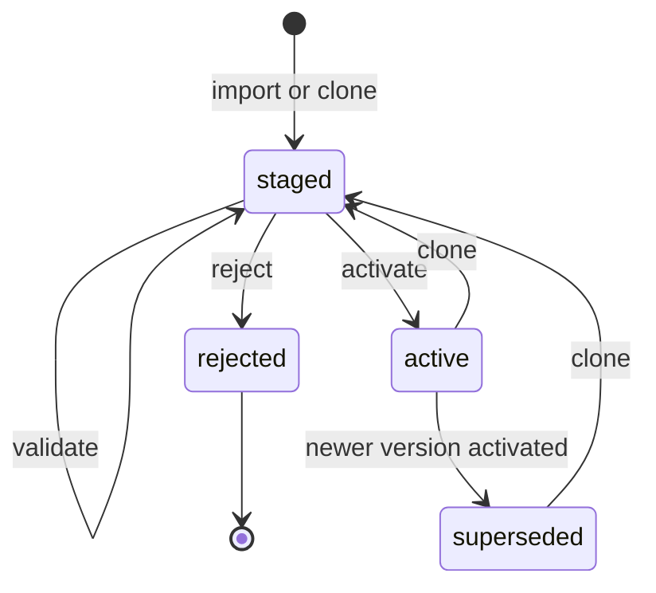

<!--
Copyright (C) 2026 the Eclipse BaSyx Authors and Fraunhofer IESE
SPDX-License-Identifier: MIT
-->

# PostgreSQL-Backed ABAC Policies

BaSyx services can store ABAC access-rule files as versioned PostgreSQL policy rows. The runtime evaluator uses the active materialized rule set from PostgreSQL and keeps a compiled in-memory cache for request performance.

The repository is service-local. Policy rows include `service_scope`, so multiple components can share one PostgreSQL database while keeping independent active ABAC policy versions.

## Configuration

```yaml
abac:
  enabled: true
  modelPath: config/access_rules/access-rules.json
  policyFileImport: if_missing
  policyScope: aasregistryservice
  managementApi:
    enabled: false
```

Environment variables:

- `ABAC_ENABLED=true`
- `ABAC_MODELPATH=/security_env/access-rules.json`
- `ABAC_POLICY_FILE_IMPORT=always|if_missing|never`
- `BASYX_ABAC_POLICY_FILE_IMPORT=always|if_missing|never`
- `ABAC_POLICY_SCOPE=aasregistryservice`
- `BASYX_ABAC_POLICY_SCOPE=aasregistryservice`
- `ABAC_MANAGEMENT_API_ENABLED=true|false`
- `ABAC_MANAGEMENTAPI_ENABLED=true|false`
- `BASYX_ABAC_MANAGEMENT_API_ENABLED=true|false`

`abac.policyScope` controls the database namespace used for stored policy versions, rule rows, events, and activation evidence. When it is empty, the service uses its built-in scope, such as `digitaltwinregistryservice` or `aasregistryservice`, so existing deployments keep their current behavior.

Use different scopes when two instances or deployments must not share access rules even though they use the same PostgreSQL database:

```yaml
abac:
  policyScope: aasregistry-internal
```

Use the same scope only when the services are meant to share one active policy. Sharing a scope across services with different route surfaces can make a policy valid for one service but incomplete or unsafe for another service, so do it deliberately and test the effective routes.

`abac.policyFileImport` controls startup file import:

- `always`: import `abac.modelPath` on every startup. Use this when the configured file is the source of truth.
- `if_missing`: import `abac.modelPath` only when no active database-backed policy exists for the effective policy scope.
- `never`: do not import the file. ABAC startup fails closed unless an active database-backed policy already exists for the effective policy scope.

When the value is empty, each service uses its default. Digital Twin Registry defaults to `always`; other ABAC-enabled services default to `if_missing`.

## Startup Import

Startup imports run under a synthetic system audit context:

- actor subject: `system:abac-preconfiguration`
- actor issuer: `basyx:<service_scope>`
- client id: `<service_scope>`
- operation: `ABACPreconfiguration`
- endpoint: `startup:abac-preconfiguration`
- HTTP method: `SYSTEM`

The importer validates the configured JSON, canonicalizes it, materializes referenced definitions, stores policy and rule rows, activates the version when required, and publishes the committed active model to the evaluator cache.

## Management API

The management API is mounted under `/security/abac/**` only when both `abac.enabled` and `abac.managementApi.enabled` are true. Swagger/OpenAPI exposes these endpoints only when the management API is active and `swagger.enabled` is true.

Digital Twin Registry keeps the same defaults as before: its startup policy-file import defaults to `always`, and its management API remains disabled unless explicitly enabled.

The API supports:

- direct inspection of the active policy version and active materialized rules
- import, list, inspect, validate, activate, and reject policy versions
- clone active policy versions to staged versions
- list, create, replace, merge-patch, and delete reusable staged definitions (`DEFATTRIBUTES`, `DEFACLS`, `DEFOBJECTS`, `DEFFORMULAS`)
- create, replace, merge-patch, delete, duplicate, move, and enable/disable staged rules

Only `staged` policy versions are editable. `active`, `superseded`, and `rejected` versions are immutable. Draft edits do not affect authorization until activation.

Protect these endpoints with explicit admin ABAC rules, for example route objects covering `/security/abac` and `/security/abac/*` with an admin-only ACL/formula.
Authenticated users who do not satisfy those admin rules receive `404 Not Found` for `/security/abac/**` instead of `403 Forbidden`, so policy version and rule identifiers are not exposed by probing.

## Policy Lifecycle



The evaluator only uses the `active` policy version. Rule edits on a `staged` version are persisted, validated, and audited, but they do not affect authorization until activation succeeds.

Activation validates the staged version, writes required WORM evidence, supersedes the previous active version, marks the selected version active, and records policy events in one database transaction. After commit, the evaluator cache is updated from the same materialized rule set used by that transaction, so activation does not depend on a second database read. If evidence is required and cannot be written, activation fails and the old active policy remains in use.

## API Interaction Examples

Examples assume:

- `BASE_URL=http://localhost:8081`
- the service has no additional `server.contextPath`; if it does, prefix the paths with that context path
- `TOKEN` is a bearer token that is already allowed by the active policy to manage `/security/abac/**`
- `abac.enabled=true` and `abac.managementApi.enabled=true`
- the target service is not Digital Twin Registry

```bash
export BASE_URL=http://localhost:8081
export TOKEN=replace-with-admin-token
```

### List Versions

Use the active policy endpoint when you only need the currently effective policy:

```bash
curl -sS \
  -H "Authorization: Bearer ${TOKEN}" \
  "${BASE_URL}/security/abac/active-policy"
```

To inspect the exact active rule rows used by the evaluator:

```bash
curl -sS \
  -H "Authorization: Bearer ${TOKEN}" \
  "${BASE_URL}/security/abac/active-policy/rules"
```

List all versions when you need staged, superseded, or rejected versions too:

```bash
curl -sS \
  -H "Authorization: Bearer ${TOKEN}" \
  "${BASE_URL}/security/abac/policy-versions"
```

Use this to find the current `active` version before creating a staged draft:

```bash
export ACTIVE_VERSION_ID="$(
  curl -sS -H "Authorization: Bearer ${TOKEN}" \
    "${BASE_URL}/security/abac/policy-versions" \
  | jq -r '.[] | select(.status == "active") | .version_id'
)"
```

### Import A Complete Policy As Staged

Importing creates a new `staged` policy version. This does not affect live authorization until you activate it.

```bash
curl -sS -X POST \
  -H "Authorization: Bearer ${TOKEN}" \
  -H "Content-Type: application/json" \
  "${BASE_URL}/security/abac/policy-versions" \
  -d @- <<'JSON'
{
  "source_ref": "change-ticket:SEC-1042",
  "policy": {
    "AllAccessPermissionRules": {
      "DEFATTRIBUTES": [
        { "name": "role_attr", "attributes": [ { "CLAIM": "role" } ] },
        { "name": "anonymous_attr", "attributes": [ { "GLOBAL": "ANONYMOUS" } ] }
      ],
      "DEFOBJECTS": [
        { "name": "description", "objects": [ { "ROUTE": "/description" } ] },
        { "name": "abac_policy_management", "objects": [ { "ROUTE": "/security/abac" }, { "ROUTE": "/security/abac/*" } ] }
      ],
      "DEFACLS": [
        { "name": "read_anonymous", "acl": { "USEATTRIBUTES": "anonymous_attr", "RIGHTS": [ "READ" ], "ACCESS": "ALLOW" } },
        { "name": "admin_all", "acl": { "USEATTRIBUTES": "role_attr", "RIGHTS": [ "ALL" ], "ACCESS": "ALLOW" } }
      ],
      "DEFFORMULAS": [
        { "name": "always_true", "formula": { "$boolean": true } },
        { "name": "role_is_admin", "formula": { "$eq": [ { "$attribute": { "CLAIM": "role" } }, { "$strVal": "admin" } ] } }
      ],
      "rules": [
        { "USEACL": "read_anonymous", "USEOBJECTS": [ "description" ], "USEFORMULA": "always_true" },
        { "USEACL": "admin_all", "USEOBJECTS": [ "abac_policy_management" ], "USEFORMULA": "role_is_admin" }
      ]
    }
  }
}
JSON
```

The response contains the new `version_id` and `policy_id`. Keep the `version_id` for validation and activation:

```bash
export DRAFT_VERSION_ID=replace-with-created-version-id
```

The sample policy above is intentionally small. Do not activate a reduced sample policy for a real service unless it includes every route that should remain accessible.

To import and activate in one all-or-nothing operation, set `activate` to `true`. If validation, WORM evidence writing, superseding, or activation fails, the imported staged version is rolled back as part of the same transaction.

```bash
curl -sS -X POST \
  -H "Authorization: Bearer ${TOKEN}" \
  -H "Content-Type: application/json" \
  "${BASE_URL}/security/abac/policy-versions" \
  -d @- <<'JSON'
{
  "source_ref": "change-ticket:SEC-1043",
  "activate": true,
  "policy": {
    "AllAccessPermissionRules": {
      "rules": [
        {
          "ACL": {
            "ACCESS": "ALLOW",
            "RIGHTS": [ "READ" ],
            "ATTRIBUTES": [ { "GLOBAL": "ANONYMOUS" } ]
          },
          "OBJECTS": [ { "ROUTE": "/description" } ],
          "FORMULA": { "$boolean": true }
        }
      ]
    }
  }
}
JSON
```

### Validate And Activate A Staged Version

```bash
curl -sS -X POST \
  -H "Authorization: Bearer ${TOKEN}" \
  "${BASE_URL}/security/abac/policy-versions/${DRAFT_VERSION_ID}/validate"
```

A valid response includes `"valid": true`, the canonical `policy_id`, and the `materialized_policy_hash`.

```bash
curl -sS -X POST \
  -H "Authorization: Bearer ${TOKEN}" \
  "${BASE_URL}/security/abac/policy-versions/${DRAFT_VERSION_ID}/activate"
```

After activation, the selected version is `active`, the previous active version is `superseded`, and the in-memory evaluator cache uses the newly committed materialized rule set.

### Clone Active Policy And Add One Rule

The safer day-to-day workflow is to clone the current active version, edit the staged clone, validate it, and activate it.

```bash
export DRAFT_VERSION_ID="$(
  curl -sS -X POST \
    -H "Authorization: Bearer ${TOKEN}" \
    "${BASE_URL}/security/abac/policy-versions/${ACTIVE_VERSION_ID}/clone" \
  | jq -r '.version_id'
)"
```

Create one inline rule at an explicit 1-based position:

```bash
curl -sS -X POST \
  -H "Authorization: Bearer ${TOKEN}" \
  -H "Content-Type: application/json" \
  "${BASE_URL}/security/abac/policy-versions/${DRAFT_VERSION_ID}/rules" \
  -d @- <<'JSON'
{
  "position": 3,
  "rule": {
    "ACL": {
      "ATTRIBUTES": [ { "CLAIM": "role" } ],
      "RIGHTS": [ "READ" ],
      "ACCESS": "ALLOW"
    },
    "OBJECTS": [ { "ROUTE": "/shell-descriptors/*" } ],
    "FORMULA": {
      "$eq": [
        { "$attribute": { "CLAIM": "role" } },
        { "$strVal": "viewer" }
      ]
    }
  }
}
JSON
```

`POST /rules` also accepts a direct rule body without the `{ "rule": ... }` wrapper when you do not need to set `position`.

### Manage Reusable Definitions

Definitions are edited separately from rules because multiple rules can reference the same ACL, object set, attribute set, or formula. The API exposes them by kind:

- `attributes` for `DEFATTRIBUTES`
- `acls` for `DEFACLS`
- `objects` for `DEFOBJECTS`
- `formulas` for `DEFFORMULAS`

List all definitions on a staged or active version:

```bash
curl -sS \
  -H "Authorization: Bearer ${TOKEN}" \
  "${BASE_URL}/security/abac/policy-versions/${DRAFT_VERSION_ID}/definitions"
```

List only reusable formulas:

```bash
curl -sS \
  -H "Authorization: Bearer ${TOKEN}" \
  "${BASE_URL}/security/abac/policy-versions/${DRAFT_VERSION_ID}/definitions/formulas"
```

Create a reusable object definition in the staged draft:

```bash
curl -sS -X POST \
  -H "Authorization: Bearer ${TOKEN}" \
  -H "Content-Type: application/json" \
  "${BASE_URL}/security/abac/policy-versions/${DRAFT_VERSION_ID}/definitions/objects" \
  -d @- <<'JSON'
{
  "name": "shared_submodel_routes",
  "objects": [
    { "ROUTE": "/submodels" },
    { "ROUTE": "/submodels/*" }
  ]
}
JSON
```

Create a formula definition and reference it from a rule:

```bash
curl -sS -X POST \
  -H "Authorization: Bearer ${TOKEN}" \
  -H "Content-Type: application/json" \
  "${BASE_URL}/security/abac/policy-versions/${DRAFT_VERSION_ID}/definitions/formulas" \
  -d @- <<'JSON'
{
  "name": "role_is_editor",
  "formula": {
    "$eq": [
      { "$attribute": { "CLAIM": "role" } },
      { "$strVal": "editor" }
    ]
  }
}
JSON

curl -sS -X POST \
  -H "Authorization: Bearer ${TOKEN}" \
  -H "Content-Type: application/json" \
  "${BASE_URL}/security/abac/policy-versions/${DRAFT_VERSION_ID}/rules" \
  -d @- <<'JSON'
{
  "rule": {
    "ACL": {
      "ATTRIBUTES": [ { "CLAIM": "role" } ],
      "RIGHTS": [ "READ" ],
      "ACCESS": "ALLOW"
    },
    "USEOBJECTS": [ "shared_submodel_routes" ],
    "USEFORMULA": "role_is_editor"
  }
}
JSON
```

Replace a definition with `PUT`. The body `name` must match the path name; use delete plus create when you intentionally rename a definition so all references are revalidated explicitly.

```bash
curl -sS -X PUT \
  -H "Authorization: Bearer ${TOKEN}" \
  -H "Content-Type: application/json" \
  "${BASE_URL}/security/abac/policy-versions/${DRAFT_VERSION_ID}/definitions/formulas/role_is_editor" \
  -d @- <<'JSON'
{
  "name": "role_is_editor",
  "formula": {
    "$eq": [
      { "$attribute": { "CLAIM": "scope" } },
      { "$strVal": "basyx.editor" }
    ]
  }
}
JSON
```

`PATCH` uses the same merge semantics as rule patching. A `null` removes a field, and this is not RFC 6902 JSON Patch.

```bash
curl -sS -X PATCH \
  -H "Authorization: Bearer ${TOKEN}" \
  -H "Content-Type: application/json" \
  "${BASE_URL}/security/abac/policy-versions/${DRAFT_VERSION_ID}/definitions/formulas/role_is_editor" \
  -d '{ "formula": { "$boolean": true } }'
```

Delete a definition only after no rule or definition references it:

```bash
curl -sS -X DELETE \
  -H "Authorization: Bearer ${TOKEN}" \
  "${BASE_URL}/security/abac/policy-versions/${DRAFT_VERSION_ID}/definitions/objects/shared_submodel_routes"
```

Every definition edit rematerializes the full staged policy. If a delete or replacement leaves a `USEACL`, `USEOBJECTS`, `USEFORMULA`, or `USEATTRIBUTES` reference unresolved, the API rejects the edit and leaves the draft unchanged.

### Inspect Rules

```bash
curl -sS \
  -H "Authorization: Bearer ${TOKEN}" \
  "${BASE_URL}/security/abac/policy-versions/${DRAFT_VERSION_ID}/rules"
```

Each rule row includes:

- `rule_index`: the stable 1-based order used by the evaluator
- `matched_rule_id`: the value stored in history audit rows when the rule authorizes a request
- `configured_rule_json`: the configured rule entry
- `materialized_rule_json`: the resolved rule after applying referenced ACL/object/formula definitions
- `rule_hash` and `materialized_rule_hash`

To resolve a history audit row later:

```bash
export POLICY_ID=replace-with-history-policy-id
export MATCHED_RULE_ID=replace-with-history-matched-rule-id

export VERSION_ID="$(
  curl -sS -H "Authorization: Bearer ${TOKEN}" \
    "${BASE_URL}/security/abac/policy-versions" \
  | jq -r --arg policy_id "${POLICY_ID}" '.[] | select(.policy_id == $policy_id) | .version_id'
)"

curl -sS \
  -H "Authorization: Bearer ${TOKEN}" \
  "${BASE_URL}/security/abac/policy-versions/${VERSION_ID}/rules" \
| jq --arg matched_rule_id "${MATCHED_RULE_ID}" '.[] | select(.matched_rule_id == $matched_rule_id)'
```

### Replace Or Merge-Patch A Rule

`PUT` replaces the configured rule at the selected `rule_index`:

```bash
curl -sS -X PUT \
  -H "Authorization: Bearer ${TOKEN}" \
  -H "Content-Type: application/json" \
  "${BASE_URL}/security/abac/policy-versions/${DRAFT_VERSION_ID}/rules/3" \
  -d @- <<'JSON'
{
  "USEACL": "admin_all",
  "USEOBJECTS": [ "abac_policy_management" ],
  "USEFORMULA": "role_is_admin"
}
JSON
```

`PATCH` uses JSON object merge semantics. A `null` value removes that field. This is not RFC 6902 JSON Patch.

```bash
curl -sS -X PATCH \
  -H "Authorization: Bearer ${TOKEN}" \
  -H "Content-Type: application/json" \
  "${BASE_URL}/security/abac/policy-versions/${DRAFT_VERSION_ID}/rules/3" \
  -d @- <<'JSON'
{
  "USEFORMULA": null,
  "FORMULA": { "$boolean": true }
}
JSON
```

Use patch carefully with the ABAC grammar exclusivity rules: a rule must have exactly one of `ACL` or `USEACL`, exactly one of `FORMULA` or `USEFORMULA`, and exactly one of `OBJECTS` or `USEOBJECTS`.

### Disable, Enable, Duplicate, Move, And Delete Rules

Disable a staged rule without deleting it:

```bash
curl -sS -X PUT \
  -H "Authorization: Bearer ${TOKEN}" \
  -H "Content-Type: application/json" \
  "${BASE_URL}/security/abac/policy-versions/${DRAFT_VERSION_ID}/rules/3/enabled" \
  -d '{ "enabled": false }'
```

For rules that use `USEACL`, enable/disable creates a rule-local inline ACL copy. That prevents toggling one rule from mutating a shared ACL definition used by other rules.

Duplicate a rule and insert the copy at a chosen position:

```bash
curl -sS -X POST \
  -H "Authorization: Bearer ${TOKEN}" \
  -H "Content-Type: application/json" \
  "${BASE_URL}/security/abac/policy-versions/${DRAFT_VERSION_ID}/rules/2/duplicate" \
  -d '{ "position": 4 }'
```

Move a rule to a new 1-based position:

```bash
curl -sS -X POST \
  -H "Authorization: Bearer ${TOKEN}" \
  -H "Content-Type: application/json" \
  "${BASE_URL}/security/abac/policy-versions/${DRAFT_VERSION_ID}/rules/4/move" \
  -d '{ "position": 2 }'
```

Delete a staged rule:

```bash
curl -sS -X DELETE \
  -H "Authorization: Bearer ${TOKEN}" \
  "${BASE_URL}/security/abac/policy-versions/${DRAFT_VERSION_ID}/rules/5"
```

Rule ordering is security-relevant. Moving, inserting, deleting, or duplicating rules recomputes `rule_index`, and unchanged configured rules keep deterministic `matched_rule_id` hash suffixes while their index prefix reflects the new order.

### Reject A Staged Version

Reject a staged version that should not be activated:

```bash
curl -sS -X POST \
  -H "Authorization: Bearer ${TOKEN}" \
  "${BASE_URL}/security/abac/policy-versions/${DRAFT_VERSION_ID}/reject"
```

Rejected versions are preserved for auditability and cannot be edited or activated. Clone another active or superseded version when you need a new draft.

## Policy Events

Policy events in PostgreSQL record imports, staged edits, validations, validation failures, activations, supersessions, and rejections with actor, issuer, client id, operation, endpoint, request/correlation ids, source metadata, before/after configured hashes, and before/after materialized hashes. They do not duplicate the full policy document per edit.

Validation failures include non-secret diagnostic details so operators can review why a draft was not activatable. Do not place bearer tokens, raw claims, request payload secrets, or user-specific runtime data in policy event details.

## Evidence

When `history.evidence.enabled=true`, activation writes an `abac_policy_version` WORM artifact before the database transaction commits. The receipt is cataloged in `history_evidence_artifacts` with `history_table = abac_policy_versions`.

The artifact contains the configured policy JSON, materialized policy JSON, ordered materialized rule rows, `policy_id`, `matched_rule_id` values, hashes, service scope, source metadata, activation timestamp, and activation audit metadata.

Normal history event artifacts continue to store only `policy_id` and `matched_rule_id`. Operators can resolve those identifiers through PostgreSQL or the ABAC policy evidence artifact.

## Shared Database Operation

Different components can run against the same database because policy state is separated by `service_scope` and the schema enforces one active policy per service scope. Operators can override the default service scope with `abac.policyScope` to split same-service deployments or intentionally share a policy namespace.

For a given effective policy scope, operate only one startup file-import owner at a time. If several instances of the same component are deployed, prefer `if_missing` or `never` for follower instances after the first active policy exists. A future configuration service flow can centralize policy import and activation.

This is especially important for Digital Twin Registry: two DTR instances using the same database, the default `digitaltwinregistryservice` policy scope, and different mounted access-rule files will both import with the default `always` mode. The instance that starts later can supersede the active policy imported by the other instance. Use distinct `abac.policyScope` values when the DTRs must be isolated, or configure exactly one DTR as the import owner and run the others with `if_missing` or `never`.

## NIS2 Support Scope

This feature provides technical controls for access-control governance, immutable active policy versions, fail-closed startup behavior, auditability, tamper-evident WORM evidence, and recovery traceability. It does not make a deployment NIS2 compliant by configuration alone.
