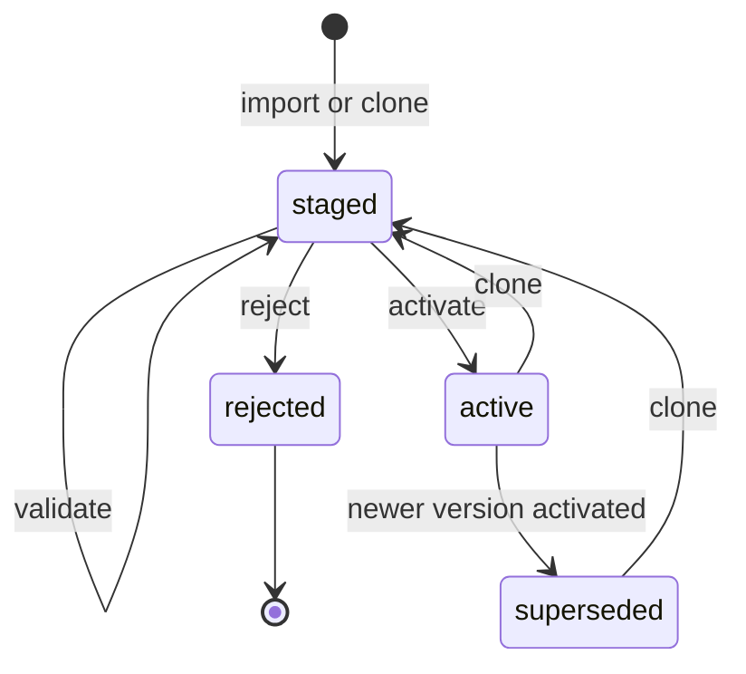

<!--
Copyright (C) 2026 the Eclipse BaSyx Authors and Fraunhofer IESE
SPDX-License-Identifier: MIT
-->

# PostgreSQL-Backed ABAC Policies

BaSyx services can store ABAC access-rule files as versioned PostgreSQL policy rows. The runtime evaluator uses the active materialized rule set from PostgreSQL and keeps a compiled in-memory cache for request performance.

The repository is service-local. Policy rows include `service_scope`, so multiple components can share one PostgreSQL database while keeping independent active ABAC policy versions.

## Configuration

```yaml
abac:
  enabled: true
  modelPath: config/access_rules/access-rules.json
  policyFileImport: if_missing
  managementApi:
    enabled: false
```

Environment variables:

- `ABAC_ENABLED=true`
- `ABAC_MODELPATH=/security_env/access-rules.json`
- `ABAC_POLICY_FILE_IMPORT=always|if_missing|never`
- `ABAC_MANAGEMENT_API_ENABLED=true|false`

`abac.policyFileImport` controls startup file import:

- `always`: import `abac.modelPath` on every startup. Use this when the configured file is the source of truth.
- `if_missing`: import `abac.modelPath` only when no active database-backed policy exists for the service scope.
- `never`: do not import the file. ABAC startup fails closed unless an active database-backed policy already exists.

When the value is empty, each service uses its default. Digital Twin Registry defaults to `always`; other ABAC-enabled services default to `if_missing`.

## Startup Import

Startup imports run under a synthetic system audit context:

- actor subject: `system:abac-preconfiguration`
- actor issuer: `basyx:<service_scope>`
- client id: `<service_scope>`
- operation: `ABACPreconfiguration`
- endpoint: `startup:abac-preconfiguration`
- HTTP method: `SYSTEM`

The importer validates the configured JSON, canonicalizes it, materializes referenced definitions, stores policy and rule rows, activates the version when required, and refreshes the evaluator cache only after activation commits.

## Management API

The management API is mounted under `/security/abac/policy-versions` only when both `abac.enabled` and `abac.managementApi.enabled` are true. Swagger/OpenAPI exposes these endpoints under the same condition.

Digital Twin Registry is the exception: it never exposes the management API. Its access-rule file remains the service source of truth and is imported on every restart by default.

The API supports:

- import, list, inspect, validate, activate, and reject policy versions
- clone active policy versions to staged versions
- create, replace, merge-patch, delete, duplicate, move, and enable/disable staged rules

Only `staged` policy versions are editable. `active`, `superseded`, and `rejected` versions are immutable. Draft edits do not affect authorization until activation.

Protect these endpoints with explicit admin ABAC rules, for example route objects covering `/security/abac` and `/security/abac/*` with an admin-only ACL/formula.

## Policy Lifecycle



The evaluator only uses the `active` policy version. Rule edits on a `staged` version are persisted, validated, and audited, but they do not affect authorization until activation succeeds.

Activation performs validation, required WORM evidence writing, previous-active supersession, active-version update, and evaluator cache refresh as one controlled operation. If evidence is required and cannot be written, activation fails and the old active policy remains in use.

## API Interaction Examples

Examples assume:

- `BASE_URL=http://localhost:8081`
- the service has no additional `server.contextPath`; if it does, prefix the paths with that context path
- `TOKEN` is a bearer token that is already allowed by the active policy to manage `/security/abac/**`
- `abac.enabled=true` and `abac.managementApi.enabled=true`
- the target service is not Digital Twin Registry

```bash
export BASE_URL=http://localhost:8081
export TOKEN=replace-with-admin-token
```

### List Versions

```bash
curl -sS \
  -H "Authorization: Bearer ${TOKEN}" \
  "${BASE_URL}/security/abac/policy-versions"
```

Use this to find the current `active` version before creating a staged draft:

```bash
export ACTIVE_VERSION_ID="$(
  curl -sS -H "Authorization: Bearer ${TOKEN}" \
    "${BASE_URL}/security/abac/policy-versions" \
  | jq -r '.[] | select(.status == "active") | .version_id'
)"
```

### Import A Complete Policy As Staged

Importing creates a new `staged` policy version. This does not affect live authorization until you activate it.

```bash
curl -sS -X POST \
  -H "Authorization: Bearer ${TOKEN}" \
  -H "Content-Type: application/json" \
  "${BASE_URL}/security/abac/policy-versions" \
  -d @- <<'JSON'
{
  "source_ref": "change-ticket:SEC-1042",
  "policy": {
    "AllAccessPermissionRules": {
      "DEFATTRIBUTES": [
        { "name": "role_attr", "attributes": [ { "CLAIM": "role" } ] },
        { "name": "anonymous_attr", "attributes": [ { "GLOBAL": "ANONYMOUS" } ] }
      ],
      "DEFOBJECTS": [
        { "name": "description", "objects": [ { "ROUTE": "/description" } ] },
        { "name": "abac_policy_management", "objects": [ { "ROUTE": "/security/abac" }, { "ROUTE": "/security/abac/*" } ] }
      ],
      "DEFACLS": [
        { "name": "read_anonymous", "acl": { "USEATTRIBUTES": "anonymous_attr", "RIGHTS": [ "READ" ], "ACCESS": "ALLOW" } },
        { "name": "admin_all", "acl": { "USEATTRIBUTES": "role_attr", "RIGHTS": [ "ALL" ], "ACCESS": "ALLOW" } }
      ],
      "DEFFORMULAS": [
        { "name": "always_true", "formula": { "$boolean": true } },
        { "name": "role_is_admin", "formula": { "$eq": [ { "$attribute": { "CLAIM": "role" } }, { "$strVal": "admin" } ] } }
      ],
      "rules": [
        { "USEACL": "read_anonymous", "USEOBJECTS": [ "description" ], "USEFORMULA": "always_true" },
        { "USEACL": "admin_all", "USEOBJECTS": [ "abac_policy_management" ], "USEFORMULA": "role_is_admin" }
      ]
    }
  }
}
JSON
```

The response contains the new `version_id` and `policy_id`. Keep the `version_id` for validation and activation:

```bash
export DRAFT_VERSION_ID=replace-with-created-version-id
```

The sample policy above is intentionally small. Do not activate a reduced sample policy for a real service unless it includes every route that should remain accessible.

### Validate And Activate A Staged Version

```bash
curl -sS -X POST \
  -H "Authorization: Bearer ${TOKEN}" \
  "${BASE_URL}/security/abac/policy-versions/${DRAFT_VERSION_ID}/validate"
```

A valid response includes `"valid": true`, the canonical `policy_id`, and the `materialized_policy_hash`.

```bash
curl -sS -X POST \
  -H "Authorization: Bearer ${TOKEN}" \
  "${BASE_URL}/security/abac/policy-versions/${DRAFT_VERSION_ID}/activate"
```

After activation, the selected version is `active`, the previous active version is `superseded`, and the in-memory evaluator cache is refreshed.

### Clone Active Policy And Add One Rule

The safer day-to-day workflow is to clone the current active version, edit the staged clone, validate it, and activate it.

```bash
export DRAFT_VERSION_ID="$(
  curl -sS -X POST \
    -H "Authorization: Bearer ${TOKEN}" \
    "${BASE_URL}/security/abac/policy-versions/${ACTIVE_VERSION_ID}/clone" \
  | jq -r '.version_id'
)"
```

Create one inline rule at an explicit 1-based position:

```bash
curl -sS -X POST \
  -H "Authorization: Bearer ${TOKEN}" \
  -H "Content-Type: application/json" \
  "${BASE_URL}/security/abac/policy-versions/${DRAFT_VERSION_ID}/rules" \
  -d @- <<'JSON'
{
  "position": 3,
  "rule": {
    "ACL": {
      "ATTRIBUTES": [ { "CLAIM": "role" } ],
      "RIGHTS": [ "READ" ],
      "ACCESS": "ALLOW"
    },
    "OBJECTS": [ { "ROUTE": "/shell-descriptors/*" } ],
    "FORMULA": {
      "$eq": [
        { "$attribute": { "CLAIM": "role" } },
        { "$strVal": "viewer" }
      ]
    }
  }
}
JSON
```

`POST /rules` also accepts a direct rule body without the `{ "rule": ... }` wrapper when you do not need to set `position`.

### Inspect Rules

```bash
curl -sS \
  -H "Authorization: Bearer ${TOKEN}" \
  "${BASE_URL}/security/abac/policy-versions/${DRAFT_VERSION_ID}/rules"
```

Each rule row includes:

- `rule_index`: the stable 1-based order used by the evaluator
- `matched_rule_id`: the value stored in history audit rows when the rule authorizes a request
- `configured_rule_json`: the configured rule entry
- `materialized_rule_json`: the resolved rule after applying referenced ACL/object/formula definitions
- `rule_hash` and `materialized_rule_hash`

To resolve a history audit row later:

```bash
export POLICY_ID=replace-with-history-policy-id
export MATCHED_RULE_ID=replace-with-history-matched-rule-id

export VERSION_ID="$(
  curl -sS -H "Authorization: Bearer ${TOKEN}" \
    "${BASE_URL}/security/abac/policy-versions" \
  | jq -r --arg policy_id "${POLICY_ID}" '.[] | select(.policy_id == $policy_id) | .version_id'
)"

curl -sS \
  -H "Authorization: Bearer ${TOKEN}" \
  "${BASE_URL}/security/abac/policy-versions/${VERSION_ID}/rules" \
| jq --arg matched_rule_id "${MATCHED_RULE_ID}" '.[] | select(.matched_rule_id == $matched_rule_id)'
```

### Replace Or Merge-Patch A Rule

`PUT` replaces the configured rule at the selected `rule_index`:

```bash
curl -sS -X PUT \
  -H "Authorization: Bearer ${TOKEN}" \
  -H "Content-Type: application/json" \
  "${BASE_URL}/security/abac/policy-versions/${DRAFT_VERSION_ID}/rules/3" \
  -d @- <<'JSON'
{
  "USEACL": "admin_all",
  "USEOBJECTS": [ "abac_policy_management" ],
  "USEFORMULA": "role_is_admin"
}
JSON
```

`PATCH` uses JSON object merge semantics. A `null` value removes that field. This is not RFC 6902 JSON Patch.

```bash
curl -sS -X PATCH \
  -H "Authorization: Bearer ${TOKEN}" \
  -H "Content-Type: application/json" \
  "${BASE_URL}/security/abac/policy-versions/${DRAFT_VERSION_ID}/rules/3" \
  -d @- <<'JSON'
{
  "USEFORMULA": null,
  "FORMULA": { "$boolean": true }
}
JSON
```

Use patch carefully with the ABAC grammar exclusivity rules: a rule must have exactly one of `ACL` or `USEACL`, exactly one of `FORMULA` or `USEFORMULA`, and exactly one of `OBJECTS` or `USEOBJECTS`.

### Disable, Enable, Duplicate, Move, And Delete Rules

Disable a staged rule without deleting it:

```bash
curl -sS -X PUT \
  -H "Authorization: Bearer ${TOKEN}" \
  -H "Content-Type: application/json" \
  "${BASE_URL}/security/abac/policy-versions/${DRAFT_VERSION_ID}/rules/3/enabled" \
  -d '{ "enabled": false }'
```

For rules that use `USEACL`, enable/disable creates a rule-local inline ACL copy. That prevents toggling one rule from mutating a shared ACL definition used by other rules.

Duplicate a rule and insert the copy at a chosen position:

```bash
curl -sS -X POST \
  -H "Authorization: Bearer ${TOKEN}" \
  -H "Content-Type: application/json" \
  "${BASE_URL}/security/abac/policy-versions/${DRAFT_VERSION_ID}/rules/2/duplicate" \
  -d '{ "position": 4 }'
```

Move a rule to a new 1-based position:

```bash
curl -sS -X POST \
  -H "Authorization: Bearer ${TOKEN}" \
  -H "Content-Type: application/json" \
  "${BASE_URL}/security/abac/policy-versions/${DRAFT_VERSION_ID}/rules/4/move" \
  -d '{ "position": 2 }'
```

Delete a staged rule:

```bash
curl -sS -X DELETE \
  -H "Authorization: Bearer ${TOKEN}" \
  "${BASE_URL}/security/abac/policy-versions/${DRAFT_VERSION_ID}/rules/5"
```

Rule ordering is security-relevant. Moving, inserting, deleting, or duplicating rules recomputes `rule_index`, and unchanged configured rules keep deterministic `matched_rule_id` hash suffixes while their index prefix reflects the new order.

### Reject A Staged Version

Reject a staged version that should not be activated:

```bash
curl -sS -X POST \
  -H "Authorization: Bearer ${TOKEN}" \
  "${BASE_URL}/security/abac/policy-versions/${DRAFT_VERSION_ID}/reject"
```

Rejected versions are preserved for auditability and cannot be edited or activated. Clone another active or superseded version when you need a new draft.

## Evidence

When `history.evidence.enabled=true`, activation writes an `abac_policy_version` WORM artifact before the database transaction commits. The receipt is cataloged in `history_evidence_artifacts` with `history_table = abac_policy_versions`.

The artifact contains the configured policy JSON, materialized policy JSON, ordered materialized rule rows, `policy_id`, `matched_rule_id` values, hashes, service scope, source metadata, and activation audit metadata.

Normal history event artifacts continue to store only `policy_id` and `matched_rule_id`. Operators can resolve those identifiers through PostgreSQL or the ABAC policy evidence artifact.

## Shared Database Operation

Different components can run against the same database because policy state is separated by `service_scope` and the schema enforces one active policy per service scope.

For a given service scope, operate only one startup file-import owner at a time. If several instances of the same component are deployed, prefer `if_missing` or `never` for follower instances after the first active policy exists. A future configuration service flow can centralize policy import and activation.

## NIS2 Support Scope

This feature provides technical controls for access-control governance, immutable active policy versions, fail-closed startup behavior, auditability, tamper-evident WORM evidence, and recovery traceability. It does not make a deployment NIS2 compliant by configuration alone.
