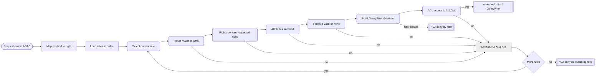
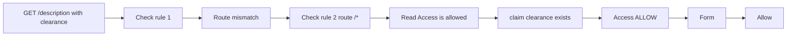

# Authorization & Request Flow based on AAS Discovery

This document provides a detailed technical explanation of how the AAS Discovery processes incoming HTTP requests, authenticates and authorizes users, and applies fine-grained access control.  
It introduces the complete architecture, the internal flow of requests, and how **QueryFilters** can further restrict access after successful authorization.

---

## 1. Overview

The AAS Discovery exposes BaSyx discovery and description APIs behind a layered security system that ensures robust protection and fine-grained access control.  
This system combines **OIDC authentication**, **ABAC authorization**, and optional **QueryFilter** logic.

### Core Components

- **OIDC Middleware (Authentication):** Validates access tokens from a trusted identity provider and injects verified claims into the request context.  
- **ABAC Middleware (Authorization):** Evaluates user claims, routes, and configured rules to determine whether the request is allowed.  
- **QueryFilter:** Optionally generated by ABAC to constrain visible or modifiable data within the controller layer.  

These components work together to ensure that only authenticated and authorized requests can reach the business logic layer.

---

## 2. System Architecture

The architecture diagram shows how different layers of the AAS Discovery interact — from incoming HTTP requests through the router, security middleware, controllers, and database.

```mermaid
flowchart LR
  subgraph Client
    C[Browser or Service]
  end

  subgraph AAS Discovery
    direction LR

    subgraph Edge
      R[chi Router]
      X[CORS Middleware]
      H[Public /contextPath/health]
    end

    subgraph Security
      O[OIDC Middleware]
      A[ABAC Middleware]
    end

    subgraph App
      D1[Discovery Controller]
      D2[Description Controller]
    end

    subgraph Data
      DB[PostgreSQL Backend]
    end
  end

  subgraph IdentityProvider
    IDP[OIDC Provider]
  end

  subgraph Config
    CFG1[config file]
    CFG2[access model file]
  end

  C --> R
  R --> H
  R --> X
  X --> O
  O --> A
  A --> D1
  A --> D2
  D1 --> DB
  D2 --> DB
  O -. jwks .-> IDP
  CFG1 -. loads .-> AAS Discovery
  CFG2 -. parsed .-> A

  ```
### Explanation

1. **Client Layer:** A user, service, or browser sends HTTP requests to the AAS Discovery.  
2. **Router & Middleware:**  
   - The **Chi Router** dispatches requests to the correct handler based on the configured `contextPath`.
   - The **CORS Middleware** ensures cross-origin requests are properly validated.  
3. **OIDC Middleware:**  
   - Validates bearer tokens via the configured OIDC provider.  
   - Extracts claims and injects them into the request context.  
4. **ABAC Middleware:**  
   - Loads the Access Rule Model (ARM).  
   - Evaluates the incoming request against rules that define access based on route, rights, attributes, and optional formulas.  
   - May generate a **QueryFilter** to restrict data returned or modified.  
5. **Controllers:**  
   - Apply QueryFilters to enforce data restrictions.  
   - Forward filtered or authorized requests to the data layer.  
6. **Database:**  
   - Executes SQL queries constrained by QueryFilters, ensuring tenants or roles can only access their permitted data.  
7. **Identity Provider (OIDC):**  
   - The external authority that issues JWT tokens validated by the service.

---

## 3. Request Flow

```mermaid
sequenceDiagram
  autonumber
  participant C as Client
  participant R as Router
  participant O as OIDC
  participant B as ABAC
  participant F as QueryFilter
  participant S as Controllers
  participant P as Postgres

  C->>R: HTTP request
  alt Health path
    R-->>C: 200 ok
  else Protected path
    R->>O: Verify token
    O-->>R: Claims in context
    R->>B: Authorize
    B-->>F: Optional QueryFilter
    alt Allowed
      R-->>S: Forward request
      S->>S: Apply QueryFilter to reads writes redactions
      S->>P: SQL with QueryFilter constraints
      P-->>S: Filtered rows or constrained ack
      S-->>C: 2xx json with redactions if any
    else Denied
      B-->>C: 403 json
    end
  end
```

### Detailed Explanation

The **Request Flow Diagram** visualizes how data moves through the AAS Discovery:

1. **Client → Router:** The client sends a request. The router checks for `/health` first; if matched, a 200 response is returned directly.  
2. **Router → OIDC Middleware:** If not `/health`, the router forwards the request to OIDC. The token is verified against the configured issuer and audience.  
3. **OIDC → ABAC:** Once authenticated, claims are injected, and the ABAC middleware evaluates rules for the given path, method, and claims.  
4. **ABAC → QueryFilter:** If access is allowed, a QueryFilter may be emitted. It contains restrictions like tenant IDs, allowed object types, or field-level redactions.  
5. **QueryFilter → Controller:** The controller layer applies QueryFilter constraints to queries or data objects.  
6. **Controller → Database:** Only filtered and authorized queries reach the database.  
7. **Response Path:** Data returned by the database is further filtered if necessary before being returned to the client.

**Summary:**  
Even after successful authorization, a user may see only partial data or be limited to certain modifications — thanks to QueryFilters.

---

## 4. ABAC Decision Flow


### Explanation

The **ABAC (Attribute-Based Access Control)** engine evaluates requests in ordered steps:

1. **Map HTTP Method → Right:** GET → READ, POST → CREATE, etc.  
2. **Iterate Through Rules:** Rules are evaluated in the order defined in the model.  
3. **Route Match:** The request path must match the rule’s defined route.  
4. **Rights Match:** The requested right must be included in the rule’s `RIGHTS`.  
5. **Attributes Check:** Required attributes (claims) must exist in the token.  
6. **Formula Evaluation:** Optional formula expressions must evaluate to `true` if present.  
7. **QueryFilter Generation:** If defined, a QueryFilter is created to limit data access.  
8. **Access Flag:** If `ACCESS = ALLOW`, the request is authorized and forwarded with the QueryFilter.  
9. **Deny Conditions:** If no rule allows access or if the QueryFilter denies, a 403 response is returned.

**Key Points:**  
- The system is deterministic: the **first matching rule** decides the outcome.  
- ABAC is **stateless** per request and re-evaluated every time.  
- QueryFilters extend authorization to the **data-level**, enforcing tenant isolation and field masking.

---

## 5. Example Access Rule

The JSON example below shows two access rules — one for read-only access on `/description` routes, and one for full access on `/*` routes.

```json
{
  "AllAccessPermissionRules": {
    "rules": [
      {
        "ACL": {
          "ACCESS": "ALLOW",
          "RIGHTS": ["READ"],
          "ATTRIBUTES": [{ "CLAIM": "clearance" }]
        },
        "OBJECTS": [{"ROUTE" : "/descpription"}],
        "FORMULA": { 
          "$ge": [ { "$numCast": { "$attribute": { "CLAIM": "clearance" } } }, 
          { "$numVal": 5 } ] 
        }
      },
      
      {
        "ACL": {
          "ACCESS": "ALLOW",
          "RIGHTS": ["READ"],
          "ATTRIBUTES": [{ "CLAIM": "clearance" }]
        },
        "OBJECTS": [{"ROUTE" : "/*"}],
        "FORMULA": {"$boolean": true}
      }
    ]
  }
}
```

### Explanation

- **Rule 1:** Allows READ access to `/descpription` routes if the token contains the claim `clearance` and is greater or equal 5.  
- **Rule 2:** Allows READ access to all routes `/*` if the same claim exists.  
- The engine evaluates the rules in order — the first rule that matches and passes all checks grants access.  

---

## 6. Example Evaluation


### Scenario

**Request:**  
```
Method: GET
Path: /lookup/shells/MT
Claims: { "clearance": 5 }
```

### Step-by-Step Evaluation

1. The ABAC engine maps `GET` → `READ`.  
2. **Rule 1:** Fails the route check (`/description` vs `/lookup/shells/MT`).  
3. **Rule 2:** Matches route `/*`.  
4. Rights include READ → pass.  
5. Attribute `clearance` is present → pass.  
6. Formula is true.  
7. No QueryFilter → skip.  
8. `ACCESS = ALLOW` → **Access Granted.**

✅ The request is authorized by **Rule 2**.

---

## 7. Controller Responsibilities and QueryFilter

The **controller layer** enforces QueryFilters emitted by ABAC to maintain data-level restrictions.

### Examples of QueryFilter Application

| Type | Example Behavior |
|------|-------------------|
| **Read Restriction** | Filter SQL queries to return only records belonging to the user’s tenant or department. |
| **Write Restriction** | Block modification of protected fields or restrict updates to allowed resources. |
| **Redaction** | Remove or mask sensitive attributes (e.g., `email`, `internalNotes`) from JSON responses. |

### Example Controller Pseudocode

```go
qf := auth.FromFilter(r) // may be nil

// Apply QueryFilter to database query
if qf != nil {
    query = qf.ApplyToQuery(query)
}

// Execute and return filtered data
rows := db.Query(query)

// Apply field-level redactions if configured
filtered := qf.RedactFields(rows)
json.NewEncoder(w).Encode(filtered)
```

---

## 8. Notes

- The ABAC and QueryFilter system ensures **defense in depth**: requests are validated at both the API and data layers.  
- Access rules can evolve without code changes — only configuration updates are required.  
- Logging each ABAC decision helps audit access behavior and identify misconfigurations.  
- QueryFilters are a flexible mechanism to integrate **multi-tenancy**, **privacy filtering**, and **data partitioning** directly into the authorization layer.

---

© 2025 Fraunhofer IESE - AAS Discovery Documentation
