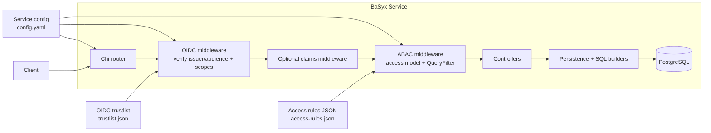
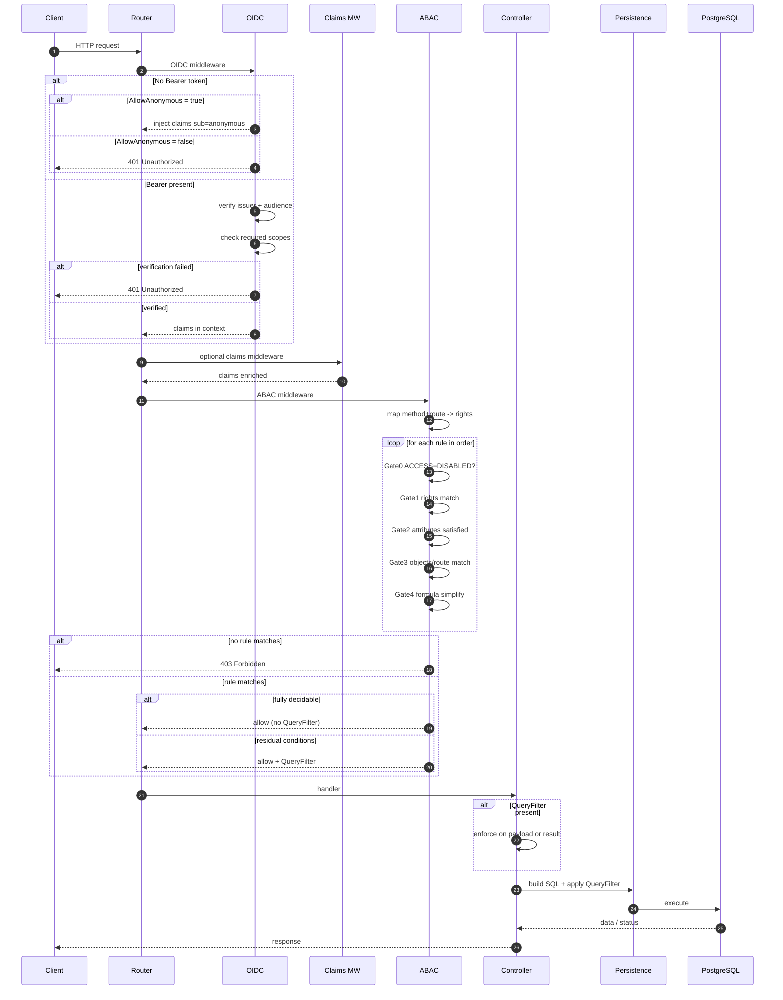

# Security Architecture and Flow

This document describes how security is wired in the BaSyx Go components, including the architecture, request flow, and enforcement process. It reflects the current implementation in the codebase.

## High-level architecture

## Request flow

## Where security is wired

- OIDC + ABAC middleware is applied in the service entrypoints.
  - AAS Registry: [cmd/aasregistryservice/main.go](cmd/aasregistryservice/main.go)
  - Discovery Service: [cmd/discoveryservice/main.go](cmd/discoveryservice/main.go)
  - Digital Twin Registry: [cmd/digitaltwinregistryservice/main.go](cmd/digitaltwinregistryservice/main.go)
- Core security logic lives in [internal/common/security](internal/common/security).
  - OIDC: [internal/common/security/oidc.go](internal/common/security/oidc.go)
  - ABAC engine: [internal/common/security/abac_engine.go](internal/common/security/abac_engine.go)
  - Route->rights mapping: [internal/common/security/abac_engine_methods.go](internal/common/security/abac_engine_methods.go)
  - Object/route matching: [internal/common/security/abac_engine_objects.go](internal/common/security/abac_engine_objects.go)
  - Attributes handling: [internal/common/security/abac_engine_attributes.go](internal/common/security/abac_engine_attributes.go)
  - Access model materialization: [internal/common/security/abac_engine_materialization.go](internal/common/security/abac_engine_materialization.go)
  - QueryFilter helpers: [internal/common/security/authorize.go](internal/common/security/authorize.go) and [internal/common/security/filter_helpers.go](internal/common/security/filter_helpers.go)

## Enablement rules

- Security is only active when ABAC is enabled in config. If `abac.enabled` is false, no OIDC or ABAC middleware is applied.
  - Example config: [cmd/aasregistryservice/config.yaml](cmd/aasregistryservice/config.yaml)
- OIDC uses the trustlist file to allow issuers and audiences.
  - Example trustlist: [cmd/aasregistryservice/config/trustlist.json](cmd/aasregistryservice/config/trustlist.json)
- Access rules are loaded from the access model JSON.
  - Example rules: [cmd/aasregistryservice/config/access_rules/access-rules.json](cmd/aasregistryservice/config/access_rules/access-rules.json)

## OIDC authentication

- OIDC provider verification uses issuer + audience from the trustlist.
- Required scopes are listed per provider in the trustlist and checked against the `scope` claim.
- If the token is valid, claims are injected into the request context.
- The middleware adds time claims `CLIENTNOW`, `LOCALNOW`, and `UTCNOW` to support time-based ABAC formulas.
- AllowAnonymous is currently enabled by default in `SetupSecurityWithClaimsMiddleware`.

Relevant code:
- [internal/common/security/oidc.go](internal/common/security/oidc.go)
- [internal/common/security/security.go](internal/common/security/security.go)

## ABAC authorization

The ABAC engine evaluates rules in order and either denies, allows, or allows with a QueryFilter.

Evaluation gates:
1. Map HTTP method + route to required rights (deny if no mapping).
2. Check rights in rule ACLs.
3. Check attribute requirements (CLAIM presence or GLOBAL=ANONYMOUS).
4. Match object routes and descriptor objects.
5. Evaluate formula and simplify using claims and globals.

Outcomes:
- No match -> deny.
- Fully decidable true -> allow.
- Residual conditions -> allow + QueryFilter for downstream enforcement.

Relevant code:
- [internal/common/security/abac_engine.go](internal/common/security/abac_engine.go)
- [internal/common/security/abac_engine_methods.go](internal/common/security/abac_engine_methods.go)
- [internal/common/security/abac_engine_objects.go](internal/common/security/abac_engine_objects.go)
- [internal/common/security/abac_engine_attributes.go](internal/common/security/abac_engine_attributes.go)
- [internal/common/security/abac_engine_materialization.go](internal/common/security/abac_engine_materialization.go)

## QueryFilter propagation

- QueryFilter is stored in request context after ABAC evaluation.
- Controllers can enforce it on payloads or results.
- Persistence helpers apply it to SQL queries and fragment projections.

Relevant code:
- [internal/common/security/authorize.go](internal/common/security/authorize.go)
- [internal/common/security/filter_helpers.go](internal/common/security/filter_helpers.go)

## Claims enrichment

- Digital Twin Registry injects the `Edc-Bpn` header into claims before ABAC.
  - [internal/common/security/edc_bpn.go](internal/common/security/edc_bpn.go)
  - [cmd/digitaltwinregistryservice/main.go](cmd/digitaltwinregistryservice/main.go)

## Access model structure (high level)

Access rules define:
- DEFATTRIBUTES: reusable attribute sets (CLAIM or GLOBAL).
- DEFOBJECTS: reusable route or descriptor object sets.
- DEFACLS: reusable rights and attribute bindings.
- DEFFORMULAS: reusable boolean expressions.
- rules: ordered rules that combine ACLs, objects, and formulas.

Example file:
- [cmd/aasregistryservice/config/access_rules/access-rules.json](cmd/aasregistryservice/config/access_rules/access-rules.json)

## Testing and security environments

- Security-focused tests use dedicated access rules and Keycloak configs under the service-specific security test folders.
  - Example: [internal/aasregistry/security_tests](internal/aasregistry/security_tests)
  - Example: [internal/discoveryservice/security_tests](internal/discoveryservice/security_tests)

## Operational checklist

- Enable ABAC in config and set the access model path.
- Configure the trustlist with issuer, audience, and scopes.
- Confirm route-to-rights mapping covers all endpoints used by the service.
- Validate the access rules against the intended claims and objects.
- Restart the service after updating rules (no hot reload).
