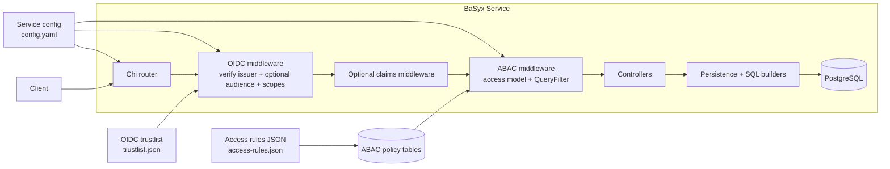
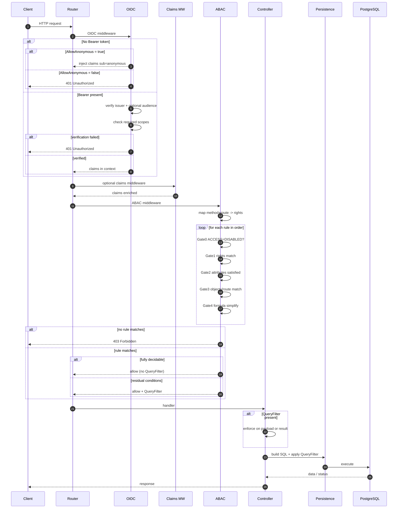
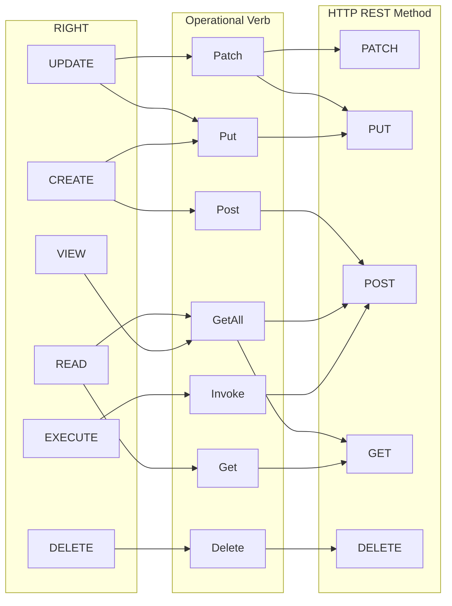

# Security Architecture and Flow

This document describes how security is wired in the BaSyx Go components, including the architecture, request flow, and enforcement process. It reflects the current implementation in the codebase.

## Scope note

This document covers runtime API security (OIDC, claims handling, ABAC, and QueryFilter enforcement).

For build and release supply-chain security (image signing, provenance attestations, SBOM attestations, SPDX/CycloneDX release assets, and verification commands), see [SUPPLY_CHAIN_SECURITY.md](SUPPLY_CHAIN_SECURITY.md).

For PostgreSQL-backed ABAC policy versions, management API behavior, and ABAC policy evidence, see [ABAC_POLICY_REPOSITORY.md](ABAC_POLICY_REPOSITORY.md).

For AAS Registry-specific `CREATE`, `UPDATE`, `READ`, `DELETE`, and status-code semantics, see [REGISTRY_SECURITY.md](REGISTRY_SECURITY.md).

For history evidence deployment guidance and NIS2-relevant operator responsibilities, see [NIS2_HISTORY_EVIDENCE.md](NIS2_HISTORY_EVIDENCE.md).

## High-level architecture


```mermaid
flowchart LR
  Client[Client]

  subgraph Service[BaSyx Service]
    Router[Chi router]
    OIDC[OIDC middleware\nverify issuer + optional audience + scopes]
    ClaimsMW[Optional claims middleware]
    ABAC[ABAC middleware\naccess model + QueryFilter]
    Ctrl[Controllers]
    Persist[Persistence + SQL builders]
    DB[(PostgreSQL)]
  end

  Rules[Access rules JSON\naccess-rules.json]
  PolicyDB[(ABAC policy tables)]
  Trust[OIDC trustlist\ntrustlist.json]
  Config[Service config\nconfig.yaml]

  Client --> Router --> OIDC --> ClaimsMW --> ABAC --> Ctrl --> Persist --> DB
  Trust --> OIDC
  Rules --> PolicyDB --> ABAC
  Config --> Router
  Config --> OIDC
  Config --> ABAC
```

## Request flow


```mermaid
sequenceDiagram
  autonumber
  participant C as Client
  participant R as Router
  participant O as OIDC
  participant M as Claims MW
  participant A as ABAC
  participant H as Controller
  participant P as Persistence
  participant D as PostgreSQL

  C->>R: HTTP request
  R->>O: OIDC middleware
  alt No Bearer token
    alt AllowAnonymous = true
      O-->>R: inject claims sub=anonymous
    else AllowAnonymous = false
      O-->>C: 401 Unauthorized
    end
  else Bearer present
    O->>O: verify issuer + optional audience
    O->>O: check required scopes
    alt verification failed
      O-->>C: 401 Unauthorized
    else verified
      O-->>R: claims in context
    end
  end

  R->>M: optional claims middleware
  M-->>R: claims enriched

  R->>A: ABAC middleware
  A->>A: map method+route -> rights
  loop for each rule in order
    A->>A: Gate0 ACCESS=DISABLED?
    A->>A: Gate1 rights match
    A->>A: Gate2 attributes satisfied
    A->>A: Gate3 objects/route match
    A->>A: Gate4 formula simplify
  end
  alt no rule matches
    A-->>C: 403 Forbidden
  else rule matches
    alt fully decidable
      A-->>R: allow (no QueryFilter)
    else residual conditions
      A-->>R: allow + QueryFilter
    end
  end

  R->>H: handler
  alt QueryFilter present
    H->>H: enforce on payload or result
  end
  H->>P: build SQL + apply QueryFilter
  P->>D: execute
  D-->>H: data / status
  H-->>C: response
```

## Where security is wired

- OIDC + ABAC middleware is applied by service entrypoints through the shared ABAC policy setup. Examples include:
  - AAS Environment: [cmd/aasenvironmentservice/main.go](../../cmd/aasenvironmentservice/main.go)
  - AAS Repository: [cmd/aasrepositoryservice/main.go](../../cmd/aasrepositoryservice/main.go)
  - Submodel Repository: [cmd/submodelrepositoryservice/main.go](../../cmd/submodelrepositoryservice/main.go)
  - AAS Registry: [cmd/aasregistryservice/main.go](../../cmd/aasregistryservice/main.go)
  - Submodel Registry: [cmd/submodelregistryservice/main.go](../../cmd/submodelregistryservice/main.go)
  - Discovery Service: [cmd/discoveryservice/main.go](../../cmd/discoveryservice/main.go)
  - Digital Twin Registry: [cmd/digitaltwinregistryservice/main.go](../../cmd/digitaltwinregistryservice/main.go)
  - AASX File Server: [cmd/aasxfileserverservice/main.go](../../cmd/aasxfileserverservice/main.go)
  - Concept Description Repository: [cmd/conceptdescriptionrepositoryservice/main.go](../../cmd/conceptdescriptionrepositoryservice/main.go)
- Core security logic lives in [internal/common/security](../../internal/common/security).
  - OIDC: [internal/common/security/oidc.go](../../internal/common/security/oidc.go)
  - ABAC engine: [internal/common/security/abac_engine.go](../../internal/common/security/abac_engine.go)
  - Route->rights mapping: [internal/common/security/abac_engine_methods.go](../../internal/common/security/abac_engine_methods.go)
  - Object/route matching: [internal/common/security/abac_engine_objects.go](../../internal/common/security/abac_engine_objects.go)
  - Attributes handling: [internal/common/security/abac_engine_attributes.go](../../internal/common/security/abac_engine_attributes.go)
  - Access model materialization: [internal/common/security/abac_engine_materialization.go](../../internal/common/security/abac_engine_materialization.go)
  - QueryFilter helpers: [internal/common/security/authorize.go](../../internal/common/security/authorize.go) and [internal/common/security/filter_helpers.go](../../internal/common/security/filter_helpers.go)

## Enablement rules

- Security is only active when ABAC is enabled in config. If `abac.enabled` is false, no OIDC or ABAC middleware is applied.
  - Example config: [cmd/aasregistryservice/config.yaml](../../cmd/aasregistryservice/config.yaml)
- OIDC uses the trustlist file to allow configured issuers and audiences.
  - Example trustlist: [cmd/aasregistryservice/config/trustlist.json](../../cmd/aasregistryservice/config/trustlist.json)
- Access rules are imported from the configured access model JSON into the PostgreSQL-backed ABAC policy repository when `abac.policyFileImport` requires it. Runtime authorization uses the active materialized DB policy.
  - Example rules: [cmd/aasregistryservice/config/access_rules/access-rules.json](../../cmd/aasregistryservice/config/access_rules/access-rules.json)
- For most services, the default startup file-import mode is `if_missing`: the JSON file is imported only when no active database-backed policy exists for the effective policy scope. If the JSON access-rule file should be the source of truth and overwrite existing policies on restart, set `abac.policyFileImport: always` or `ABAC_POLICY_FILE_IMPORT=always`. Digital Twin Registry is the current exception and defaults to `always`.
- DB-backed policy rows are isolated by service scope by default. Set `abac.policyScope` only when a deployment must split same-service instances or deliberately share one policy namespace.
- The protected ABAC management API under `/security/abac/**` is available only when `abac.enabled` and `abac.managementApi.enabled` are both true. Digital Twin Registry keeps this API disabled by default but can expose it through the same explicit opt-in. The OpenAPI/Swagger documentation follows the same condition.

## OIDC authentication

- OIDC provider verification supports configured providers that issue compact signed JWT bearer access tokens. Opaque OAuth tokens, token introspection, DPoP, and mTLS-bound access tokens are not supported.
- Issuer matching is exact. Tokens must pass signature, expiry, and configured audience checks before claims are exposed to ABAC.
- `audience` remains optional for compatibility with existing deployments. Omitting it skips the token audience (`aud`) check and logs a startup security warning. Configure it for production deployments.
- Standard OIDC discovery is loaded from `<issuer>/.well-known/openid-configuration`. Set `discoveryUrl` only when the provider exposes metadata at another URL; the metadata issuer must still match exactly and include `jwks_uri`.
- Required scopes are listed per provider in the trustlist. By default they are collected from `scope` and Entra ID's `scp` delegated-permission claim. Space-delimited strings and string arrays are accepted.
- Verified scopes are exposed to ABAC as `basyx.scopes`. Raw verified claims remain unchanged.
- Optional claim mappings expose provider-specific claims under the reserved `basyx.` namespace. Mapping sources are RFC 6901 JSON pointers.
- Tokens that already contain a `basyx.*` claim are rejected after verification to prevent canonical-claim spoofing. The rejected claim name is logged by the service.
- If the token is valid, claims are injected into the request context.
- The middleware adds time claims `CLIENTNOW`, `LOCALNOW`, and `UTCNOW` to support time-based ABAC formulas.
- AllowAnonymous is currently enabled by default in `SetupSecurityWithClaimsMiddleware`.

PostgreSQL-backed policy versions:
- [ABAC_POLICY_REPOSITORY.md](ABAC_POLICY_REPOSITORY.md)
- [internal/common/security/abacpolicy](../../internal/common/security/abacpolicy)

Relevant code:
- [internal/common/security/oidc.go](../../internal/common/security/oidc.go)
- [internal/common/security/security.go](../../internal/common/security/security.go)

Example trustlist entry:

```json
{
  "issuer": "https://issuer.example",
  "audience": "basyx-api",
  "scopes": ["read"],
  "discoveryUrl": "https://issuer.example/custom/openid-configuration",
  "scopeClaims": ["/scope", "/scp"],
  "claimMappings": [
    { "target": "roles", "mode": "list", "sources": ["/roles", "/realm_access/roles"] },
    { "target": "clear", "mode": "scalar", "sources": ["/extension_clearance"] }
  ]
}
```

`list` mappings merge and deduplicate scalar strings and string arrays from all configured sources. `scalar` mappings use the first present primitive source and accept an array only when it has exactly one item. Tokens with invalid mapped claim shapes are rejected with `401`.

For mixed delegated and app-only tokens from one issuer, avoid mandatory trustlist `scopes` when app-only tokens do not carry delegated scopes. Express the alternatives in ABAC using existing Part 4 operators and mapped scalar claims. The current grammar has no exact list-membership operator, so do not use substring checks for multi-value role authorization.

## ABAC authorization

The ABAC engine evaluates rules in order and either denies, allows, or allows with a QueryFilter.

Evaluation gates:
1. Map HTTP method + route to required rights (deny if no mapping).
   - Rights within one mapping entry are combined using logical OR (example: `PUT -> [CREATE, UPDATE]` means either right is sufficient).
   - Multiple matching mapping entries are also OR alternatives.
2. Check rights in rule ACLs.
3. Check attribute requirements (CLAIM presence or GLOBAL=ANONYMOUS).
4. Match object routes and descriptor objects.
5. Evaluate formula and simplify using claims and globals.

Outcomes:
- No match -> deny.
- Fully decidable true -> allow.
- Residual conditions -> allow + QueryFilter for downstream enforcement.

Relevant code:
- [internal/common/security/abac_engine.go](../../internal/common/security/abac_engine.go)
- [internal/common/security/abac_engine_methods.go](../../internal/common/security/abac_engine_methods.go)
- [internal/common/security/abac_engine_objects.go](../../internal/common/security/abac_engine_objects.go)
- [internal/common/security/abac_engine_attributes.go](../../internal/common/security/abac_engine_attributes.go)
- [internal/common/security/abac_engine_materialization.go](../../internal/common/security/abac_engine_materialization.go)

## RIGHT -> Operational Verb -> HTTP method mapping


```mermaid
flowchart LR
  subgraph RIGHTS[RIGHT]
    direction TB
    R_UPDATE[UPDATE]
    R_CREATE[CREATE]
    R_READ[READ]
    R_VIEW[VIEW]
    R_EXECUTE[EXECUTE]
    R_DELETE[DELETE]
  end

  subgraph VERBS[Operational Verb]
    direction TB
    V_PATCH[Patch]
    V_PUT[Put]
    V_POST[Post]
    V_GETALL[GetAll]
    V_GET[Get]
    V_INVOKE[Invoke]
    V_DELETE[Delete]
  end

  subgraph HTTP[HTTP REST Method]
    direction TB
    H_PATCH[PATCH]
    H_PUT[PUT]
    H_POST[POST]
    H_GET[GET]
    H_DELETE[DELETE]
  end

  R_UPDATE --> V_PATCH
  R_UPDATE --> V_PUT
  R_CREATE --> V_PUT
  R_CREATE --> V_POST
  R_READ --> V_GETALL
  R_READ --> V_GET
  R_VIEW --> V_GETALL
  R_EXECUTE --> V_INVOKE
  R_DELETE --> V_DELETE

  V_PATCH --> H_PATCH
  V_PATCH --> H_PUT
  V_PUT --> H_PUT
  V_POST --> H_POST
  V_GETALL --> H_GET
  V_GETALL --> H_POST
  V_GET --> H_GET
  V_INVOKE --> H_POST
  V_DELETE --> H_DELETE
```

Notes:
- Multiple edges into the same HTTP method node indicate different endpoints can use the same HTTP method with different operational verb meaning.
- For each concrete endpoint + HTTP method combination, there is exactly one mapped operational verb.

## QueryFilter propagation

- QueryFilter is stored in request context after ABAC evaluation.
- Controllers can enforce it on payloads or results.
- Persistence helpers apply it to SQL queries and fragment projections.
- QueryFilter carries right-scoped formulas in `FormulasByRight` (for example, separate formulas for `CREATE` and `UPDATE`).
- `SelectPutFormulaByExistence(ctx, dataExists)` switches the active `Formula` for PUT upsert checks (create vs update).

## Formula enforcement gate

- `ShouldEnforceFormula(ctx)` is the single helper used by components to decide if formula-based ABAC checks must run.
- It returns `(false, nil)` when ABAC is disabled or when no `QueryFilter` is present.
- It returns an error when configuration is missing in context.
- It validates the invariant `Formula != nil => len(FormulasByRight) > 0` and returns an error when violated.
- Components must propagate helper errors as internal errors with component-specific error codes.

## Runtime context requirements

- Security-sensitive code paths must use context-aware methods and pass `ctx` through all checks.
- Do not use runtime fallback logic that bypasses context-based security decisions.
- Security-specific work should be scoped inside `if shouldEnforce { ... }` to avoid unnecessary overhead when formula checks are not required.

Relevant code:
- [internal/common/security/authorize.go](../../internal/common/security/authorize.go)
- [internal/common/security/filter_helpers.go](../../internal/common/security/filter_helpers.go)

Registry-specific operation semantics:
- [REGISTRY_SECURITY.md](REGISTRY_SECURITY.md)

## Claims enrichment

- Digital Twin Registry injects the `Edc-Bpn` header into claims before ABAC.
  - [internal/common/security/edc_bpn.go](../../internal/common/security/edc_bpn.go)
  - [cmd/digitaltwinregistryservice/main.go](../../cmd/digitaltwinregistryservice/main.go)

## Access model structure (high level)

Access rules define:
- DEFATTRIBUTES: reusable attribute sets (CLAIM, GLOBAL, or REFERENCE).
- DEFOBJECTS: reusable route or descriptor object sets.
- DEFACLS: reusable rights and attribute bindings.
- DEFFORMULAS: reusable boolean expressions.
- rules: ordered rules that combine ACLs, objects, and formulas.

Validation invariants enforced by the current implementation:
- Rule-level one-of:
  - exactly one of `ACL` or `USEACL`
  - exactly one of `FORMULA` or `USEFORMULA`
  - exactly one of `OBJECTS` or `USEOBJECTS`
- ACL one-of:
  - exactly one of `ATTRIBUTES` or `USEATTRIBUTES`
- Filter validation:
  - `FILTER` (single) and `FILTERLIST` (multiple) are both supported
  - each filter entry must define `FRAGMENT`
  - each filter entry must define exactly one of `CONDITION` or `USEFORMULA`
  - optional `MATCH` boolean defaults to `false`; when `true` on array-ended fragments, filter evaluation is row-local
- Reference resolution:
  - `USEACL`, `USEATTRIBUTES`, `USEFORMULA`, and `USEOBJECTS` are resolved during model materialization at startup
  - unknown references fail fast (`... not found`)
  - `USEOBJECTS` also rejects empty references and circular references
- Parsing strictness:
  - unknown JSON fields are rejected (`DisallowUnknownFields`)
  - object identifiers in `OBJECTS` use the strict `ObjectItem` grammar (ROUTE / IDENTIFIABLE / REFERABLE / FRAGMENT / DESCRIPTOR forms)

Example file:
- [cmd/aasregistryservice/config/access_rules/access-rules.json](../../cmd/aasregistryservice/config/access_rules/access-rules.json)

## Testing and security environments

- Security-focused tests use dedicated access rules and identity-provider configs under the service-specific security test folders.
  - Example: [internal/aasregistry/security_tests](../../internal/aasregistry/security_tests)
  - Example: [internal/discoveryservice/security_tests](../../internal/discoveryservice/security_tests)
- Tests that intentionally run without ABAC enforcement must provide explicit config context with ABAC disabled.
- Production/runtime code must not inject ABAC-disabled fallback config to compensate for missing context.

## Operational checklist

- Enable ABAC in config and set the access model path.
- Configure the trustlist with issuer, audience, and required scopes. Treat an omitted audience as a legacy compatibility mode.
- Confirm route-to-rights mapping covers all endpoints used by the service.
- Validate the access rules against the intended claims and objects.
- Choose `abac.policyFileImport` deliberately. Use `always` when the JSON file is the source of truth and should overwrite the active DB policy at startup; use `if_missing` when the database-managed policy should survive restarts; use `never` when an active DB policy is mandatory.
- Use `abac.policyScope` deliberately. Sharing a scope across services with different routes can make one service's policy incomplete or unsafe for another service.
- Enable `abac.managementApi.enabled` only for services where runtime policy administration is required. For Digital Twin Registry, remember that startup file import defaults to `always`; if multiple DTRs share the default policy scope with different files, later startups can supersede earlier active policies. Protect `/security/abac/**` with admin-only ABAC rules.
- Restarting is no longer the only update path when the management API is enabled; staged rule edits still require explicit activation before they affect authorization.
