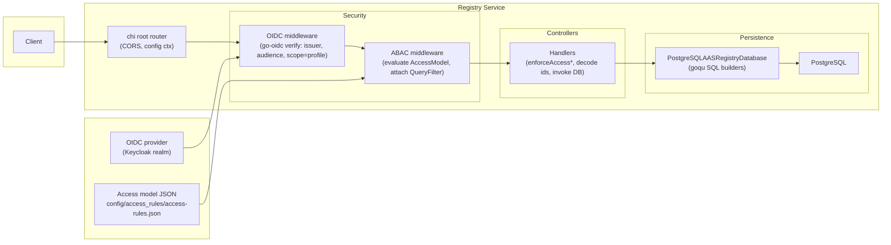
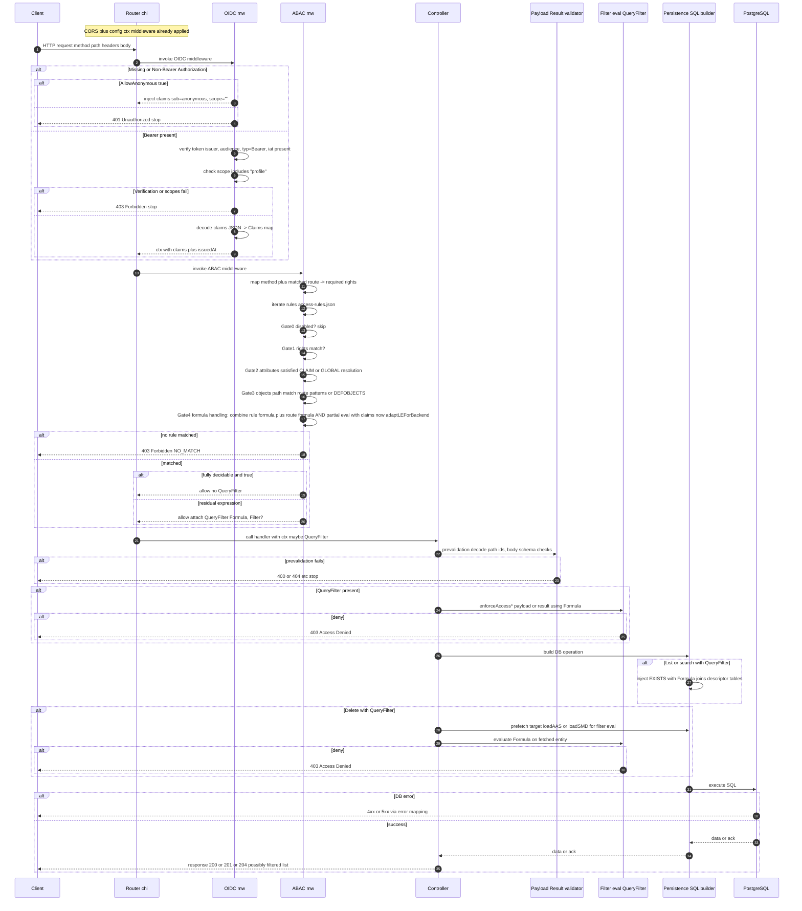

Developer Guide for AAS Registry Security - (ai generated)
===============================================================

Audience: backend/infra engineers touching the AAS Registry service (authn/z, routing, data path).
Goal: understand and safely extend the OIDC + ABAC stack, know its gates, configs, and how to debug.

Contents
--------
1) High-level diagrams (architecture + request sequence)
2) End-to-end flow overview
3) Components and files
4) OIDC authentication (go-oidc)
5) ABAC engine (rules, gates, evaluation)
6) QueryFilter propagation and enforcement
7) Controller behaviors (CRUD specifics)
8) Persistence filtering (SQL injection of filters)
9) Configuration knobs
10) Access model structure (access_rules.json)
11) Worked example: editor vs viewer vs anonymous
12) Worked example: delete with filter
13) Failure and logging signals
14) Local run + testing notes
15) Dev tips and extension checklist
16) Glossary
17) Appendix: gates with code pointers
18) Appendix: Example curl scripts


1) High-level diagrams
----------------------





2) End-to-end flow overview
---------------------------
- chi router mounts ConfigMiddleware, CORS, health.
- OIDC middleware authenticates bearer tokens (issuer, audience, typ, iat, scope=profile). Anonymous allowed if configured.
- ABAC middleware authorizes per AccessModel, attaches QueryFilter when residual conditions remain.
- Controllers validate inputs, enforce QueryFilter on payload/result, map errors to HTTP.
- Persistence injects QueryFilter into SQL and applies in-memory filters for submodels before pagination.


3) Components and files
-----------------------
- Entrypoint: `cmd/aasregistryservice/main.go`
  - Loads config, sets up Postgres, mounts router, applies `auth.SetupSecurity` (OIDC + ABAC).
- Security package: `internal/common/security/*`
  - `oidc.go`: token verification, claims injection, scope check.
  - `authorize.go`: middleware glue, QueryFilter context key.
  - `abac_engine*.go`: AccessModel parsing, rule evaluation, mapping routes to rights.
- Access model types: `internal/common/model/grammar/*`
- API layer: `internal/aasregistry/api/*`
  - `helper.go`: enforceAccess, decode helpers, pagedResponse.
  - `api_asset_administration_shell_registry_api_service.go`: handlers.
- Persistence layer: `internal/aasregistry/persistence/PostgreSQLAASRegistryDatabase.go`
  - Delegates to `internal/common/descriptors/*` for SQL.
- Filter plumbing:
  - `internal/common/descriptors/AASFilterQuery.go`: injects QueryFilter into goqu SELECT via EXISTS.
  - `internal/common/descriptors/SubModelDescriptorHandler.go`: in-memory filtering of submodel lists.
- Config: `cmd/aasregistryservice/config.yaml`, `cmd/aasregistryservice/config/access_rules/access-rules.json`.
- Tests: `internal/aasregistry/security_tests/*` (Keycloak realm + compose).


4) OIDC authentication (go-oidc)
--------------------------------
- Settings: Issuer, Audience, AllowAnonymous (wired true in SetupSecurity).
- Requirements on token:
  - Authorization: Bearer <JWT>.
  - Claim typ = Bearer (case-insensitive).
  - Claim iat present (unix seconds).
  - scope contains profile.
  - iss matches provider; aud matches configured client.
- Behavior:
  - Missing/invalid token: 401 if anonymous disallowed, else 403 for verification errors.
  - AllowAnonymous: inject claims {sub=anonymous, scope=""}; continues to ABAC.
  - Claims stored in ctx (claimsKey); issued-at stored in ctx (issuedAtKey).
- Errors encoded via `common.NewErrorResponse` + `openapi.EncodeJSONResponse`.
- Logs: verification failure, missing iat, missing scope, unexpected typ.


5) ABAC engine (rules, gates, evaluation)
-----------------------------------------
- Access model load: `SetupSecurity` reads modelPath, `ParseAccessModel` into `AccessModel` (grammar.AccessRuleModelSchemaJSON).
- Route->rights map: `mapMethodAndPatternToRightsData` in `abac_engine_methods.go`; default deny if no match (no rights, NO_MATCH).
- Gates in `AuthorizeWithFilter`:
  - Gate0: skip if ACL.ACCESS == DISABLED.
  - Gate1: Rights containment (`rightsContainsAll`).
  - Gate2: Attributes satisfied (`attributesSatisfiedAll`): resolves CLAIM/GLOBAL (ANONYMOUS, UTCNOW, LOCALNOW, CLIENTNOW).
  - Gate3: Objects/path match (`matchRouteObjectsObjItem`), supports DEFOBJECTS recursion and route formulas.
  - Gate4: Formula handling:
    - Combine rule formula + route formula (AND).
    - Partial eval with claims/time (`adaptLEForBackend`).
    - If fully decidable: evaluate; allow or continue.
    - If residual: collect residual expressions; carry FILTER block if present.
- Outcomes:
  - No rule expressions picked ? NO_MATCH ? deny.
  - Fully decidable true ? allow without QueryFilter.
  - Residual expression(s) ? allow + QueryFilter{Formula, Filter}.
- Expression features: boolean, eq/ne/gt/ge/lt/le, regex, contains, startsWith, endsWith, and/or/not, match array, numeric cast, field lookups (`$aasdesc#...`), attribute/global references.


6) QueryFilter propagation and enforcement
------------------------------------------
- Stored in ctx by ABAC middleware (filterKey).
- Access via `auth.GetQueryFilter(ctx)`.
- Controller usage:
  - `enforceAccessForAAS`, `enforceAccessForSubmodel` evaluate Formula on payload/result.
  - Delete handlers fetch entity when QueryFilter present, then evaluate before deleting.
- Persistence usage:
  - `AASFilterQuery.go`: `EvaluateToExpression()` -> goqu expression inside EXISTS with joins over descriptor tables.
  - `SubModelDescriptorHandler.go`: filters loaded submodels in Go prior to pagination.
- If no QueryFilter: no extra filtering beyond ABAC allow.


7) Controller behaviors (CRUD specifics)
----------------------------------------
- POST AAS/Submodel:
  - enforceAccess* on body against QueryFilter Formula; deny if formula fails.
  - Existence checks (conflict when ID exists).
  - Insert; map DB errors to 400/409/500.
- GET by id:
  - Load from DB; if QueryFilter exists, evaluate Formula on result; deny 403 if fail.
- PUT (AAS/Submodel):
  - Decode path IDs; ensure body ID matches path; enforceAccess* on body.
  - Replace; 201 when created, 204 when updated; error mapping.
- DELETE:
  - If QueryFilter exists, prefetch entity; evaluate Formula; deny if fail.
  - Execute delete; error mapping (404/400/500).
- LIST:
  - Cursor pagination; QueryFilter injected into SQL EXISTS.
  - Submodel list also filtered in-memory before pagination to keep cursor correctness.


8) Persistence filtering (SQL injection of filters)
---------------------------------------------------
- `AASFilterQuery.go` builds EXISTS:
  - Joins: descriptor -> aas_descriptor -> specific_asset_id -> external_subject_reference -> reference_keys -> endpoints -> submodel_descriptor -> submodel_descriptor_endpoint -> semantic_id reference keys.
  - WHERE includes `descriptor.id` correlation + evaluated Formula expression.
- `SubModelDescriptorHandler.go`:
  - After loading submodels for an AAS, applies Formula via `EvaluateSubmodelDescriptor` per element; errors treated as non-match.
  - Sorts and paginates after filtering.


9) Configuration knobs
----------------------
- `cmd/aasregistryservice/config.yaml`:
  - server.port, contextPath
  - postgres.host/port/user/password/dbname/pool settings
  - oidc.issuer, oidc.audience (AllowAnonymous true in code)
  - abac.enabled, abac.modelPath, abac.clientRolesAudience, abac.enableDebugErrorResponses
- Access model file: `cmd/aasregistryservice/config/access_rules/access-rules.json`.
- To disable anonymous: modify `SetupSecurity` to set `AllowAnonymous: false` (code change) or enforce upstream.


10) Access model structure (sample)
-----------------------------------
- DEFATTRIBUTES:
  - anonym_attr: GLOBAL=ANONYMOUS
  - role_attr: CLAIM role
  - member_attr: CLAIM role + CLAIM clear
- DEFOBJECTS:
  - health (/health)
  - god (/*)
  - description (/description)
  - shellDescriptorById (/shell-descriptors/*)
  - shellDescriptors (/shell-descriptors)
  - allShellDescriptors (both base and wildcard)
  - allShellDescriptorsObject (DESCRIPTOR selector $aasdesc("*"))
  - specialShellDescriptor (DESCRIPTOR selector for specific id)
- DEFACLS:
  - disabled_god: ANONYMOUS, rights CREATE/READ/UPDATE/DELETE, ACCESS=DISABLED
  - read_only_public: ANONYMOUS, rights READ, ACCESS=ALLOW
  - write_role/read_role: CLAIM role, rights CREATE or READ
  - write_member/read_member: CLAIM role+clear
  - admin: CLAIM role+clear, rights ALL, ACCESS=ALLOW
- DEFFORMULAS (examples):
  - always_true
  - is_public_readable: compares externalSubjectId key value to PUBLIC_READABLE
  - isRole=viewer&customerPartId: role viewer + specificAssetIds name == customerPartId
  - isMember&manufacturerPartId: role viewer + clear>=1 + name == manufacturerPartId
  - isRole=editor&X: role editor + externalSubjectId key value == WRITTEN_BY_X
  - isMember&Y: role editor + clear>=1 + externalSubjectId == WRITTEN_BY_Y
  - isAdmin: role admin + clear>=10
  - isTest: role test + true
- rules (ordered):
  - disabled_god on god (deny all)
  - read_only_public on health (allow anonymous health)
  - admin on allShellDescriptorsObject with isAdmin
  - read_only_public on allShellDescriptors with is_public_readable
  - read_role on allShellDescriptors with isRole=viewer&customerPartId
  - read_member on allShellDescriptors with isMember&manufacturerPartId
  - write_role on allShellDescriptors with isRole=editor&X
  - write_member on allShellDescriptors with isMember&Y
  - read_role on specific descriptor with isTest
- Rule ordering matters: first allow/deny that matches controls outcome.


11) Worked example: viewer vs editor vs anonymous
-------------------------------------------------
Scenario data: descriptors contain specificAssetIds with names and externalSubjectId keys/values; claims provide role and clear.

Anonymous GET /health
- OIDC: missing bearer -> anonymous claims injected.
- ABAC: rule read_only_public on health passes; allow.
- Response: 200.

Viewer (role=viewer, clear=0) GET /shell-descriptors
- OIDC: verified token.
- ABAC:
  - admin rule fails role check.
  - public-readable rule applies when descriptor has externalSubjectId key value PUBLIC_READABLE -> residual formula -> QueryFilter.
  - viewer/customerPartId rule applies when specificAssetIds name == customerPartId -> residual formula -> QueryFilter.
- Controller: list uses QueryFilter; SQL EXISTS restricts rows.
- Result: only descriptors satisfying formulas are returned.

Editor (role=editor, clear=2) POST /shell-descriptors with descriptor tagged WRITTEN_BY_X
- OIDC: ok.
- ABAC: write_role rule with isRole=editor&X matches; partial evaluation on payload via enforceAccessForAAS ensures fields satisfy formula; allow.
- Persistence: insert.
- Response: 201 created.

Admin (role=admin, clear=12) GET /shell-descriptors
- OIDC: ok.
- ABAC: admin rule passes, fully decidable (claims only) -> allow without QueryFilter; full dataset returned.


12) Worked example: delete with filter
--------------------------------------
- Request: DELETE /shell-descriptors/{id}
- ABAC attaches QueryFilter (e.g., isRole=editor&X) when rule matched with residual.
- Controller:
  - If QueryFilter present: load descriptor (loadAASForAuth), evaluate Formula on loaded entity; if false -> 403, do not delete.
  - If true -> proceed to delete.
- Persistence: delete operation executes only after filter approval.


13) Failure and logging signals
-------------------------------
- OIDC failures:
  - Token verification failed -> 403.
  - Missing iat -> 403.
  - Missing scope profile -> 403.
  - Unexpected typ -> 403.
  - No bearer while anonymous disallowed -> 401.
- ABAC failures:
  - Logs: "ABAC(model): <reason>"; client sees 403 when NO_MATCH.
- Controller failures:
  - Access denied in enforceAccess* -> 403.
  - Decode errors -> 400.
  - Not found -> 404.
  - Conflicts -> 409.
  - Internal errors -> 500.
- DB failures: mapped via common.IsErr* helpers.


14) Local run + testing notes
-----------------------------
- Run service: `go run cmd/aasregistryservice/main.go -config cmd/aasregistryservice/config.yaml`
- DB: ensure Postgres reachable; schema from `basyxschema.sql`.
- Security tests:
  - `internal/aasregistry/security_tests/docker_compose/docker_compose.yml` spins Keycloak + registry.
  - Realm: `internal/aasregistry/security_tests/docker_compose/keycloak/realm/basyx-realm.json`.
  - Integration test: `internal/aasregistry/security_tests/integration_test.go` fetches token and exercises endpoints.
- Adjusting policy: edit access_rules.json and restart (no hot reload).


15) Dev tips and extension checklist
------------------------------------
- Adding endpoint:
  - Add chi route in controller; ensure `mapMethodAndPatternToRightsData` covers verb+pattern.
  - Add OBJECT/DEF and RULE in access model to constrain it.
- Adding claim-based policy:
  - Add DEFFORMULA using `$attribute: {CLAIM: "name"}`; use `$numCast` if numeric compare.
- Stricter scopes: extend `required := []string{"profile"}` in `oidc.go`.
- Disable anonymous: change `AllowAnonymous: true` in `SetupSecurity` to false.
- Debug filters:
  - Log `qf.Formula` or `EvaluateToExpression()` in tests.
  - Verify SQL EXISTS is present for list endpoints.
- Cursor safety: keep in-memory filter before pagination (see SubModelDescriptorHandler) when adding new list variants.


16) Glossary
------------
- OIDC middleware: Authenticates bearer JWT and injects claims.
- ABAC middleware: Authorizes using AccessModel; may return QueryFilter.
- QueryFilter: Residual logical expression + optional FILTER; applied post-ABAC in controllers/DB.
- RIGHTS: CRUD-like rights mapped from HTTP method+route.
- OBJECTS: Route patterns or descriptor selectors defining target resources.
- FORMULA: Logical expression combining claims/globals/fields.
- FILTER: Optional backend filter defined in rule; carried with QueryFilter.


17) Appendix: gates with code pointers
--------------------------------------
- Gate0 disabled: `abac_engine.go` (ACCESS DISABLED skip).
- Gate1 rights: `rightsContainsAll` in `abac_engine_methods.go`.
- Gate2 attributes: `attributesSatisfiedAll` (CLAIM/GLOBAL resolution) in `abac_engine_eval.go`.
- Gate3 objects: `matchRouteObjectsObjItem`, `resolveObjects` in `abac_engine_objects.go` + `abac_engine_methods.go`.
- Gate4 formula: `adaptLEForBackend`, `evalLE` in `abac_engine_eval.go`.
- QueryFilter creation: `AuthorizeWithFilter` returns QueryFilter when residual exists.
- Context propagation: `ABACMiddleware` stores QueryFilter under filterKey.
- Controller enforcement: `enforceAccessForAAS`/`enforceAccessForSubmodel` in `internal/aasregistry/api/helper.go`.
- SQL injection: `AASFilterQuery.go` uses `EvaluateToExpression()` to build EXISTS.
- In-memory filter: `SubModelDescriptorHandler.go` loops over submodels applying Formula.
- OIDC checks: `oidc.go` verifies issuer, audience, typ, iat, scope.


18) Appendix: Example curl scripts
----------------------------------
- Acquire token (pseudo, adjust for your Keycloak):
  ```
  TOKEN=$(curl -s -X POST "http://localhost:8080/realms/basyx/protocol/openid-connect/token" \
    -d "client_id=discovery-service" \
    -d "grant_type=password" \
    -d "username=viewer" \
    -d "password=viewer" \
    | jq -r .access_token)
  ```
- GET all descriptors as viewer:
  ```
  curl -H "Authorization: Bearer $TOKEN" http://localhost:5004/shell-descriptors
  ```
- POST descriptor as editor (requires fields satisfying rule):
  ```
  TOKEN_EDITOR=... # editor token
  curl -X POST http://localhost:5004/shell-descriptors \
    -H "Authorization: Bearer $TOKEN_EDITOR" \
    -H "Content-Type: application/json" \
    -d @descriptor.json
  ```
- DELETE descriptor with filter check:
  ```
  TOKEN_EDITOR=... # same editor token
  curl -X DELETE http://localhost:5004/shell-descriptors/{id} \
    -H "Authorization: Bearer $TOKEN_EDITOR"
  ```


Extended deep-dive: expression grammar cheatsheet
-----------------------------------------------
- Value sources:
  - $attribute: { CLAIM: "role" } -> pulls from JWT claims
  - $attribute: { GLOBAL: "ANONYMOUS" | "UTCNOW" | "LOCALNOW" | "CLIENTNOW" }
  - $field: "$aasdesc#specificAssetIds[].name" -> traverses descriptor fields
  - $strVal / $numVal / $boolean constants
- Operators:
  - $eq, $ne, $gt, $ge, $lt, $le (binary)
  - $regex, $contains, $startsWith, $endsWith (string ops)
  - $and, $or (arrays), $not
  - $match (list of structures)
  - $numCast (attempt numeric conversion)
- Composition rules:
  - Route formula AND Rule formula when both present.
  - adaptLEForBackend reduces expressions containing only CLAIM/GLOBAL values.

Practical debugging steps
-------------------------
1) Confirm route mapping: ensure chi pattern matches entry in mapMethodAndPatternToRightsData.
2) Dump QueryFilter: in a debug build, log `qf.Formula` when present to see residual conditions.
3) Validate claims: decode JWT (base64) and verify role/clear/typ/scope.
4) Validate data fields: ensure descriptors contain fields referenced by formula ($aasdesc#...).
5) Inspect SQL: enable goqu debug or log generated SQL to confirm EXISTS clause.
6) Ordering of rules: remember first matching rule that passes all gates defines outcome; reposition to change priority.

Edge cases and assumptions
--------------------------
- AllowAnonymous is true; rules relying on GLOBAL=ANONYMOUS remain meaningful. If you disable anonymous, remove such rules.
- Missing claims: attribute resolution fails the gate; ensure required claims exist in tokens for privileged paths.
- iat must be present; tokens lacking iat are rejected in OIDC middleware.
- scope=profile required; adjust if your issuer omits it.
- DESCRIPTOR selectors ($aasdesc("*") etc.) rely on grammar evaluation; keep schema aligned with model grammar.

Testing recipes
---------------
- Unit: use `FromFilterFromFile` to load QueryFilter and evaluate against fabricated descriptors.
- Integration: run docker_compose in security_tests; use provided realm to obtain tokens and hit service.
- Negative: craft tokens with wrong audience or missing scope to assert 401/403 from OIDC.
- Performance: ABAC evaluation is in-memory; most cost comes from SQL EXISTS; check indexes on joined tables (descriptor, specific_asset_id, reference_keys) for performance.

Operational considerations
--------------------------
- Rotating issuer/audience: update config.yaml and restart service; OIDC provider metadata fetched at startup.
- Model updates: service must restart to pick new access_rules.json (no watcher implemented).
- Logging: avoid logging full tokens; current code logs reasons only.
- Scaling: chi + go-oidc are lightweight; database becomes bottleneck; ensure pool sizes match load.

Future improvements (ideas)
---------------------------
- Make AllowAnonymous configurable instead of hardcoded.
- Expose health endpoint outside security stack to simplify public checks (current model already allows via rules).
- Add structured logging for ABAC decisions (rule id, reason) gated by debug flag.
- Hot-reload access_rules.json with checksum watch for faster policy iteration.
- Extend scope requirements per endpoint (e.g., write may need extra scope).

FAQ
---
Q: Why both Formula and Filter? 
A: Formula is the logical expression; Filter is an optional backend filter block from the model. Current code primarily uses Formula; Filter is preserved for extension.

Q: How do I add tenant scoping? 
A: Encode tenant in claims and in descriptor field, add DEFFORMULA comparing them, reference in relevant RULES; ensure list SQL path includes the field.

Q: How do I allow a specific descriptor id? 
A: Add DEFOBJECTS with DESCRIPTOR selector or ROUTE targeting the id; add rule with matching ACL.

Q: What if mapMethodAndPatternToRightsData misses a route? 
A: Default deny (NO_MATCH) now; add mapping to intentionally allow.

Concrete SQL pattern (simplified)
---------------------------------
- The EXISTS injected resembles:
  ```sql
  WHERE EXISTS (
    SELECT 1
    FROM descriptor AS descriptor
    LEFT JOIN aas_descriptor ON aas_descriptor.descriptor_id = descriptor.id
    LEFT JOIN specific_asset_id ON specific_asset_id.descriptor_id = descriptor.id
    LEFT JOIN external_subject_reference ON external_subject_reference.id = specific_asset_id.external_subject_ref
    LEFT JOIN external_subject_reference_key ON external_subject_reference_key.reference_id = external_subject_reference.id
    LEFT JOIN aas_descriptor_endpoint ON aas_descriptor_endpoint.descriptor_id = descriptor.id
    LEFT JOIN submodel_descriptor ON submodel_descriptor.aas_descriptor_id = aas_descriptor.descriptor_id
    LEFT JOIN submodel_descriptor_endpoint ON submodel_descriptor_endpoint.descriptor_id = submodel_descriptor.descriptor_id
    LEFT JOIN aasdesc_submodel_descriptor_semantic_id_reference ON aasdesc_submodel_descriptor_semantic_id_reference.id = submodel_descriptor.semantic_id
    LEFT JOIN aasdesc_submodel_descriptor_semantic_id_reference_key ON aasdesc_submodel_descriptor_semantic_id_reference_key.reference_id = aasdesc_submodel_descriptor_semantic_id_reference.id
    WHERE descriptor.id = <outer descriptor id>
      AND (<evaluated Formula>)
  )
  ```
- Adjust joins if you extend formulas to new fields.

Token structure expectations
----------------------------
- Example claims map:
  ```json
  {
    "iss": "http://localhost:8080/realms/basyx",
    "aud": "discovery-service",
    "sub": "user-id",
    "typ": "Bearer",
    "scope": "profile",
    "role": "viewer",
    "clear": 1,
    "iat": 1700000000,
    "exp": 1700003600
  }
  ```
- Add custom claims as needed; reference them via $attribute CLAIM in formulas.

Change management reminders
---------------------------
- When changing ABAC model, update this doc with new attributes/objects/formulas.
- When adding controller routes, align chi pattern, rights map, and access model objects.
- When hardening OIDC (scopes, typ checks), document it and adjust tests.
