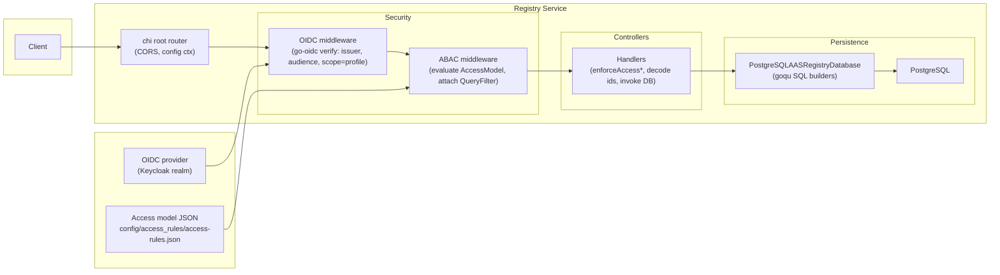
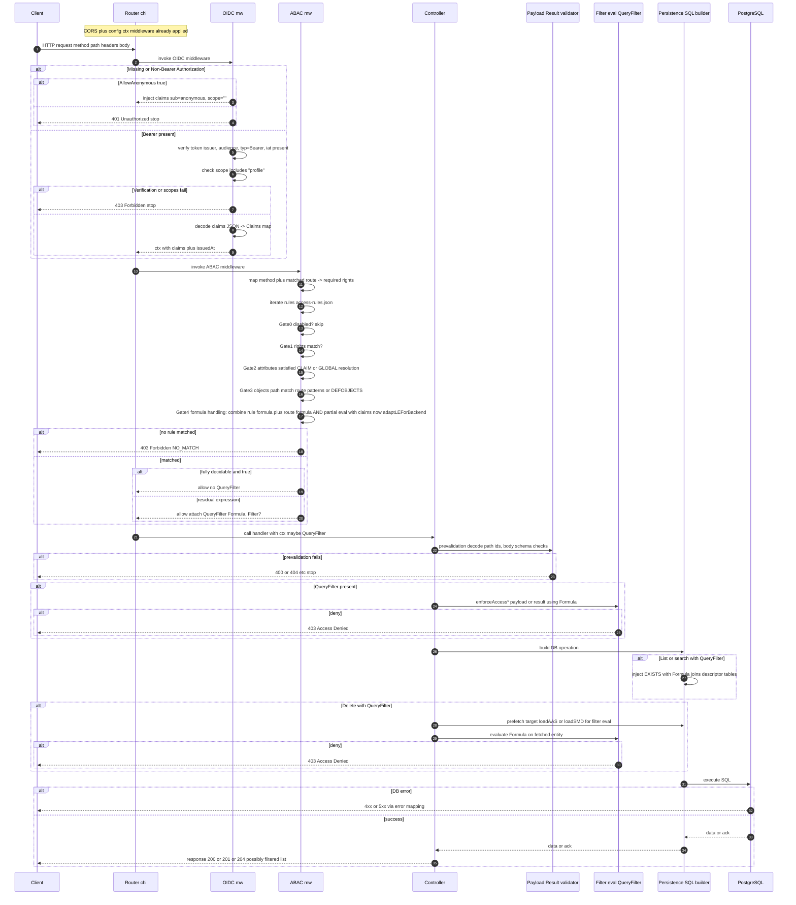

```mermaid
flowchart LR
  subgraph ClientSide[" "]
    C["Client"]
  end

  subgraph Service["Registry Service"]
    R["chi root router<br/>(CORS, config ctx)"]

    subgraph Sec["Security"]
      OIDC["OIDC middleware<br/>(go-oidc verify: issuer, audience, scope=profile)"]
      ABAC["ABAC middleware<br/>(evaluate AccessModel, attach QueryFilter)"]
    end

    subgraph API["Controllers"]
      Ctrl["Handlers<br/>(enforceAccess*, decode ids, invoke DB)"]
    end

    subgraph DBLayer["Persistence"]
      P["PostgreSQLAASRegistryDatabase<br/>(goqu SQL builders)"]
      SQL["PostgreSQL"]
    end
  end

  C --> R
  R --> OIDC --> ABAC --> Ctrl --> P --> SQL

  subgraph Inputs[" "]
    Rules["Access model JSON<br/>config/access_rules/access-rules.json"]
    Keycloak["OIDC provider<br/>(Keycloak realm)"]
  end

  Rules --> ABAC
  Keycloak --> OIDC
```

```mermaid
sequenceDiagram
  autonumber
  participant C as Client
  participant R as Router chi
  participant O as OIDC mw
  participant A as ABAC mw
  participant H as Controller
  participant V as Payload Result validator
  participant F as Filter eval QueryFilter
  participant P as Persistence SQL builder
  participant D as PostgreSQL

  note over R: CORS plus config ctx middleware already applied
  C->>R: HTTP request method path headers body

  %% OIDC
  R->>O: invoke OIDC middleware
  alt Missing or Non-Bearer Authorization
    alt AllowAnonymous true
      O-->>R: inject claims sub=anonymous, scope=""
    else
      O-->>C: 401 Unauthorized stop
    end
  else Bearer present
    O->>O: verify token issuer, audience, typ=Bearer, iat present
    O->>O: check scope includes "profile"
    alt Verification or scopes fail
      O-->>C: 403 Forbidden stop
    else
      O->>O: decode claims JSON -> Claims map
      O-->>R: ctx with claims plus issuedAt
    end
  end

  %% ABAC gates
  R->>A: invoke ABAC middleware
  A->>A: map method plus matched route -> required rights
  A->>A: iterate rules access-rules.json
  A->>A: Gate0 disabled? skip
  A->>A: Gate1 rights match?
  A->>A: Gate2 attributes satisfied CLAIM or GLOBAL resolution
  A->>A: Gate3 objects path match route patterns or DEFOBJECTS
  A->>A: Gate4 formula handling: combine rule formula plus route formula AND partial eval with claims now adaptLEForBackend
  alt no rule matched
    A-->>C: 403 Forbidden NO_MATCH
  else matched
    alt fully decidable and true
      A-->>R: allow no QueryFilter
    else residual expression
      A-->>R: allow attach QueryFilter Formula, Filter?
    end
  end

  %% Controller entry
  R->>H: call handler with ctx maybe QueryFilter
  H->>V: prevalidation decode path ids, body schema checks
  alt prevalidation fails
    V-->>C: 400 or 404 etc stop
  end

  %% For create update read flows with body or result checks
  alt QueryFilter present
    H->>F: enforceAccess* payload or result using Formula
    alt deny
      F-->>C: 403 Access Denied
    end
  end

  %% Persistence
  H->>P: build DB operation
  alt List or search with QueryFilter
    P->>P: inject EXISTS with Formula joins descriptor tables
  end
  alt Delete with QueryFilter
    H->>P: prefetch target loadAAS or loadSMD for filter eval
    H->>F: evaluate Formula on fetched entity
    alt deny
      F-->>C: 403 Access Denied
    end
  end

  P->>D: execute SQL
  alt DB error
    D-->>C: 4xx or 5xx via error mapping
  else success
    D-->>P: data or ack
    P-->>H: data or ack
    H-->>C: response 200 or 201 or 204 possibly filtered list
  end
```