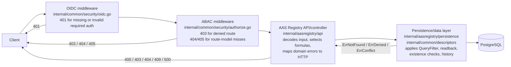
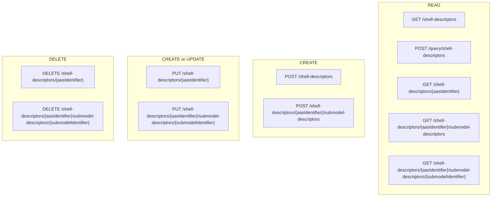
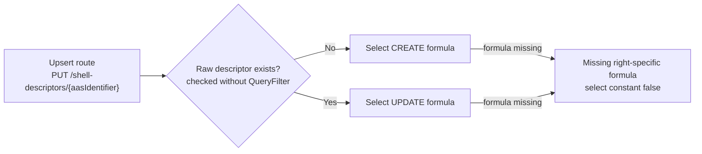
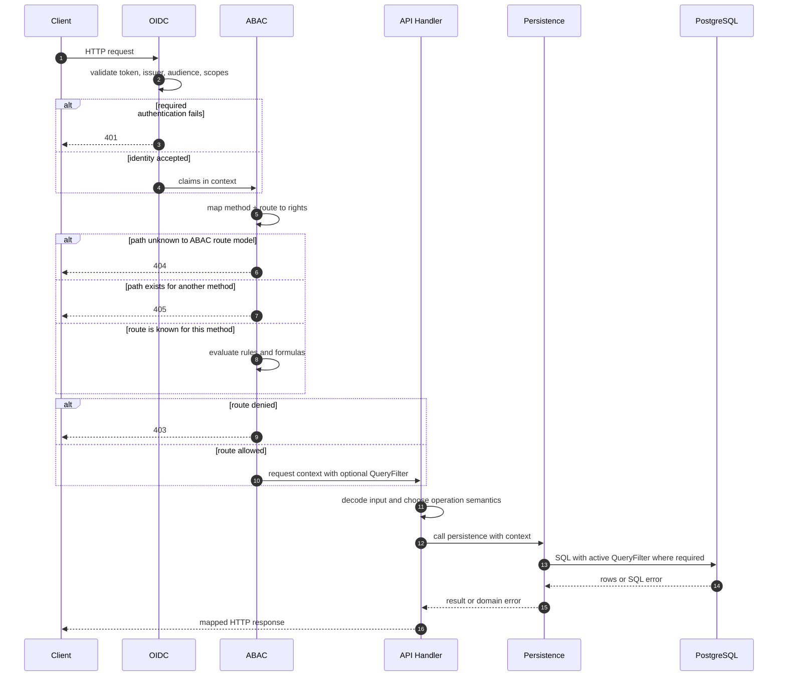
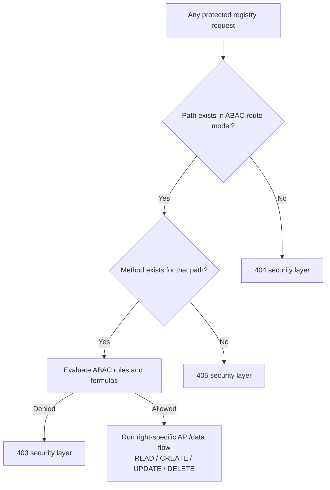
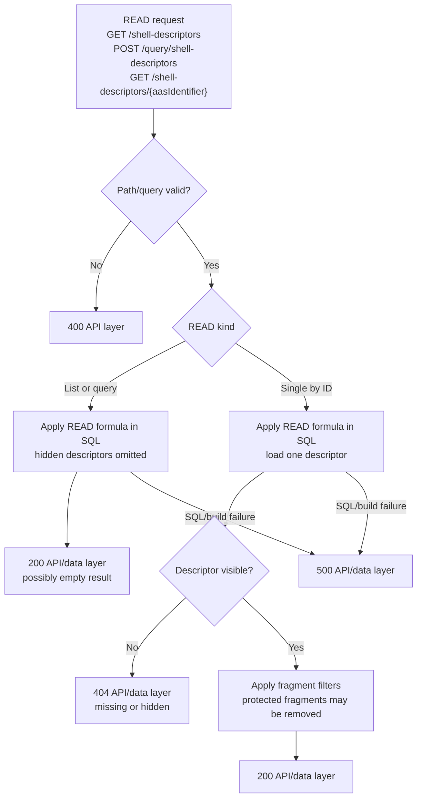
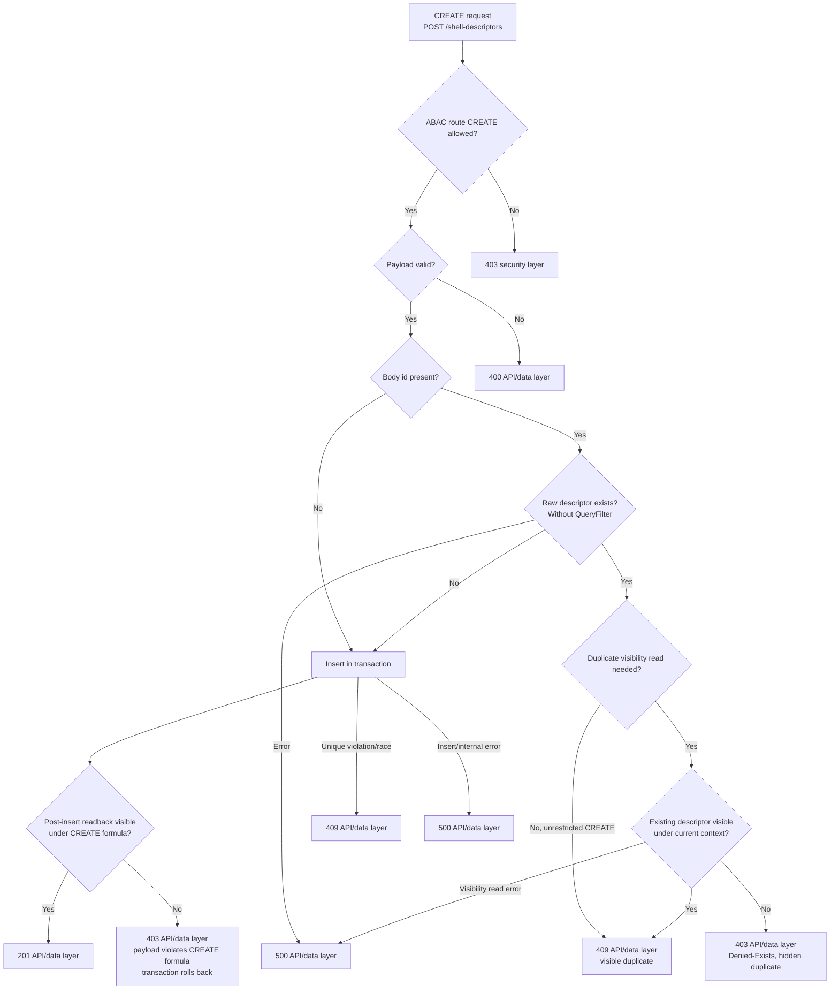
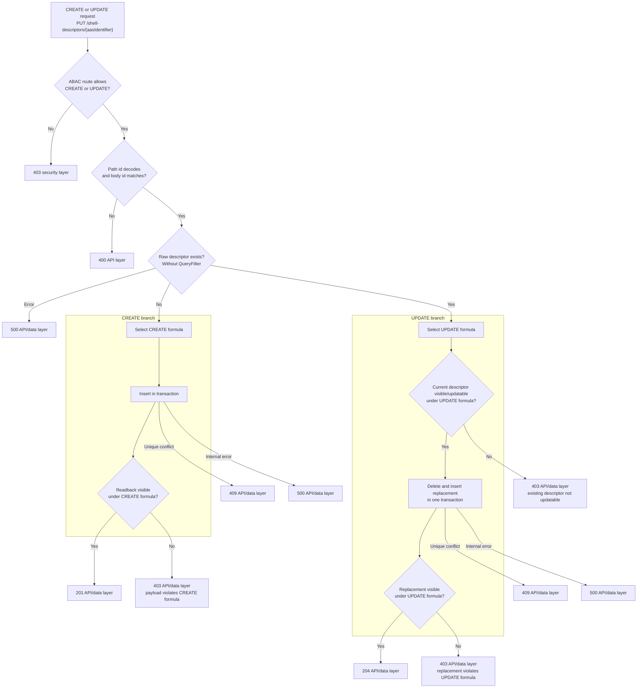
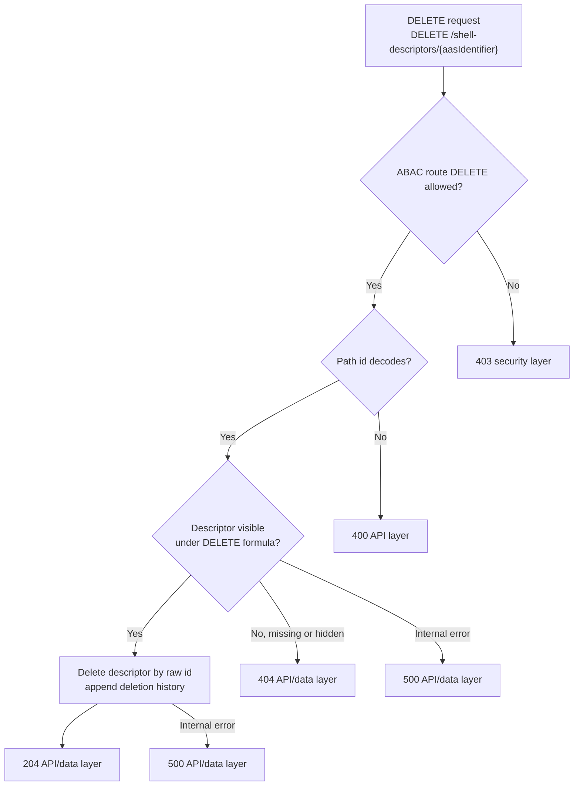
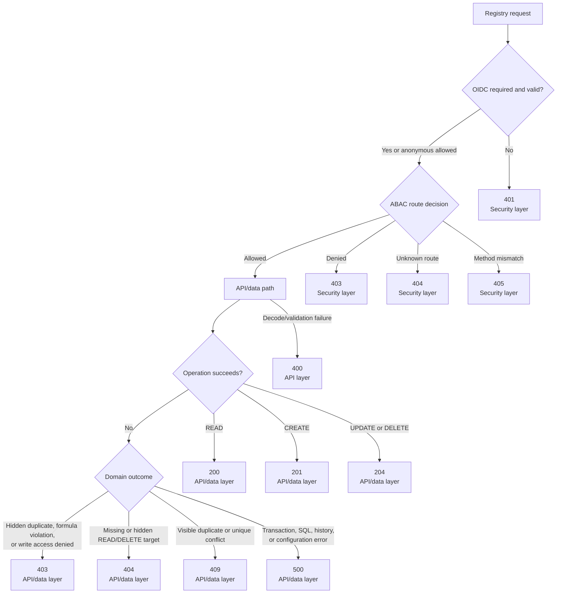

# AAS Registry Security Semantics

This document describes the current AAS Registry authorization and status-code behavior for descriptor rights: `CREATE`, `UPDATE`, `READ`, and `DELETE`. It focuses on `shell-descriptors` routes and the shared flow used by the nested submodel-descriptor routes.

## Layers

Security is enforced across middleware, API/controller code, and persistence code. A `403` can come directly from ABAC middleware before the handler runs, or from the API/data path after a route was allowed but the specific data or payload failed formula checks.

```mermaid
flowchart LR
  Client[Client]
  OIDC[OIDC middleware<br/>internal/common/security/oidc.go<br/>401 for missing or invalid required auth]
  ABAC[ABAC middleware<br/>internal/common/security/authorize.go<br/>403 for denied route<br/>404/405 for route-model misses]
  API[AAS Registry API/controller<br/>internal/aasregistry/api<br/>decodes input, selects formulas,<br/>maps domain errors to HTTP]
  Data[Persistence/data layer<br/>internal/aasregistry/persistence<br/>internal/common/descriptors<br/>applies QueryFilter, readback,<br/>existence checks, history]
  DB[(PostgreSQL)]

  Client --> OIDC --> ABAC --> API --> Data --> DB
  Data -->|ErrNotFound / ErrDenied / ErrConflict| API
  API -->|400 / 403 / 404 / 409 / 500| Client
  ABAC -->|403 / 404 / 405| Client
  OIDC -->|401| Client
```

## Route Rights

The AAS Registry route-to-rights mapping is centralized in `internal/common/security/abac_engine_methods.go`.

```mermaid
flowchart TB
  subgraph ReadRoutes[READ]
    GetAll["GET /shell-descriptors"]
    Query["POST /query/shell-descriptors"]
    GetOne["GET /shell-descriptors/{aasIdentifier}"]
    GetSMAll["GET /shell-descriptors/{aasIdentifier}/submodel-descriptors"]
    GetSMOne["GET /shell-descriptors/{aasIdentifier}/submodel-descriptors/{submodelIdentifier}"]
  end

  subgraph CreateRoutes[CREATE]
    PostAAS["POST /shell-descriptors"]
    PostSM["POST /shell-descriptors/{aasIdentifier}/submodel-descriptors"]
  end

  subgraph UpsertRoutes[CREATE or UPDATE]
    PutAAS["PUT /shell-descriptors/{aasIdentifier}"]
    PutSM["PUT /shell-descriptors/{aasIdentifier}/submodel-descriptors/{submodelIdentifier}"]
  end

  subgraph DeleteRoutes[DELETE]
    DeleteAAS["DELETE /shell-descriptors/{aasIdentifier}"]
    DeleteSM["DELETE /shell-descriptors/{aasIdentifier}/submodel-descriptors/{submodelIdentifier}"]
  end
```

The upsert route can be authorized through either `CREATE` or `UPDATE`. The API layer then checks raw existence and selects the active formula by existence.

```mermaid
flowchart LR
  UpsertRequest["Upsert route<br/>PUT /shell-descriptors/{aasIdentifier}"]
  Exists{"Raw descriptor exists?<br/>checked without QueryFilter"}
  CreateFormula["Select CREATE formula"]
  UpdateFormula["Select UPDATE formula"]
  FalseFormula["Missing right-specific formula<br/>select constant false"]

  UpsertRequest --> Exists
  Exists -->|No| CreateFormula
  Exists -->|Yes| UpdateFormula
  CreateFormula -->|formula missing| FalseFormula
  UpdateFormula -->|formula missing| FalseFormula
```

## Common Request Flow

```mermaid
sequenceDiagram
  autonumber
  participant C as Client
  participant O as OIDC
  participant A as ABAC
  participant H as API Handler
  participant P as Persistence
  participant D as PostgreSQL

  C->>O: HTTP request
  O->>O: validate token, issuer, audience, scopes
  alt required authentication fails
    O-->>C: 401
  else identity accepted
    O->>A: claims in context
  end

  A->>A: map method + route to rights
  alt path unknown to ABAC route model
    A-->>C: 404
  else path exists for another method
    A-->>C: 405
  else route is known for this method
    A->>A: evaluate rules and formulas
  end
  alt route denied
    A-->>C: 403
  else route allowed
    A->>H: request context with optional QueryFilter
  end

  H->>H: decode input and choose operation semantics
  H->>P: call persistence with context
  P->>D: SQL with active QueryFilter where required
  D-->>P: rows or SQL error
  P-->>H: result or domain error
  H-->>C: mapped HTTP response
```

For all protected registry endpoints, the ABAC middleware first checks whether the path exists in the route model and whether the requested method is valid for that path. A method mismatch returns `405` from the security layer before any `READ`, `CREATE`, `UPDATE`, or `DELETE` handler runs.

```mermaid
flowchart TB
  Request["Any protected registry request"]
  RouteModel{"Path exists in ABAC route model?"}
  MethodModel{"Method exists for that path?"}
  RuleEval["Evaluate ABAC rules and formulas"]
  Handler["Run right-specific API/data flow<br/>READ / CREATE / UPDATE / DELETE"]

  Request --> RouteModel
  RouteModel -->|No| R404["404 security layer"]
  RouteModel -->|Yes| MethodModel
  MethodModel -->|No| R405["405 security layer"]
  MethodModel -->|Yes| RuleEval
  RuleEval -->|Denied| R403["403 security layer"]
  RuleEval -->|Allowed| Handler
```

For route-level denies, the response is created by the security layer. For data-specific denials, hidden duplicates, failed write readback, and filtered `READ` results, the response is created by the API/data path.

## READ Semantics

`READ` routes apply the `READ` formula to SQL and return only visible data. Single descriptor reads return `404` when the row is missing or filtered out by `READ`. The common route/method gate above has already handled `404` for unknown routes, `405` for method mismatches, and `403` for route-level denial.

```mermaid
flowchart TB
  Start["READ request<br/>GET /shell-descriptors<br/>POST /query/shell-descriptors<br/>GET /shell-descriptors/{aasIdentifier}"]
  Decode{"Path/query valid?"}
  ReadKind{"READ kind"}
  ListSQL["Apply READ formula in SQL<br/>hidden descriptors omitted"]
  SingleSQL["Apply READ formula in SQL<br/>load one descriptor"]
  SingleVisible{"Descriptor visible?"}
  FragmentFilter["Apply fragment filters<br/>protected fragments may be removed"]

  Start --> Decode
  Decode -->|No| R400["400 API layer"]
  Decode -->|Yes| ReadKind
  ReadKind -->|List or query| ListSQL --> R200List["200 API/data layer<br/>possibly empty result"]
  ReadKind -->|Single by ID| SingleSQL --> SingleVisible
  SingleVisible -->|No| R404Data["404 API/data layer<br/>missing or hidden"]
  SingleVisible -->|Yes| FragmentFilter --> R200One["200 API/data layer"]
  ListSQL -->|SQL/build failure| R500["500 API/data layer"]
  SingleSQL -->|SQL/build failure| R500
```

## CREATE Semantics

`CREATE` covers `POST /shell-descriptors` and the create branch of the upsert route. Before inserting, the API performs a raw existence precheck without the active formula. If the ID exists, the precheck then performs a visibility-aware read unless the `CREATE` formula is unrestricted.

```mermaid
flowchart TB
  Start["CREATE request<br/>POST /shell-descriptors"]
  RouteAllowed{"ABAC route CREATE allowed?"}
  Decode{"Payload valid?"}
  HasID{"Body id present?"}
  RawExists{"Raw descriptor exists?<br/>Without QueryFilter"}
  VisibilityNeeded{"Duplicate visibility read needed?"}
  ExistingVisible{"Existing descriptor visible<br/>under current context?"}
  Insert["Insert in transaction"]
  Readback{"Post-insert readback visible<br/>under CREATE formula?"}

  Start --> RouteAllowed
  RouteAllowed -->|No| R403Security["403 security layer"]
  RouteAllowed -->|Yes| Decode
  Decode -->|No| R400["400 API/data layer"]
  Decode -->|Yes| HasID
  HasID -->|No| Insert
  HasID -->|Yes| RawExists
  RawExists -->|Error| R500Pre["500 API/data layer"]
  RawExists -->|No| Insert
  RawExists -->|Yes| VisibilityNeeded
  VisibilityNeeded -->|No, unrestricted CREATE| R409Visible["409 API/data layer<br/>visible duplicate"]
  VisibilityNeeded -->|Yes| ExistingVisible
  ExistingVisible -->|Yes| R409Visible
  ExistingVisible -->|No| R403Hidden["403 API/data layer<br/>Denied-Exists, hidden duplicate"]
  ExistingVisible -->|Visibility read error| R500Pre
  Insert -->|Unique violation/race| R409Race["409 API/data layer"]
  Insert -->|Insert/internal error| R500Insert["500 API/data layer"]
  Insert --> Readback
  Readback -->|Yes| R201["201 API/data layer"]
  Readback -->|No| R403Payload["403 API/data layer<br/>payload violates CREATE formula<br/>transaction rolls back"]
```

Two `CREATE` cases intentionally return `403`: an existing descriptor hidden from the caller, and a new payload that the caller is not allowed to create.

## UPDATE Semantics

`UPDATE` covers the existing-descriptor branch of `PUT /shell-descriptors/{aasIdentifier}`. The same route uses `CREATE` when the descriptor is missing. The path ID and body ID must match.

```mermaid
flowchart TB
  Start["CREATE or UPDATE request<br/>PUT /shell-descriptors/{aasIdentifier}"]
  RouteAllowed{"ABAC route allows<br/>CREATE or UPDATE?"}
  Decode{"Path id decodes<br/>and body id matches?"}
  RawExists{"Raw descriptor exists?<br/>Without QueryFilter"}

  Start --> RouteAllowed
  RouteAllowed -->|No| R403Security["403 security layer"]
  RouteAllowed -->|Yes| Decode
  Decode -->|No| R400["400 API layer"]
  Decode -->|Yes| RawExists
  RawExists -->|Error| R500Pre["500 API/data layer"]
  RawExists -->|No| SelectCreate
  RawExists -->|Yes| SelectUpdate

  subgraph CreatePath[CREATE branch]
    SelectCreate["Select CREATE formula"]
    Insert["Insert in transaction"]
    CreateReadback{"Readback visible<br/>under CREATE formula?"}
    SelectCreate --> Insert --> CreateReadback
  end

  CreateReadback -->|Yes| R201["201 API/data layer"]
  CreateReadback -->|No| R403Create["403 API/data layer<br/>payload violates CREATE formula"]
  Insert -->|Unique conflict| R409Create["409 API/data layer"]
  Insert -->|Internal error| R500Create["500 API/data layer"]

  subgraph UpdatePath[UPDATE branch]
    SelectUpdate["Select UPDATE formula"]
    PreRead{"Current descriptor visible/updatable<br/>under UPDATE formula?"}
    Replace["Delete and insert replacement<br/>in one transaction"]
    UpdateReadback{"Replacement visible<br/>under UPDATE formula?"}
    SelectUpdate --> PreRead
    PreRead -->|Yes| Replace --> UpdateReadback
  end

  PreRead -->|No| R403Current["403 API/data layer<br/>existing descriptor not updatable"]
  UpdateReadback -->|Yes| R204["204 API/data layer"]
  UpdateReadback -->|No| R403Replacement["403 API/data layer<br/>replacement violates UPDATE formula"]
  Replace -->|Unique conflict| R409Update["409 API/data layer"]
  Replace -->|Internal error| R500Update["500 API/data layer"]
```

`UPDATE` is stricter than a normal `READ` for hidden existing data: hidden existing data can look like `404` on `READ`, but the existing-descriptor write path maps the hidden/not-updatable condition to `403`.

## DELETE Semantics

`DELETE` covers `DELETE /shell-descriptors/{aasIdentifier}`. The data layer first reads the descriptor for authorization and history, then deletes by raw ID in the same transaction.

```mermaid
flowchart TB
  Start["DELETE request<br/>DELETE /shell-descriptors/{aasIdentifier}"]
  RouteAllowed{"ABAC route DELETE allowed?"}
  Decode{"Path id decodes?"}
  ReadExisting{"Descriptor visible<br/>under DELETE formula?"}
  Delete["Delete descriptor by raw id<br/>append deletion history"]

  Start --> RouteAllowed
  RouteAllowed -->|No| R403Security["403 security layer"]
  RouteAllowed -->|Yes| Decode
  Decode -->|No| R400["400 API layer"]
  Decode -->|Yes| ReadExisting
  ReadExisting -->|No, missing or hidden| R404["404 API/data layer"]
  ReadExisting -->|Yes| Delete --> R204["204 API/data layer"]
  ReadExisting -->|Internal error| R500Read["500 API/data layer"]
  Delete -->|Internal error| R500Delete["500 API/data layer"]
```

Nested submodel-descriptor delete routes follow the same route-level pattern, but their API mapping also has explicit `ErrDenied -> 403` handling for submodel-specific access denial.

## Status Code Summary

```mermaid
flowchart TB
  Request[Registry request]
  Auth{"OIDC required and valid?"}
  Route{"ABAC route decision"}
  Handler["API/data path"]
  Success{"Operation succeeds?"}
  Domain{"Domain outcome"}

  Request --> Auth
  Auth -->|No| S401["401<br/>Security layer"]
  Auth -->|Yes or anonymous allowed| Route
  Route -->|Denied| S403Security["403<br/>Security layer"]
  Route -->|Unknown route| S404Security["404<br/>Security layer"]
  Route -->|Method mismatch| S405["405<br/>Security layer"]
  Route -->|Allowed| Handler
  Handler -->|Decode/validation failure| S400["400<br/>API layer"]
  Handler --> Success
  Success -->|READ| S200["200<br/>API/data layer"]
  Success -->|CREATE| S201["201<br/>API/data layer"]
  Success -->|UPDATE or DELETE| S204["204<br/>API/data layer"]
  Success -->|No| Domain
  Domain -->|Hidden duplicate, formula violation,<br/>or write access denied| S403Data["403<br/>API/data layer"]
  Domain -->|Missing or hidden READ/DELETE target| S404Data["404<br/>API/data layer"]
  Domain -->|Visible duplicate or unique conflict| S409["409<br/>API/data layer"]
  Domain -->|Transaction, SQL, history,<br/>or configuration error| S500["500<br/>API/data layer"]
```

## Implementation References

- Route rights: `internal/common/security/abac_engine_methods.go`
- ABAC middleware response mapping: `internal/common/security/authorize.go`
- `CREATE`/`UPDATE` formula selection: `internal/common/security/authorize.go`
- `CREATE` duplicate precheck: `internal/common/registryprecheck/create.go`
- AAS Registry API mapping: `internal/aasregistry/api/api_asset_administration_shell_registry_api_service.go`
- AAS Registry persistence: `internal/aasregistry/persistence/PostgreSQLAASRegistryDatabase.go`
- Descriptor SQL filtering and readback: `internal/common/descriptors/AssetAdminShellDescriptorHandler.go`
