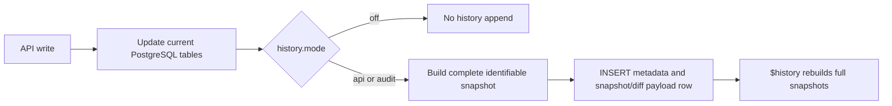
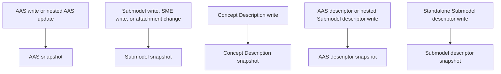

# AAS API v3.2 User Guide

This guide summarizes the user-visible AAS API v3.2 changes in the BaSyx Go components.

The most important additions are:

- Historical reads for AAS and Submodels.
- Recent-change feeds for AAS, Submodels, and Concept Descriptions.
- Timestamp filters for AAS and Submodel descriptor list endpoints.
- Signed AAS and Submodel reads.
- The new `Batch` value for `AssetKind`.
- Extended administrative timestamp fields used by recent-change filters.

Endpoint examples below are written relative to the service base path. If your service uses a context path such as `/api/v3`, prefix the paths with that context path.

## Endpoint Availability

Implemented history, recent-change, and signing endpoints:

- AAS Repository: `GET /shells/$recent-changes`
- AAS Repository: `GET /shells/{aasIdentifier}/$history`
- AAS Repository: `GET /shells/{aasIdentifier}/$signed`
- Submodel Repository: `GET /submodels/$recent-changes`
- Submodel Repository: `GET /submodels/{submodelIdentifier}/$history`
- Submodel Repository: `GET /submodels/{submodelIdentifier}/$signed`
- Concept Description Repository: `GET /concept-descriptions/$recent-changes`
- AAS Registry and Digital Twin Registry: `createdFrom` and `updatedFrom` filters on `GET /shell-descriptors`
- Submodel Registry: `createdFrom` and `updatedFrom` filters on `GET /submodel-descriptors`
- AAS Environment: exposes the corresponding AAS, Submodel, Concept Description, and descriptor list endpoints through the composed service.

Additional compatibility endpoint:

- Submodel Repository and AAS Environment: `GET /submodels/{submodelIdentifier}/$value/$signed`

Known v3.2 OpenAPI gaps in standalone services:

- Standalone AAS Repository `/serialization` is present in generated code but is not wired by the service entrypoint.
- Standalone Concept Description Repository `/serialization` is present in the OpenAPI file but is not currently exposed by a generated controller/service.
- Standalone Submodel Repository `/serialization` is routed but returns `501 Not Implemented`.
- AAS Environment `/serialization` and `/upload` are implemented and should be used when full environment import/export is needed.

## History Configuration

History behavior is controlled through lightweight, vendor-neutral configuration. Versioning is opt-in: `history.mode` defaults to `off`.

Environment variables:

- `BASYX_HISTORY_MODE`: `off`, `api`, or `audit`. Default is `off`.
- `BASYX_HISTORY_RETENTION_DAYS`: must remain `0`. Automatic cleanup is not implemented yet.
- `BASYX_HISTORY_FULL_SNAPSHOT_INTERVAL`: `1` stores every PostgreSQL history row and WORM mutation event as a complete snapshot when its sink is enabled. Values greater than `1` store one full checkpoint followed by up to `N-1` RFC 6902 diffs, with earlier checkpoints when a diff is not smaller than its snapshot.
- `BASYX_HISTORY_IMMUTABILITY`: `none` or `postgres_guarded`. Default is `none`.
- `BASYX_AUDIT_IDENTITY_MODE`: `none`, `minimal`, or `extended`. `minimal` stores request/correlation headers, authenticated OIDC subject/issuer/client id when available, ABAC allow metadata, operation, endpoint, and method. `extended` also stores trusted source IP, user agent, policy hash, and deterministic rule ids where available.
- `BASYX_HISTORY_EVIDENCE_ENABLED`: `true` enables fail-closed WORM mutation evidence. It may be combined with any history mode, including `off`; mutating requests fail when required evidence cannot be stored.
- `BASYX_HISTORY_EVIDENCE_PROVIDER`: `s3` for the S3-compatible evidence backend.
- `BASYX_HISTORY_EVIDENCE_BUCKET`, `BASYX_HISTORY_EVIDENCE_PREFIX`, `BASYX_HISTORY_EVIDENCE_REGION`, `BASYX_HISTORY_EVIDENCE_ENDPOINT`: object-store target settings. `endpoint` is useful for MinIO tests.
- `BASYX_HISTORY_EVIDENCE_ACCESS_KEY_ID`, `BASYX_HISTORY_EVIDENCE_SECRET_ACCESS_KEY`, `BASYX_HISTORY_EVIDENCE_SECRET_KEY`, `BASYX_HISTORY_EVIDENCE_PATH_STYLE`: optional S3-compatible credentials and path-style addressing. `BASYX_HISTORY_EVIDENCE_SECRET_KEY` is a supported alias for the secret access key.
- `BASYX_HISTORY_EVIDENCE_RETENTION_MODE`, `BASYX_HISTORY_EVIDENCE_RETENTION_DAYS`: required object-lock retention settings when evidence is enabled, such as `governance` plus a positive day count.
- `BASYX_HISTORY_EVIDENCE_WRITE_TIMEOUT_SECONDS`: timeout for synchronous WORM writes while the PostgreSQL transaction is open. Default is `10`.
- `BASYX_HISTORY_EVIDENCE_SIGNING_PRIVATE_KEY_PATH`: optional manifest signing key. When empty, evidence signing can use `jws.privateKeyPath`.
- `BASYX_HISTORY_EVIDENCE_SIGNING_PUBLIC_KEY_PATH`: optional trusted RSA public key for signed manifest verification.
- `BASYX_HISTORY_EVIDENCE_SIGNING_REQUIRED`: when `true`, verifier tooling rejects missing or unsigned manifests unless a signed manifest verifies with the configured public key.
- `BASYX_HISTORY_INTEGRITY_ANCHOR_PROVIDER`: must remain `none` in this release. Ledger/timestamping providers are reserved for later work.

Equivalent YAML:

```yaml
history:
  mode: off
  retentionDays: 0
  fullSnapshotInterval: 1
  immutability: none
  auditIdentityMode: none
  evidence:
    enabled: false
    provider: none
    bucket: ""
    prefix: basyx-history-evidence
    region: us-east-1
    endpoint: ""
    accessKeyId: ""
    secretAccessKey: ""
    pathStyle: false
    retentionMode: ""
    retentionDays: 0
    writeTimeoutSeconds: 10
    signing:
      privateKeyPath: ""
      publicKeyPath: ""
      required: false
  integrityAnchor:
    provider: none
```

Mode semantics:

- `off`: new history writes are skipped. Existing history rows remain readable.
- `api`: functional AAS v3.2 history behavior for API consumers.
- `audit`: the same runtime snapshot writes as `api`, intended for audit-oriented deployments where guarded storage is configured explicitly.

Evidence is independent from PostgreSQL history:

| `history.mode` | `history.evidence.enabled` | Result |
| --- | --- | --- |
| `off` | `false` | Current state only. |
| `api` or `audit` | `false` | PostgreSQL history only. |
| `off` | `true` | Canonical WORM mutation chain only; PostgreSQL history payload tables do not grow. |
| `api` or `audit` | `true` | One PostgreSQL history row and the same canonical WORM mutation artifact. |

`history.fullSnapshotInterval` controls WORM checkpoints in every evidence-enabled combination. A diff is replaced by a snapshot when its canonical representation would not be smaller.

Current implementation status:

- Runtime history rows are append-only, hash-chained event rows in `api` and `audit` mode.
- Schema migration installs PostgreSQL guard triggers. `postgres_guarded` enables them at service startup. When enabled, `UPDATE`, `DELETE`, and `TRUNCATE` on history metadata and payload tables fail with `history tables are append-only`.
- When WORM evidence is enabled, each acknowledged mutation synchronously stores a history-independent `mutation_event` artifact in S3-compatible object storage. It contains a snapshot or diff, `effective_diff`, a per-entity evidence sequence, and an evidence hash chain. PostgreSQL history identifiers and row hashes are linked only in the receipt catalog when history is also enabled.
- `cmd/historyevidenceverifier -mutation` verifies and reconstructs the independent chain against an independently retained terminal event hash, including required binary-reference and immutable-binary receipts. Existing v1 `history_event` manifests and recovery catalogs remain supported for previously stored evidence.
- `external_anchor`, non-zero `retentionDays`, and non-`none` integrity anchor providers currently fail fast during configuration loading. External anchoring remains future-compatible and optional.
- Audit metadata is populated when `history.auditIdentityMode` is `minimal` or `extended` and request/OIDC/ABAC metadata is available. Clients, API gateways, or reverse proxies should set `X-Request-ID` and `X-Correlation-ID` for traceable HTTP history rows; BaSyx copies these headers when present and leaves the audit fields empty when they are missing. Anonymous/local requests remain valid with empty identity fields.
- BaSyx provides technical controls that can support NIS2-aligned integrity, auditability, traceability, recovery, and tamper-detection requirements when deployed and operated correctly. Enabling the feature does not by itself make an operator NIS2 compliant.

Guarded PostgreSQL mode protects against normal accidental or unauthorized mutations through the application database user. PostgreSQL superusers or operators with permissions to alter triggers/functions can still bypass or remove this protection. Stronger tamper and recovery evidence comes from independent mutation artifacts in S3-compatible WORM storage such as AWS S3 Object Lock. Signed PostgreSQL history manifests remain available for legacy v1 evidence. MinIO Object Lock is useful for tests and local examples, but production deployments should use an operated WORM-capable object store with versioning and retention policy controls.

WORM mutation artifacts provide recoverability for acknowledged writes while evidence is enabled. With `fullSnapshotInterval: 5`, recovery starts from the latest WORM snapshot and replays up to four WORM diffs. Use `fullSnapshotInterval: 1` when each mutation must be independently recoverable as a full snapshot. `effective_diff` remains the attribution trail even when the stored payload is a checkpoint. Recovery exports verified JSON; PostgreSQL restore remains an operator-controlled action.

The guard switch is database-wide. Configure all BaSyx services that share one database with the same history immutability mode. Runtime services may enable guarded mode, but normal service startup cannot disable an enabled database guard. A service configured as unguarded fails during startup when it encounters an already-enabled database guard. Disabling guarded mode is an explicit operator maintenance action.

See `examples/BaSyxHistoryAuditGuardedExample` for a Docker Compose setup with audit history and `postgres_guarded` enabled.

Example evidence publication:

```sh
go run ./cmd/historyevidenceverifier \
  -config ./config.yaml \
  -table submodel_history \
  -identifier 'https://example.com/submodels/1' \
  -from 1 \
  -to 25 \
  -write
```

Example verification against a stored manifest object:

```sh
go run ./cmd/historyevidenceverifier \
  -config ./config.yaml \
  -table submodel_history \
  -identifier 'https://example.com/submodels/1' \
  -from 1 \
  -to 25 \
  -manifest-object-key '<object-key-from-receipt>' \
  -manifest-sha256 '<expected-sha256>' \
  -require-signed-manifest
```

Example recovery catalog export and verified WORM recovery:

```sh
go run ./cmd/historyevidenceverifier \
  -config ./config.yaml \
  -table submodel_history \
  -identifier 'https://example.com/submodels/1' \
  -from 1 \
  -to 25 \
  -catalog-export \
  -out ./submodel-history-recovery-catalog.json
```

```sh
go run ./cmd/historyevidenceverifier \
  -config ./config.yaml \
  -table submodel_history \
  -identifier 'https://example.com/submodels/1' \
  -from 1 \
  -to 25 \
  -recover \
  -recovery-catalog ./submodel-history-recovery-catalog.json \
  -out ./submodel-history-recovered.json
```

The verifier and recovery modes print machine-readable JSON and exit non-zero when critical findings are present, which makes them suitable for cron jobs, Kubernetes CronJobs, or alerting wrappers. See [NIS2 history evidence guidance](../security/NIS2_HISTORY_EVIDENCE.md) for deployment responsibilities.

Independent evidence verification or reconstruction uses evidence sequences rather than PostgreSQL `history_id` values:

```sh
go run ./cmd/historyevidenceverifier \
  -config ./config.yaml \
  -mutation \
  -table submodel_history \
  -identifier 'https://example.com/submodels/1' \
  -from 1 \
  -to 25 \
  -expected-head-hash '<independently-retained-event-hash-for-sequence-25>'
```

Add `-recover` to include the reconstructed terminal snapshot in the report. The terminal event hash, change type, deletion state, operation time, and audit context make deleted-state recovery explicit. Verification fails if the requested terminal sequence, its event hash, or live WORM retention check does not match the independently retained expectation.

The expected pair of terminal evidence sequence and event hash is a trust anchor. Export it after a successful verification and retain it outside the BaSyx PostgreSQL database, for example in a protected monitoring, SIEM, or evidence-preservation system. Later checks must use the previously retained value before advancing that value to a newer successfully verified head. Reading the expected hash from the database being verified cannot detect a database attacker who removed the same tail from both catalog tables. The first retained value is a trust-on-first-use baseline and must be established through an operator-controlled process.

## Internal Attachments And Thumbnails

Internal File SME attachments and default thumbnails use model values of the form `/aasx/files/<opaque-token>/<safe-filename>`. This is a logical AASX package-part path, not an HTTP endpoint. Upload, download, replacement, and deletion continue to use the standardized attachment and thumbnail endpoints; no `/aasx/files/...` route is exposed. Upload filenames must be one safe path segment and may contain at most 255 UTF-8 bytes. This is a byte limit, so a filename containing multibyte characters may contain fewer than 255 characters.

Every successful upload receives a new opaque token, including same-name replacements. Payloads are deduplicated globally by SHA-256 plus byte length across attachments and thumbnails, while authorization always resolves through the owning AAS, thumbnail, or File SME. Tokens, hashes, PostgreSQL OIDs, WORM object keys, versions, and deduplication outcomes are never lookup authorities or public API metadata. `general.uploadMaxSizeBytes` bounds both the HTTP request and the streamed binary content written to PostgreSQL.

When evidence is enabled, canonical bytes are streamed once to content-addressed WORM storage. The owning mutation hash commits the binary digest, size, filename, content type, managed path, and immutable object version; each upload then writes the matching binary-reference artifact. Reusing identical content reuses the PostgreSQL Large Object and immutable WORM object and only extends retention when required. Replacing or deleting the final live reference removes the PostgreSQL Large Object, but immutable WORM bytes and reference evidence remain retained.

Absolute `http://` and `https://` values remain external links. BaSyx does not fetch, deduplicate, or copy their content. AASX serialization writes each associated internal binary at its exact `/aasx/files/...` URI and preserves that value in the serialized model.

The v1.1.8 upgrade does not scan, rewrite, or WORM-backfill legacy `file_data` and `thumbnail_file_data` Large Objects. Existing files and their model values remain readable through the compatibility path. Replacing them uses canonical storage and assigns a new managed path; missing WORM evidence for the earlier bytes is accepted. Complete AASX File Server package files remain outside this deduplication scope.

Apply v1.1.8 as a quiesced database upgrade, not as a rolling deployment. Stop every database-backed BaSyx service, back up the database including Large Objects, run the configuration service alone, and start only v1.1.8 services after the schema is clean. Startup version checks reject newly started mismatched services but cannot stop a v1.1.7 process that was already connected. Rollback requires restoring the complete pre-upgrade backup before v1.1.7 is restarted; changing only the service image is not supported.

Global deduplication does not change authorization or API response content. An already-authorized uploader may observe a noisy timing difference between storing a new payload and reusing an existing payload, but receives no owner or content metadata about another reference. Deployments with a genuine cross-tenant timing-isolation requirement should use separate databases or service instances for those security boundaries.

## What Activating Versioning Means

When versioning is active, each supported identifiable create, update, or delete appends a new row to a dedicated history table. With `fullSnapshotInterval: 1`, every row stores a complete identifiable snapshot. With a larger interval, the runtime stores a full checkpoint followed by up to `N-1` RFC 6902 diffs against the previous reconstructed snapshot.

For example, `history.fullSnapshotInterval: 3` stores at most two diffs after a checkpoint: `snapshot, diff, diff, snapshot...`. The runtime may insert an earlier full snapshot when the diff JSON would not be smaller than the full snapshot payload. Historical reads rebuild the full snapshot at query time from the nearest checkpoint and verify the stored payload/content hashes before returning it.



The owning identifiable depends on the write:



This has operational consequences:

- History consumes additional storage for every write and adds hashing plus one metadata insert and one payload insert to the write request.
- Writes for the same identifiable are serialized briefly while the next hash-chain row is appended. Different identifiers can still proceed independently.
- Partial updates usually derive the new snapshot from the previous reconstructed history snapshot. This reduces reads from the normalized backend.
- Snapshot and diff JSON are stored in one-to-one payload tables so indexed history metadata rows stay narrow.
- Schema migration does not backfill existing entities. Historical state from before activation is unavailable.
- If an existing entity has no history row yet, its first partial update falls back to materializing the current complete identifiable once. Later partial updates can derive snapshots from history.
- While PostgreSQL history or WORM evidence is active, an unclassified write endpoint is rejected before its handler runs with `HISTORY-COVERAGE-UNCLASSIFIED`. This prevents a newly added endpoint from silently changing current state without recording its required mutation.

Eventing placeholders:

- `BASYX_EVENTING_ENABLED`
- `BASYX_EVENTING_FORMAT`, currently expected to be `cloudevents`
- `BASYX_EVENTING_SINKS`
- `BASYX_EVENTING_OUTBOX_ENABLED`
- `BASYX_EVENTING_TOPIC_PREFIX`

These settings reserve the configuration shape for future CloudEvents-compatible outbox/event publishing. MQTT and Kafka publishing are not implemented yet. Enabling eventing, configuring sinks, or enabling the outbox currently fails fast during configuration loading.

Compact history storage:

- Keep `fullSnapshotInterval: 1` for the full-snapshot behavior.
- Use values greater than `1` to store periodic full checkpoints plus diff rows between checkpoints.
- Each row stores a hash of the reconstructed full snapshot and a separate hash of the stored snapshot or diff payload.

## Historical Reads

Normal `GET` endpoints return the latest current version. Use `$history` when you need the entity that was valid at a specific point in time.

Example:

```sh
curl \
  'http://localhost:6004/shells/{base64urlAasIdentifier}/$history?date=2026-05-28T10:15:30Z'
```

```sh
curl \
  'http://localhost:6004/submodels/{base64urlSubmodelIdentifier}/$history?date=2026-05-28T10:15:30Z'
```

Behavior:

- The identifier path parameter is encoded the same way as other IDTA identifier path parameters.
- The `date` query parameter selects the version that was valid at that time.
- A date before deletion can still resolve the historical version.
- A date after deletion returns not found.
- If the requested date is exactly on an update boundary, the newer version is returned.

Submodel element changes are tracked as part of the owning Submodel. If a Submodel Element is added, changed, deleted, or has an attachment update, the next Submodel history version reconstructs to a full Submodel snapshot even when the stored payload row is a diff.

## Submodel Element History FAQ

Submodel Elements do not have independent history streams. They are part of their owning Submodel. An SME write therefore appends an `Updated` event for the Submodel, even when the SME itself was newly created or deleted.

| SME operation | History effect |
| --- | --- |
| Create a top-level SME with `POST /submodels/{submodelIdentifier}/submodel-elements` | Append an `Updated` Submodel snapshot containing the new SME. |
| Create a nested SME with `POST /submodels/{submodelIdentifier}/submodel-elements/{idShortPath}` | Append an `Updated` Submodel snapshot. The path identifies the existing parent below which the new SME is added. |
| Create or replace an SME with `PUT /submodels/{submodelIdentifier}/submodel-elements/{idShortPath}` | Append an `Updated` Submodel snapshot. The path identifies the target SME. |
| Patch an SME, its metadata, or its value | Append an `Updated` Submodel snapshot containing the changed SME state. |
| Delete an SME with `DELETE /submodels/{submodelIdentifier}/submodel-elements/{idShortPath}` | Append an `Updated` Submodel snapshot without the deleted SME. Deleting a container also removes its nested children from the new snapshot. |
| Upload or delete a file attachment | Append an `Updated` Submodel snapshot containing the changed File SME metadata. |

**Why is an SME create or delete reported as `Updated`?**

The event describes the owning identifiable. An SME is nested content of a Submodel, so creating, changing, or deleting an SME updates that Submodel.

**What happens for nested `idShortPath` values?**

For nested paths such as `Measurements.temperature`, history still represents the complete Submodel snapshot. With WORM evidence enabled, the persistence layer reads the complete Submodel before the change, refreshes the affected top-level SME subtree after the change, and combines both explicitly. The small PostgreSQL evidence-head row never contains the model snapshot. With PostgreSQL history only, the existing history reconstruction optimization remains available.

**What happens if the Submodel has no earlier snapshot?**

With WORM evidence enabled, every partial mutation reads the complete live pre-mutation Submodel while holding its evidence lock. This avoids depending on PostgreSQL history or rewriting a duplicate full-model checkpoint in the evidence catalog. With PostgreSQL history only, the first partial mutation reads the complete current Submodel and later mutations can derive the new snapshot from history.

**Does deleting an SME container create a separate history entry for every nested SME?**

No. One SME request appends one `Updated` snapshot for the owning Submodel. The new snapshot no longer contains the deleted container or its descendants.

**Do AAS superpath routes also create an AAS history entry?**

The AAS Repository and AAS Environment also expose SME routes below the AAS superpath:

```text
/shells/{aasIdentifier}/submodels/{submodelIdentifier}/submodel-elements/...
```

These routes delegate to the same Submodel behavior. An SME-only change appends an `Updated` entry to `submodel_history`; it does not append an AAS history row because the AAS-to-Submodel reference did not change.

## Recent Changes

Recent-change endpoints return cursor-paged projections of the current repository rows that carry valid administrative timestamps. Their result shape depends on the component:

| Component | Result fields |
| --- | --- |
| AAS Repository | `createdAt`, `updatedAt`, `id`, and optional `globalAssetId` and `specificAssetIds` |
| Submodel Repository | `createdAt`, `updatedAt`, `id`, and optional `semanticId` and `supplementalSemanticIds` |
| Concept Description Repository | `createdAt`, `updatedAt`, and `id` |

Example:

```sh
curl 'http://localhost:6004/shells/$recent-changes?limit=50'
```

```sh
curl 'http://localhost:6004/submodels/$recent-changes?limit=50&updatedFrom=2026-05-28T00:00:00Z'
```

Common query parameters:

- `limit`: maximum number of changes to return. The default is `100`.
- `cursor`: pagination cursor from the previous response.
- `createdFrom`: lower bound for administrative creation timestamps.
- `updatedFrom`: lower bound for administrative update timestamps.

Additional filters:

- AAS recent changes support `assetIds`. Each value is a base64url-encoded `SpecificAssetId`.
- Submodel recent changes support `semanticId`. Its semantic-reference value is base64url encoded.

Recent-change endpoints use the current repository rows and project them into the V3.2 recent-change response shape. The `createdFrom` and `updatedFrom` filters use the administrative timestamps supplied in the persisted resource payload. BaSyx does not generate or overwrite `administration.createdAt` or `administration.updatedAt`. Resources without valid administrative timestamps are not returned by public recent-change endpoints. Deleted resources do not appear in public recent-change results, while internal history rows remain available for historical reconstruction when history is enabled.

Registry descriptor list endpoints use current descriptor rows and accept timestamp filters directly:

```sh
curl 'http://localhost:6003/shell-descriptors?limit=50&updatedFrom=2026-05-28T00:00:00Z'
```

```sh
curl 'http://localhost:6002/submodel-descriptors?limit=50&createdFrom=2026-05-28T00:00:00Z'
```

Descriptor timestamp filters use the descriptor payload's persisted `administration.createdAt` and `administration.updatedAt` values. Descriptor writes do not generate or overwrite those fields.

## Signed Reads

Signed endpoints return a compact JWS string for the requested AAS or Submodel.

Example:

```sh
curl 'http://localhost:6004/shells/{base64urlAasIdentifier}/$signed'
```

```sh
curl 'http://localhost:6004/submodels/{base64urlSubmodelIdentifier}/$signed'
```

If signing is not configured, the endpoint returns an error instead of an unsigned payload. Signed reads use the same read authorization rules as the corresponding normal read endpoints.

## AssetKind Batch

AAS API v3.2 adds `Batch` to `AssetKind`. Existing database values are migrated so older persisted enum indices keep their intended meaning after `Batch` is inserted.

For users this means:

- New payloads may use `Batch`.
- Existing data with older asset-kind values is adjusted during the schema migration.
- Integration tests cover both accepting `Batch` in new payloads and migrating old numeric values.

## Security

The new history, recent-change, and signed endpoints are protected as read endpoints by the same ABAC middleware used by the rest of the service.

Important operational note:

- `$history` is route-authorized in this release. It does not apply current-table ABAC filters or logical-expression redaction to stored snapshots. `$recent-changes` applies current identifiable ABAC filters.
- Fine-grained snapshot field filtering is intentionally out of scope for history responses.

## Operational Considerations

History support increases database growth because each write creates a history row. Configure `history.fullSnapshotInterval` above `1` when storage growth from full snapshots is too high.

Runtime overhead is reduced by:

- Keeping current tables separate from history tables.
- Using indexed metadata for recent-change queries.
- Keeping JSONB snapshot/diff payloads in one-to-one payload tables outside indexed history metadata rows.
- Using cursor pagination for recent-change feeds.
- Deriving partial-update snapshots from the latest history row when possible.
- Reading only the affected top-level Submodel Element subtree for nested SME changes.
- Storing compact internal delete tombstones where supported.
- Hashing canonical JSON snapshots instead of signing or anchoring every row by default.

For large installations, plan retention and monitoring:

- Monitor history table row counts and table sizes.
- Decide how long historical versions must be retained and implement an operator-controlled cleanup process if needed.
- Consider partitioning or compaction for high-write deployments.
- Pay special attention to large Submodels with frequent Submodel Element changes.
- Keep the PostgreSQL guard implications in mind: guarded mode intentionally blocks direct `UPDATE`, `DELETE`, and `TRUNCATE` maintenance on history tables until the guard is disabled.
