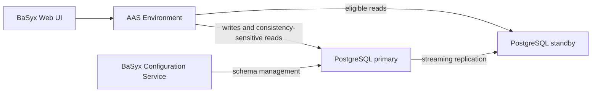

# BaSyx PostgreSQL Read Replica Example

This example runs the BaSyx AAS Environment and Web UI with separate PostgreSQL writer and reader connections. The reader is a real streaming standby, not another connection to the primary.



The AAS Environment hosts the AAS and Submodel repositories, both registries, Discovery, and the Concept Description Repository. Eligible reads for all of these APIs use the standby.

## Prerequisites

- Docker with Docker Compose
- Free ports `3000` and `8084`

## Start

From this directory:

```bash
docker compose up -d
./smoke.sh
```

Open the BaSyx Web UI at [http://localhost:3000](http://localhost:3000). The preconfigured `IESEDriveMotorDM3000` shell is loaded through the writer and displayed through reader-routed requests after replication catches up.

The AAS Environment APIs are available at [http://localhost:8084](http://localhost:8084).

## Verify the routing

The smoke test verifies:

- PostgreSQL reports that `postgres-reader` is in recovery mode.
- PostgreSQL reports that the standby WAL receiver is actively streaming.
- the AAS Environment writer pool is connected to `postgres-primary`.
- the reader pool is connected to `postgres-reader`.
- no reader-pool connection is present on the primary.
- the preconfigured shell is visible through a reader-routed API request.
- the BaSyx Web UI is reachable and serves the expected `mono-all` infrastructure configuration.

You can inspect the active connections directly:

```bash
docker compose exec postgres-primary \
  psql -U admin -d basyxReadReplica -c \
  "SELECT application_name, state FROM pg_stat_activity WHERE application_name LIKE 'aasenvironmentservice%';"

docker compose exec postgres-reader \
  psql -U admin -d basyxReadReplica -c \
  "SELECT application_name, state FROM pg_stat_activity WHERE application_name LIKE 'aasenvironmentservice%';"
```

The relevant application settings are visible in `docker-compose.yml`:

- `POSTGRES_HOST=postgres-primary`
- `POSTGRES_READER_HOST=postgres-reader`
- independent writer and reader connection-pool limits
- `default_transaction_read_only=on` as an additional reader-session guard
- the bounded `basyx_reader` physical replication slot retains WAL while the standby is temporarily unavailable

## Consistency behavior

Reader-routed requests are eventually consistent. A successful write can take a short time to appear through a later GET request while PostgreSQL replays the corresponding WAL records. BaSyx keeps mutation guards, transactional work, read-after-write-sensitive paths, schema management, asynchronous jobs, authorization storage, and upload staging on the writer.

Both configured endpoints are required during startup. BaSyx does not silently send reader traffic to the writer if the reader is unavailable.

## Stop and reset

Stop the example:

```bash
docker compose down
```

Remove both database volumes and start with a fresh primary and standby:

```bash
docker compose down -v
```

## Production note

The embedded replication scripts, fixed passwords, and disabled TLS are intended only for a local demonstration. In Kubernetes, use a PostgreSQL operator or managed database that exposes distinct writer and reader endpoints. With CloudNativePG, the Helm equivalent is the RW Pooler for the writer and the optional RO Pooler for reader traffic. Size the total pool capacity across all BaSyx pods against the connection budgets of both endpoints.
