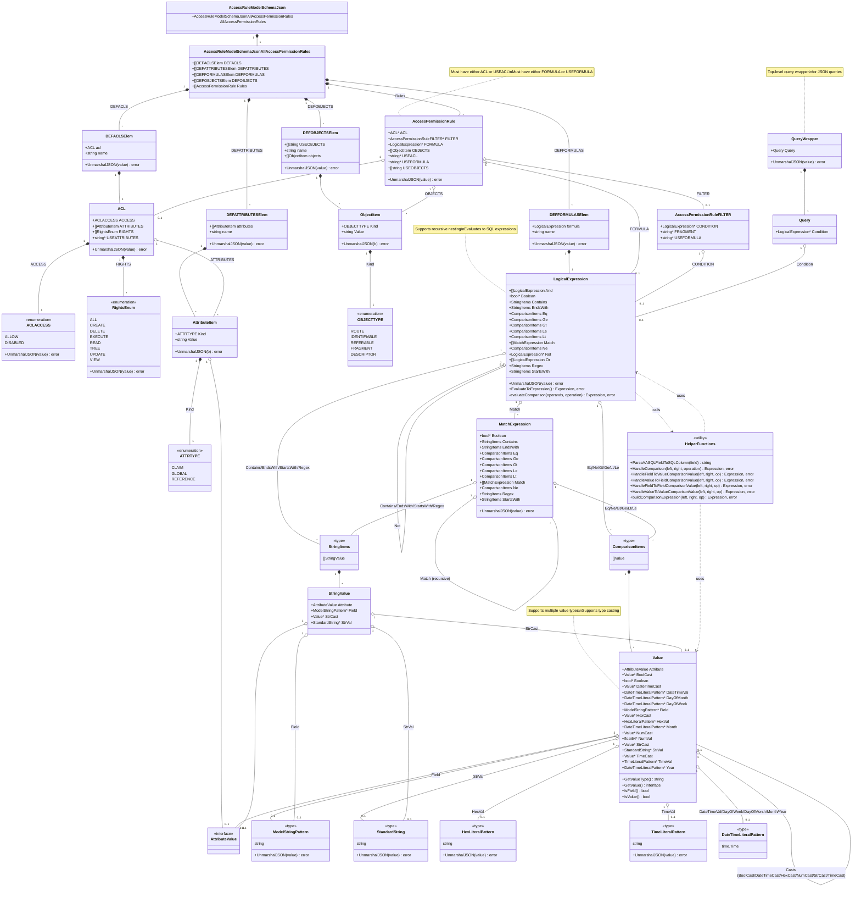

```mermaid
classDiagram
    %% Main Schema Container
    class AccessRuleModelSchemaJson {
        +AccessRuleModelSchemaJsonAllAccessPermissionRules AllAccessPermissionRules
    }

    class AccessRuleModelSchemaJsonAllAccessPermissionRules {
        +[]DEFACLSElem DEFACLS
        +[]DEFATTRIBUTESElem DEFATTRIBUTES
        +[]DEFFORMULASElem DEFFORMULAS
        +[]DEFOBJECTSElem DEFOBJECTS
        +[]AccessPermissionRule Rules
    }

    %% Access Permission Rule
    class AccessPermissionRule {
        +ACL* ACL
        +AccessPermissionRuleFILTER* FILTER
        +LogicalExpression* FORMULA
        +[]ObjectItem OBJECTS
        +string* USEACL
        +string* USEFORMULA
        +[]string USEOBJECTS
        +UnmarshalJSON(value) error
    }

    class AccessPermissionRuleFILTER {
        +LogicalExpression* CONDITION
        +string* FRAGMENT
        +string* USEFORMULA
    }

    %% ACL
    class ACL {
        +ACLACCESS ACCESS
        +[]AttributeItem ATTRIBUTES
        +[]RightsEnum RIGHTS
        +string* USEATTRIBUTES
        +UnmarshalJSON(value) error
    }

    class ACLACCESS {
        <<enumeration>>
        ALLOW
        DISABLED
        +UnmarshalJSON(value) error
    }

    class RightsEnum {
        <<enumeration>>
        ALL
        CREATE
        DELETE
        EXECUTE
        READ
        TREE
        UPDATE
        VIEW
        +UnmarshalJSON(value) error
    }

    %% Attributes
    class AttributeItem {
        +ATTRTYPE Kind
        +string Value
        +UnmarshalJSON(b) error
    }

    class ATTRTYPE {
        <<enumeration>>
        CLAIM
        GLOBAL
        REFERENCE
    }

    class AttributeValue {
        <<interface>>
    }

    %% Objects
    class ObjectItem {
        +OBJECTTYPE Kind
        +string Value
        +UnmarshalJSON(b) error
    }

    class OBJECTTYPE {
        <<enumeration>>
        ROUTE
        IDENTIFIABLE
        REFERABLE
        FRAGMENT
        DESCRIPTOR
    }

    %% Logical Expression
    class LogicalExpression {
        +[]LogicalExpression And
        +bool* Boolean
        +StringItems Contains
        +StringItems EndsWith
        +ComparisonItems Eq
        +ComparisonItems Ge
        +ComparisonItems Gt
        +ComparisonItems Le
        +ComparisonItems Lt
        +[]MatchExpression Match
        +ComparisonItems Ne
        +LogicalExpression* Not
        +[]LogicalExpression Or
        +StringItems Regex
        +StringItems StartsWith
        +UnmarshalJSON(value) error
        +EvaluateToExpression() Expression, error
        -evaluateComparison(operands, operation) Expression, error
    }

    class MatchExpression {
        +bool* Boolean
        +StringItems Contains
        +StringItems EndsWith
        +ComparisonItems Eq
        +ComparisonItems Ge
        +ComparisonItems Gt
        +ComparisonItems Le
        +ComparisonItems Lt
        +[]MatchExpression Match
        +ComparisonItems Ne
        +StringItems Regex
        +StringItems StartsWith
        +UnmarshalJSON(value) error
    }

    %% Value Types
    class Value {
        +AttributeValue Attribute
        +Value* BoolCast
        +bool* Boolean
        +Value* DateTimeCast
        +DateTimeLiteralPattern* DateTimeVal
        +DateTimeLiteralPattern* DayOfMonth
        +DateTimeLiteralPattern* DayOfWeek
        +ModelStringPattern* Field
        +Value* HexCast
        +HexLiteralPattern* HexVal
        +DateTimeLiteralPattern* Month
        +Value* NumCast
        +float64* NumVal
        +Value* StrCast
        +StandardString* StrVal
        +Value* TimeCast
        +TimeLiteralPattern* TimeVal
        +DateTimeLiteralPattern* Year
        +GetValueType() string
        +GetValue() interface
        +IsField() bool
        +IsValue() bool
    }

    class ComparisonItems {
        <<type>>
        []Value
    }

    class StringValue {
        +AttributeValue Attribute
        +ModelStringPattern* Field
        +Value* StrCast
        +StandardString* StrVal
    }

    class StringItems {
        <<type>>
        []StringValue
    }

    %% Pattern Types
    class ModelStringPattern {
        <<type>>
        string
        +UnmarshalJSON(value) error
    }

    class StandardString {
        <<type>>
        string
        +UnmarshalJSON(value) error
    }

    class HexLiteralPattern {
        <<type>>
        string
        +UnmarshalJSON(value) error
    }

    class TimeLiteralPattern {
        <<type>>
        string
        +UnmarshalJSON(value) error
    }

    class DateTimeLiteralPattern {
        <<type>>
        time.Time
    }

    %% Query Wrapper
    class QueryWrapper {
        +Query Query
        +UnmarshalJSON(value) error
    }

    class Query {
        +LogicalExpression* Condition
    }

    %% Definition Elements
    class DEFACLSElem {
        +ACL acl
        +string name
        +UnmarshalJSON(value) error
    }

    class DEFATTRIBUTESElem {
        +[]AttributeItem attributes
        +string name
        +UnmarshalJSON(value) error
    }

    class DEFFORMULASElem {
        +LogicalExpression formula
        +string name
        +UnmarshalJSON(value) error
    }

    class DEFOBJECTSElem {
        +[]string USEOBJECTS
        +string name
        +[]ObjectItem objects
        +UnmarshalJSON(value) error
    }

    %% Helper Functions (shown as notes)
    class HelperFunctions {
        <<utility>>
        +ParseAASQLFieldToSQLColumn(field) string
        +HandleComparison(left, right, operation) Expression, error
        +HandleFieldToValueComparisonValue(left, right, op) Expression, error
        +HandleValueToFieldComparisonValue(left, right, op) Expression, error
        +HandleFieldToFieldComparisonValue(left, right, op) Expression, error
        +HandleValueToValueComparisonValue(left, right, op) Expression, error
        +buildComparisonExpression(left, right, op) Expression, error
    }

    %% Relationships
    AccessRuleModelSchemaJson "1" *-- "1" AccessRuleModelSchemaJsonAllAccessPermissionRules
    
    AccessRuleModelSchemaJsonAllAccessPermissionRules "1" *-- "*" DEFACLSElem : DEFACLS
    AccessRuleModelSchemaJsonAllAccessPermissionRules "1" *-- "*" DEFATTRIBUTESElem : DEFATTRIBUTES
    AccessRuleModelSchemaJsonAllAccessPermissionRules "1" *-- "*" DEFFORMULASElem : DEFFORMULAS
    AccessRuleModelSchemaJsonAllAccessPermissionRules "1" *-- "*" DEFOBJECTSElem : DEFOBJECTS
    AccessRuleModelSchemaJsonAllAccessPermissionRules "1" *-- "*" AccessPermissionRule : Rules

    DEFACLSElem "1" *-- "1" ACL
    DEFATTRIBUTESElem "1" *-- "*" AttributeItem
    DEFFORMULASElem "1" *-- "1" LogicalExpression
    DEFOBJECTSElem "1" *-- "*" ObjectItem

    AccessPermissionRule "1" o-- "0..1" ACL
    AccessPermissionRule "1" o-- "0..1" AccessPermissionRuleFILTER : FILTER
    AccessPermissionRule "1" o-- "0..1" LogicalExpression : FORMULA
    AccessPermissionRule "1" o-- "*" ObjectItem : OBJECTS

    AccessPermissionRuleFILTER "1" o-- "0..1" LogicalExpression : CONDITION

    ACL "1" *-- "1" ACLACCESS : ACCESS
    ACL "1" o-- "*" AttributeItem : ATTRIBUTES
    ACL "1" *-- "*" RightsEnum : RIGHTS

    AttributeItem "1" *-- "1" ATTRTYPE : Kind
    AttributeItem "1" o-- "0..1" AttributeValue

    ObjectItem "1" *-- "1" OBJECTTYPE : Kind

    LogicalExpression "1" o-- "*" LogicalExpression : And/Or
    LogicalExpression "1" o-- "0..1" LogicalExpression : Not
    LogicalExpression "1" o-- "*" ComparisonItems : Eq/Ne/Gt/Ge/Lt/Le
    LogicalExpression "1" o-- "*" StringItems : Contains/EndsWith/StartsWith/Regex
    LogicalExpression "1" o-- "*" MatchExpression : Match

    MatchExpression "1" o-- "*" ComparisonItems : Eq/Ne/Gt/Ge/Lt/Le
    MatchExpression "1" o-- "*" StringItems : Contains/EndsWith/StartsWith/Regex
    MatchExpression "1" o-- "*" MatchExpression : Match (recursive)

    ComparisonItems "1" *-- "*" Value
    StringItems "1" *-- "*" StringValue

    Value "1" o-- "0..1" AttributeValue
    Value "1" o-- "0..1" ModelStringPattern : Field
    Value "1" o-- "0..1" StandardString : StrVal
    Value "1" o-- "0..1" HexLiteralPattern : HexVal
    Value "1" o-- "0..1" TimeLiteralPattern : TimeVal
    Value "1" o-- "0..1" DateTimeLiteralPattern : DateTimeVal/DayOfWeek/DayOfMonth/Month/Year
    Value "1" o-- "0..1" Value : Casts (BoolCast/DateTimeCast/HexCast/NumCast/StrCast/TimeCast)

    StringValue "1" o-- "0..1" AttributeValue
    StringValue "1" o-- "0..1" ModelStringPattern : Field
    StringValue "1" o-- "0..1" StandardString : StrVal
    StringValue "1" o-- "0..1" Value : StrCast

    QueryWrapper "1" *-- "1" Query
    Query "1" o-- "0..1" LogicalExpression : Condition

    HelperFunctions ..> Value : uses
    HelperFunctions ..> LogicalExpression : uses
    LogicalExpression ..> HelperFunctions : calls

    %% Notes
    note for AccessPermissionRule "Must have either ACL or USEACL\nMust have either FORMULA or USEFORMULA"
    note for LogicalExpression "Supports recursive nesting\nEvaluates to SQL expressions"
    note for Value "Supports multiple value types\nSupports type casting"
    note for QueryWrapper "Top-level query wrapper\nfor JSON queries"
```